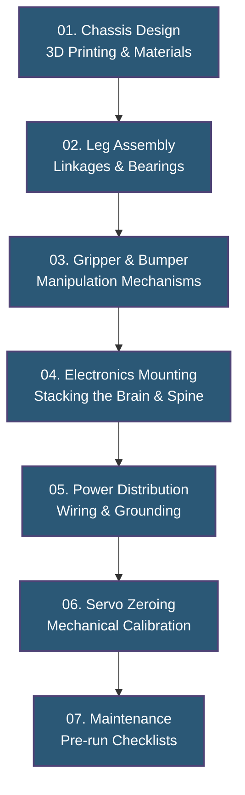

# Mechanical Assembly & Hardware Workflow

## Introduction
The Mechanical layer is the physical foundation of the FusionForce quadruped. Flawless software cannot fix a poorly balanced chassis or stripped servo gears. This curriculum guides you through printing, assembling, and zeroing the 14-DOF robot.

## Assembly Workflow

## Learning Path & Modules

Follow these directories in order to assemble the robot from scratch:

1. **[01 Chassis Design](./01_chassis_design/README.md)** - Materials, Infill, and CoG.
2. **[02 Leg Assembly](./02_leg_assembly/README.md)** - 3-DOF Mammalian kinematics setup.
3. **[03 Gripper & Bumper](./03_gripper_and_bumper/README.md)** - Building the Task 01 and Task 03 manipulators.
4. **[04 Electronics Mounting](./04_electronics_mounting/README.md)** - Securely stacking the Pi, STM32, and Sensors.
5. **[05 Power Distribution](./05_power_distribution/README.md)** - Routing high-current LiPo power safely.
6. **[06 Calibration & Zeroing](./06_calibration_and_zeroing/README.md)** - The most critical step: 90-degree zeroing.
7. **[07 Maintenance & Repair](./07_maintenance_and_repair/README.md)** - Debugging physical failures.

---
🔙 **[Back to Main Repository README](../README.md)**
