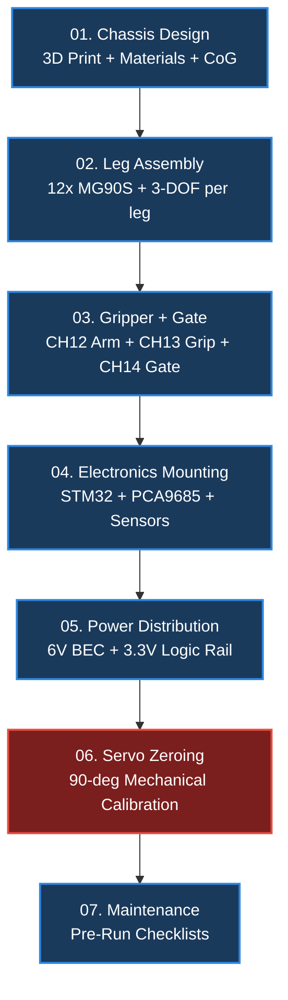

# Mechanical Assembly & Hardware Workflow
## RUNNER-4 | 12-DOF Quadruped | EN2533 BREACH PROTOCOL

> **MCU:** STM32F411CEU6 (Black Pill) | **Servos:** 12x MG90S legs + 3x MG90S mechanisms = **15 total**
> **Links:** Coxa = 30 mm | Femur = 60 mm | Tibia = 80 mm | **Power:** 6V switching BEC ≥5A

## Assembly Workflow

```mermaid
flowchart TD
    classDef phase fill:#1a3a5c,stroke:#2e86de,color:#fff,stroke-width:2px;
    classDef critical fill:#7b1e1e,stroke:#e74c3c,color:#fff,stroke-width:2px;

    A[01. Chassis Design\n3D Print + Materials + CoG]:::phase
    B[02. Leg Assembly\n12x MG90S + 3-DOF per leg]:::phase
    C[03. Gripper + Gate\nCH12 Arm + CH13 Grip + CH14 Gate]:::phase
    D[04. Electronics Mounting\nSTM32 + PCA9685 + Sensors]:::phase
    E[05. Power Distribution\n6V BEC + 3.3V Logic Rail]:::phase
    F[06. Servo Zeroing\n90-deg Mechanical Calibration]:::critical
    G[07. Maintenance\nPre-Run Checklists]:::phase

    A --> B
    B --> C
    C --> D
    D --> E
    E --> F
    F --> G
```

## Module Summary

| # | Module | Key Hardware | Status |
|---|--------|-------------|--------|
| 01 | [Chassis Design](./01_chassis_design/README.md) | PETG body, base plate, top plate | Design phase |
| 02 | [Leg Assembly](./02_leg_assembly/README.md) | 12x MG90S, L1=30 L2=60 L3=80mm | Assembly phase |
| 03 | [Gripper & Gate](./03_gripper_and_bumper/README.md) | CH12 arm, CH13 gripper, CH14 gate | Assembly phase |
| 04 | [Electronics Mounting](./04_electronics_mounting/README.md) | STM32, PCA9685, IMU, ToF, IR array | Wiring phase |
| 05 | [Power Distribution](./05_power_distribution/README.md) | Switching BEC 6V, 3.3V logic | Wiring phase |
| 06 | [Calibration & Zeroing](./06_calibration_and_zeroing/README.md) | PCA9685 UART cal, offset array | **Critical step** |
| 07 | [Maintenance & Repair](./07_maintenance_and_repair/README.md) | Pre-run checklist, common failures | Ongoing |

## Hardware Bill of Materials (Mechanical)

| Item | Qty | Spec | Notes |
|------|-----|------|-------|
| MG90S Metal Gear Servo | 15 | 2.2 kg.cm @ 6V | 12 legs + 3 arm/grip/gate |
| PETG Filament | ~400g | 1.75mm, black | Body plates + brackets |
| M3 Socket Head Screws | 80 | 8mm, 12mm, 16mm | All structural joints |
| M3 Locknuts (nylon) | 60 | DIN985 | Vibration-proof joints |
| M2.5 Standoffs | 20 | Brass, 10mm | PCB mounting |
| Brass Heat-set Inserts | 40 | M3 | PETG structural holes |
| Radial Bearings | 12 | 3x8x3mm MR83ZZ | Opposite side of coxa servo horns |
| Rubber Feet | 4 | 10mm dia silicone | Tibia tips, prevents slipping |
| Servo Extension Wire | 2m | 3-pin 26AWG | Leg routing |

---
🔙 **[Back to Main Repository README](../README.md)**
