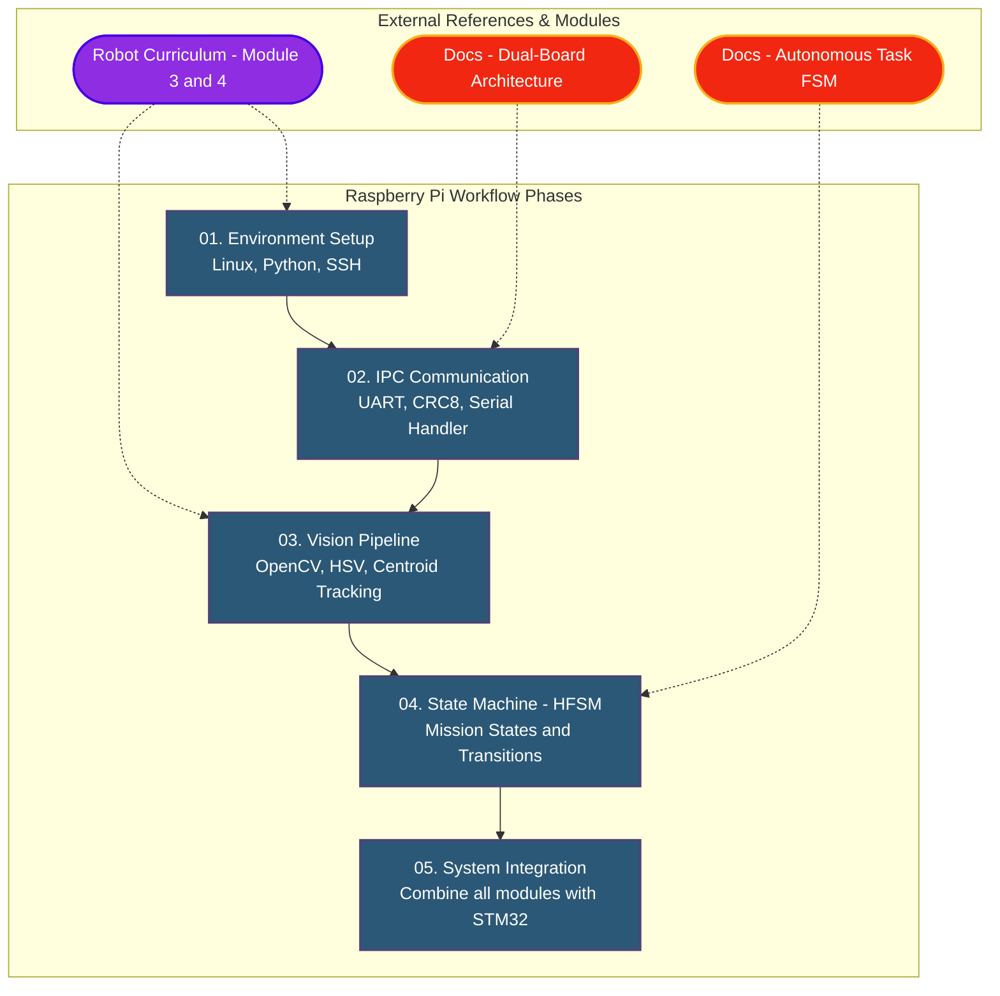

# Raspberry Pi Workflow: High-Level Overview

## Introduction
The Raspberry Pi 4B serves as the central "Brain" of the FusionForce robot. It handles computationally heavy tasks like computer vision (OpenCV) and high-level decision making (Hierarchical State Machine), while offloading real-time motion and reflex control to the STM32 microcontroller. 

This folder contains a complete, step-by-step workflow for implementing the Raspberry Pi software layer.

## System Workflow & Architecture

The following diagram illustrates the overall workflow and integration strategy for the Raspberry Pi software:

## Workflow Documents
Please follow these steps in order to fully implement the Pi's logic:

1. [01. Environment Setup](./01_Environment_Setup.md)
2. [02. IPC Communication](./02_IPC_Communication.md)
3. [03. Vision Pipeline](./03_Vision_Pipeline.md)
4. [04. State Machine](./04_State_Machine.md)
5. [05. Integration and Testing](./05_Integration_and_Testing.md)

## Key References
- [Dual-Board Software Architecture & IPC](../docs/03_Dual_Board_Software_Architecture_and_IPC.md)
- [Autonomous Task State Machine](../docs/04_Autonomous_Task_State_Machine.md)
