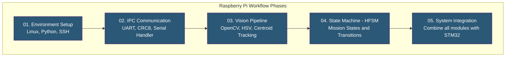

# Raspberry Pi Workflow & Curriculum

## Introduction
The Raspberry Pi 4B serves as the central "Brain" of the FusionForce robot. It handles computationally heavy tasks like computer vision (OpenCV) and high-level decision making (Hierarchical State Machine), while offloading real-time motion and reflex control to the STM32 microcontroller.

## System Workflow & Architecture

## Learning Path & Modules

Follow these numbered directories for a complete learning path from basic setup to competition deployment.

1.  **[01 Setup](./01_setup/README.md)** - OS, SSH, VNC, Python Dependencies
2.  **[02 Linux Fundamentals](./02_linux/README.md)** - Terminal navigation, Permissions
3.  **[03 Camera Configuration](./03_camera/README.md)** - Pi Camera Module 3 Setup
4.  **[04 OpenCV Basics](./04_opencv/README.md)** - Grayscale, Thresholds, Line Tracking
5.  **[05 Perception Algorithms](./05_perception/README.md)** - HSV Color, Intersection Detection
6.  **[06 Decision Making & State Machines](./06_decision_making/README.md)** - HFSM, Mission Logic, PID
7.  **[07 UART Communication](./07_uart/README.md)** - IPC, Binary Packets, Telemetry
8.  **[08 System Integration](./08_integration/README.md)** - Main Loop, Error Recovery
9.  **[09 Testing Methodologies](./09_testing/README.md)** - Dry Runs, Tethered Testing
10. **[10 Final Deployment](./10_deployment/README.md)** - Systemd services for headless boot

---
🔙 **[Back to Main Repository README](../README.md)**
