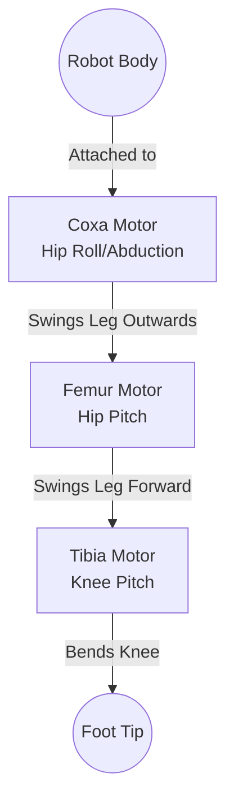

# Module 1: Mechanical Design Principles

Before writing any code, we must design the physical robot. For a quadruped (4-legged) robot, the design of the legs dictates everything else.

## Degrees of Freedom (DOF)

A "Degree of Freedom" refers to a single independent joint. In robotics, a standard, highly-capable quadruped leg has **3 DOF** (3 motors per leg, 12 motors total).

Here is the standard naming convention for those 3 joints:

### Why 3 DOF?
- **1 DOF (Knee only)**: Can only bounce up and down.
- **2 DOF (Hip Pitch + Knee)**: Can walk forward and backward, but cannot turn easily or sidestep.
- **3 DOF (Hip Roll + Hip Pitch + Knee)**: The foot can reach any (X, Y, Z) coordinate in a 3D hemisphere below the hip. The robot can strafe (sidestep), turn in place, and adjust its roll/pitch dynamically.

## Direct Drive vs. Linkages

When attaching the Tibia (lower leg) to the Femur (upper leg), you have two choices for where to put the Tibia motor:

1.  **Direct Drive**: The Tibia motor is mounted exactly at the knee joint.
    *   *Pros*: Mechanically very simple to build and design.
    *   *Cons*: The Femur motor has to lift the heavy weight of the Tibia motor. This drastically increases the torque required at the hip.
2.  **Linkage (Parallel Mechanism)**: Both the Femur and Tibia motors are mounted together at the hip. A solid rod (linkage) runs down the Femur to actuate the knee.
    *   *Pros*: Keeps the heavy motors close to the robot's body. The legs are lightweight, allowing for much faster swinging and jumping.
    *   *Cons*: Mechanically complex. The math for Inverse Kinematics becomes much harder because the knee angle depends on a triangle formed by the linkage.

*Recommendation for beginners*: Stick to **Direct Drive** using standard RC servos for your first build to simplify the math.

## Center of Mass (CoM)

The Center of Mass is the point where the robot perfectly balances. 
For a quadruped, you want the CoM to be exactly in the dead-center of the body.

If you place the heavy LiPo battery at the very back of the robot:
1.  The rear motors will have to work twice as hard to lift the robot.
2.  The front motors will have barely any traction.
3.  When the robot tries to walk, the uneven weight distribution will cause it to fall over.

**Design Rule**: Always design your CAD chassis so the Battery, Raspberry Pi, and STM32 are centrally located.

## 📺 Recommended Viewing
*   Search YouTube for: `"James Bruton open dog build"` - James is a master of 3D printed robotics and explains linkages and CoM brilliantly.
*   Search YouTube for: `"MIT Mini Cheetah design"` - To see the gold standard of professional 3 DOF leg design.
