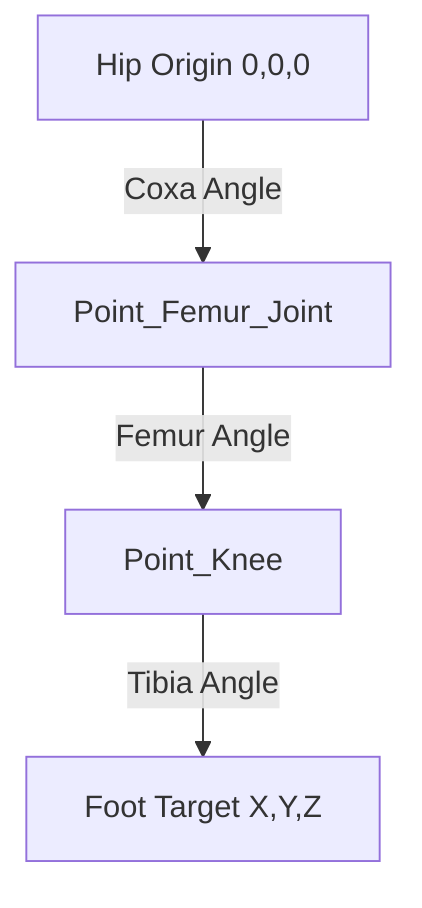

# Module 1: Inverse Kinematics (IK)

Inverse Kinematics is the most important mathematical concept for making a legged robot walk. It is the exact opposite of Forward Kinematics.

## What is Inverse Kinematics (IK)?

**Inverse Kinematics** asks the question:
> *"If I want the foot to be at a specific (X, Y, Z) coordinate, what angles do my 3 motors need to be at to reach that point?"*

When the Raspberry Pi decides the robot needs to take a step forward, it doesn't calculate angles directly. It calculates a path through the air. For example:
1. Lift foot to (X: 0, Y: -50, Z: 50)
2. Move foot forward to (X: 100, Y: -50, Z: 50)
3. Put foot down at (X: 100, Y: -100, Z: 50)

The IK algorithm takes these (X,Y,Z) targets and converts them into the exact angles (e.g., Coxa: 10°, Femur: 45°, Tibia: -30°) to send to the STM32.

## The Math (3 DOF Leg)

Calculating IK for a 3 DOF leg requires spatial geometry and the **Law of Cosines**.



### Step 1: The Coxa Angle (Hip Roll)
Look at the leg from top-down. We only care about the X and Z axes to find the roll angle.
We can use the `atan2` function (ArcTangent) available in Python:
`Coxa_Angle = atan2(Z, X)`

### Step 2: The Femur and Tibia Angles
Once the Coxa is rotated to face the target, we can treat the rest of the leg as a 2D problem (just a triangle formed by the Hip, Knee, and Foot).

Let $D$ be the straight-line distance from the Hip joint to the Foot target.
Using the **Law of Cosines**: $c^2 = a^2 + b^2 - 2ab \cdot \cos(C)$

We can solve for the Tibia (Knee) angle:
`cos_Tibia = (D^2 - FemurLength^2 - TibiaLength^2) / (2 * FemurLength * TibiaLength)`
`Tibia_Angle = acos(cos_Tibia)`

Then we solve for the Femur (Hip Pitch) angle using a combination of `atan2` and `acos`.

## Implementation in Python

You will write a Python function on the Raspberry Pi that looks like this:

```python
import math

def calculate_IK(x, y, z):
    # ... trig math happens here ...
    return coxa_angle, femur_angle, tibia_angle
```

This function will be called hundreds of times a second as the robot walks.

## 📺 Recommended Viewing
*   Search YouTube for: `"Inverse Kinematics quadruped math"` - There are excellent whiteboard animations breaking down the Law of Cosines for robot legs.
*   Search YouTube for: `"Spot Micro Inverse Kinematics Python"`
