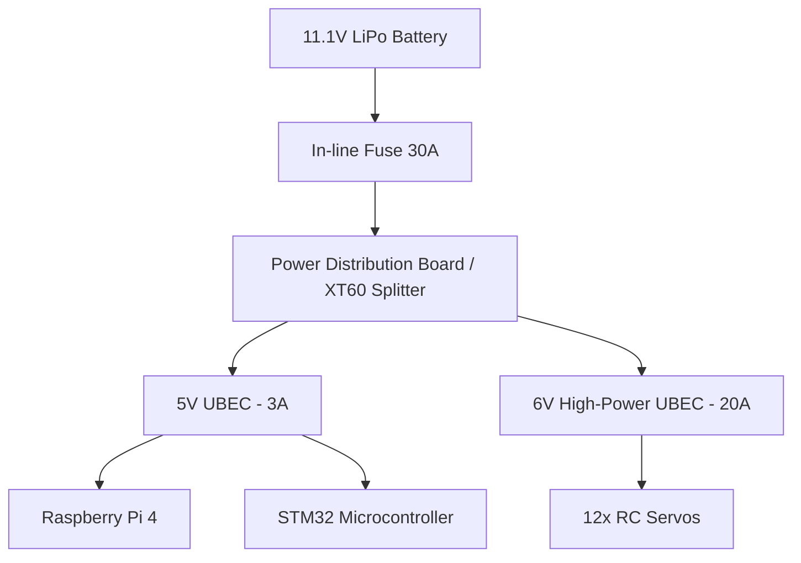

# Module 1: Power Distribution & Safety

A 12-motor legged robot draws a massive amount of electrical current. If you wire this incorrectly, your robot will brown-out (reset constantly) or, worse, catch fire.

## The Power Source: LiPo Batteries

Robots use **Lithium Polymer (LiPo)** batteries because they can discharge huge amounts of current very quickly.

### Voltage (S Rating)
*   `2S` = 7.4 Volts
*   `3S` = 11.1 Volts
*   `4S` = 14.8 Volts
*   *Choosing*: Most standard RC servos run on 5V to 7.4V. If you use 2S, you might be able to power high-voltage servos directly. If you use 3S or 4S (for longer battery life or BLDC motors), you **must** step the voltage down for the servos.

### Current (C Rating)
The C rating tells you how fast the battery can dump its energy.
`Max Continuous Current = Capacity (Ah) × C-Rating`
*Example*: A 2200mAh (2.2Ah) battery with a 20C rating can safely output `2.2 × 20 = 44 Amps`. 12 stalled servos can easily draw 20+ Amps, so ensure your C-Rating is high enough!

## Voltage Regulation (UBEC / Buck Converters)

The Raspberry Pi needs exactly 5V (and at least 3 Amps).
The STM32 needs 3.3V or 5V (very low Amps).
The Servos might need 6V (drawing 15+ Amps total).

**You cannot power the servos from the Raspberry Pi or the STM32's 5V pin.** The current draw will instantly fry the microcontrollers.

You must use a **UBEC (Universal Battery Eliminator Circuit)** or a high-power Buck Converter to step the battery's 11.1V down to the safe 5V/6V needed by your components.

### Wiring Architecture (The Star Topology)

**Crucial Rule**: The *Ground (GND)* wires of the Pi, the STM32, and the Servos **MUST** all be connected together. If they do not share a common ground, the data signals (UART, PWM) will not work, and the robot will twitch violently.

## Safety Warnings
1.  **Never puncture a LiPo battery.** It will ignite.
2.  **Never over-discharge a LiPo.** If a cell drops below 3.2V, the battery is permanently damaged. Buy a cheap "LiPo Voltage Alarm" and plug it into the balance lead while running the robot.
3.  **Wire Gauge (AWG)**: Use thick wires (e.g., 14 AWG or 16 AWG) between the battery and the Servo UBEC. Thin wires will melt under a 20 Amp load.

## 📺 Recommended Viewing
*   Search YouTube for: `"LiPo battery safety guide for drones"`
*   Search YouTube for: `"How to wire UBEC drone"`
