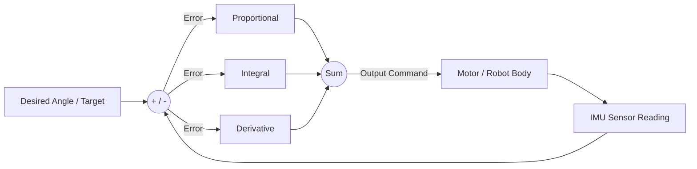

# Module 2: PID Control Theory

PID (Proportional, Integral, Derivative) is the mathematical heart of all control systems. If you want your robot to balance perfectly, or if you use advanced BLDC motors, you must understand PID.

*(Note: Standard cheap RC Servos have a PID controller built into their internal chip. However, the STM32 will still need a software PID loop to balance the entire robot body using the IMU data).*

## The Problem: Overshoot and Oscillation

Imagine you are driving a car and want to stop exactly at a stop sign.
*   If you slam the brakes too late, you blow past it (Overshoot).
*   If you then throw it in reverse and slam the gas, you blow past it backwards (Oscillation).

A PID controller looks at the **Error** (the distance between where you are and where you want to be) and calculates exactly how hard to press the gas/brakes to stop perfectly on the line.

## The Three Components

Let's break down the formula: `Output = (Kp * Error) + (Ki * Integral) + (Kd * Derivative)`

### 1. P (Proportional) - "The Present"
*   **What it does**: Pushes harder the further away you are from the target. 
*   *Analogy*: If you are 100 feet from the stop sign, press the gas hard. If you are 5 feet away, press it gently.
*   *The Catch*: If you only use P, the robot will likely overshoot the target and vibrate back and forth forever.

### 2. D (Derivative) - "The Future"
*   **What it does**: Looks at the *rate of change* (how fast you are approaching the target) and acts as a dampener or brake.
*   *Analogy*: "I see the stop sign approaching very quickly, I better start easing off the gas now so I don't overshoot."
*   *The Catch*: D makes the movement smooth and kills the vibrations caused by P. But if D is too high, the robot moves very sluggishly.

### 3. I (Integral) - "The Past"
*   **What it does**: Adds up the error over time. It fixes steady-state errors (when the robot is stuck just slightly off-target).
*   *Analogy*: The robot stopped 1 inch short of the line. P isn't pushing hard enough to overcome friction. Over time, 'I' builds up and gives it that final little nudge to reach the exact line.
*   *The Catch*: If 'I' is too high, it builds up too much energy ("integral windup") and causes massive, violent oscillations.

## How to Tune a PID Loop (The Standard Method)

When writing a balance controller for the robot's body pitch/roll:
1.  Set **Ki** and **Kd** to zero.
2.  Slowly increase **Kp** until the robot starts to oscillate (vibrate back and forth) around the balance point.
3.  Cut **Kp** in half.
4.  Slowly increase **Kd** until the oscillation completely stops and the robot feels "stiff" when you push it.
5.  If the robot droops slightly under its own weight, add a tiny bit of **Ki** to pull it perfectly level.

## 📺 Recommended Viewing
*   Search YouTube for: `"PID Control - A brief introduction"` (Brian Douglas has the best control theory videos).
*   Search YouTube for: `"Drone PID tuning explained"`
