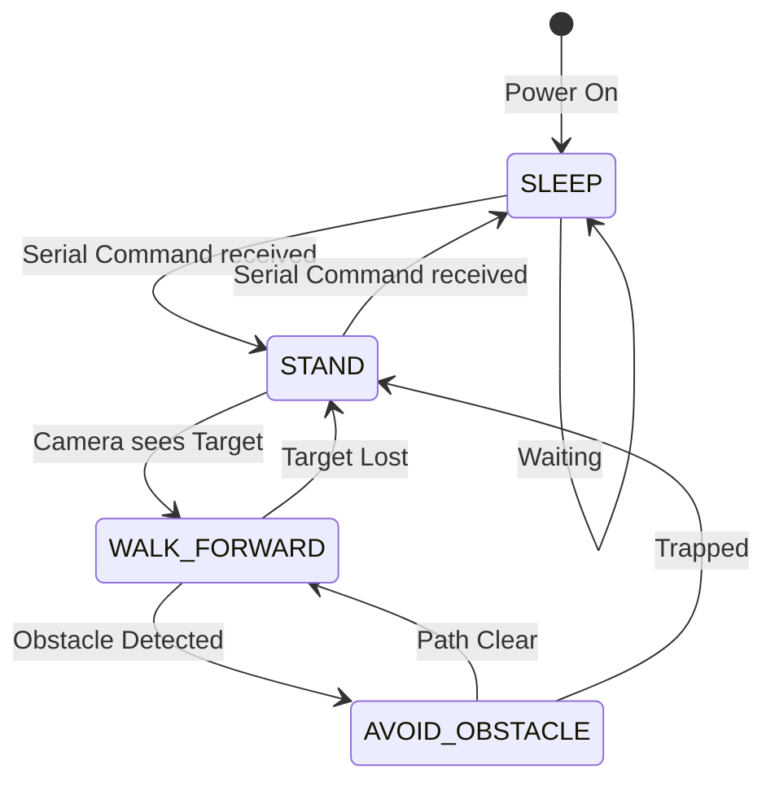

# Module 3: State Machine Architecture

A robot cannot just execute code in a straight line from top to bottom. It must constantly react to its environment, changing its behavior based on sensor inputs, camera vision, or battery levels.

To organize this logic, we use a **Finite State Machine (FSM)**.

## What is a State Machine?

A State Machine ensures the robot is only ever doing exactly one task at a time (a "State"). It defines strict rules (Transitions) for how the robot moves from one state to another.

For our quadruped, a basic state machine might look like this:



### Why use an FSM?
If you just write a massive block of `if/else` statements, your code will eventually become "spaghetti". The robot might accidentally try to Walk and Sleep at the same time, leading to unpredictable crashes.

By organizing code into States, you isolate the logic.
*   If `State == SLEEP`: The Pi stops running Inverse Kinematics math, stops sending UART commands to the STM32, and simply polls the network for a wake-up command.
*   If `State == WALK_FORWARD`: The Pi ignores everything else and focuses solely on calculating the Trot gait and tracking the camera target.

## Implementing an FSM in Python

You will write a `main.py` script on the Raspberry Pi that looks conceptually like this:

```python
import time

# Define our states
STATE_SLEEP = 0
STATE_STAND = 1
STATE_TRACK = 2

current_state = STATE_SLEEP

def loop():
    global current_state
    
    while True:
        # 1. Read Inputs (Camera, Network, Serial from STM32)
        vision_data = camera.read()
        
        # 2. Execute current state logic & Check for transitions
        if current_state == STATE_SLEEP:
            if network.received("WAKE"):
                current_state = STATE_STAND
                
        elif current_state == STATE_STAND:
            stm32.send_command("STAND_TALL")
            if vision_data.target_found:
                current_state = STATE_TRACK
                
        elif current_state == STATE_TRACK:
            # Calculate Kinematics to walk towards the target
            calculate_kinematics(vision_data.x, vision_data.y)
            if not vision_data.target_found:
                current_state = STATE_STAND
                
        # 3. Keep the loop running fast
        time.sleep(0.01)

if __name__ == "__main__":
    loop()
```

## 📺 Recommended Viewing
*   Search YouTube for: `"State Machines in Python"`
*   Search YouTube for: `"How Boston Dynamics programs robots (State Machines)"`
