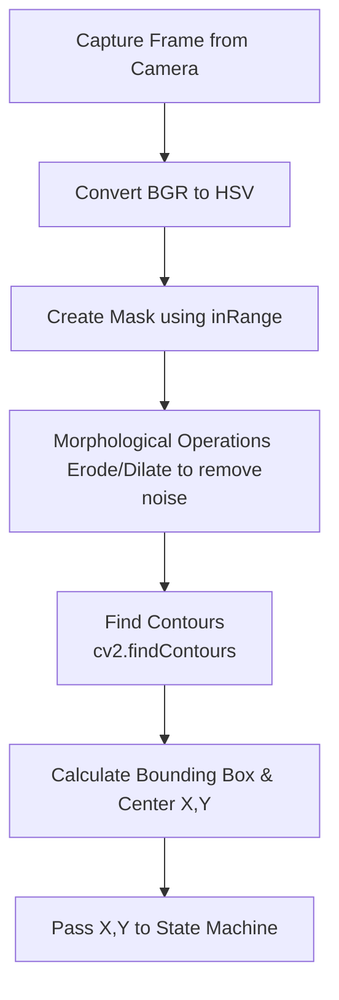

# Module 4: OpenCV Fundamentals

Computer Vision allows the robot to interact with its environment. Without it, the robot is just blindly walking forward. The standard library for vision on the Raspberry Pi is **OpenCV**.

## How Images Work in Memory
To a computer, an image is just a massive matrix (grid) of numbers. 
A 1080p image is a matrix of 1920 columns by 1080 rows.

In standard BGR (Blue, Green, Red) format, each pixel contains 3 numbers, ranging from 0 to 255.
*   `[255, 0, 0]` = Pure Blue
*   `[255, 255, 255]` = White
*   `[0, 0, 0]` = Black

## Why RGB is Bad for Tracking (Use HSV!)
If you want the robot to track a "Red Ball", you might think you just search the matrix for pixels where Red is high and Green/Blue are low.
*The Problem*: As soon as a cloud blocks the sun, the shadow changes the RGB values of the ball. The "red" becomes "dark brownish-red", and your robot loses the target.

**The Solution: HSV (Hue, Saturation, Value)**
OpenCV can instantly convert the camera image into the HSV color space.
*   **Hue**: The actual color (0-179). Red is always around 0, regardless of lighting.
*   **Saturation**: How washed out the color is.
*   **Value (Brightness)**: How dark the shadow is.

By tracking the *Hue*, your robot can track the red ball perfectly in both bright sunlight and dark rooms.

## The Vision Pipeline

Here is the standard flowchart for object tracking in Python:



### The Code
```python
import cv2
import numpy as np

cap = cv2.VideoCapture(0)

# Define the lower and upper bounds of "Red" in HSV
lower_red = np.array([0, 120, 70])
upper_red = np.array([10, 255, 255])

while True:
    ret, frame = cap.read()
    hsv = cv2.cvtColor(frame, cv2.COLOR_BGR2HSV)
    
    # Create a binary mask (White where it sees red, Black everywhere else)
    mask = cv2.inRange(hsv, lower_red, upper_red)
    
    # Find the outlines of the white shapes
    contours, _ = cv2.findContours(mask, cv2.RETR_EXTERNAL, cv2.CHAIN_APPROX_SIMPLE)
    
    for contour in contours:
        if cv2.contourArea(contour) > 500: # Ignore tiny specs of dust
            x, y, w, h = cv2.boundingRect(contour)
            # Draw a green box around the ball
            cv2.rectangle(frame, (x, y), (x+w, y+h), (0, 255, 0), 2)
            
    cv2.imshow("Mask", mask)
    cv2.imshow("Frame", frame)
    if cv2.waitKey(1) == ord('q'): break
```

## 📺 Recommended Viewing
*   Search YouTube for: `"OpenCV Object Tracking HSV tutorial Python"`
*   Search YouTube for: `"Paul McWhorter OpenCV Raspberry Pi"` (The best teacher for absolute beginners).
