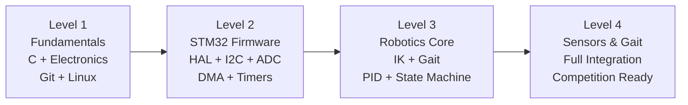

# FusionForce Master Robotics Curriculum
## RUNNER-4 | EN2533 BREACH PROTOCOL | STM32F411CEU6

Progress through these 4 levels to build full competency for autonomous quadruped development.
No computer vision — all perception is sensor-based (IR array, ToF, colour sensor, IMU).

## Curriculum Path

## Modules

| Level | Module | Topics | Time Estimate |
|-------|--------|---------|--------------|
| [Level 1](./Level_1_Fundamentals/README.md) | Fundamentals | C, Electronics, Git, STM32 setup | 2–3 weeks |
| [Level 2](./Level_2_STM32/README.md) | STM32 Firmware | HAL, I2C, ADC DMA, PCA9685, Timers | 2–3 weeks |
| [Level 3](./Level_3_Robotics/README.md) | Robotics Core | IK solver, trot gait, PD control | 2–3 weeks |
| [Level 4](./Level_4_Sensors_and_Gait/README.md) | Sensors & Integration | All sensors, HFSM, full mission | 1–2 weeks |

## What This Curriculum Does NOT Cover
- Computer vision / OpenCV — all RUNNER-4 perception uses hardware sensors
- Raspberry Pi — all logic runs on STM32F411CEU6
- ROS / ROS2 — bare-metal HAL only

---
🔙 **[Back to Main Repository README](../README.md)**
