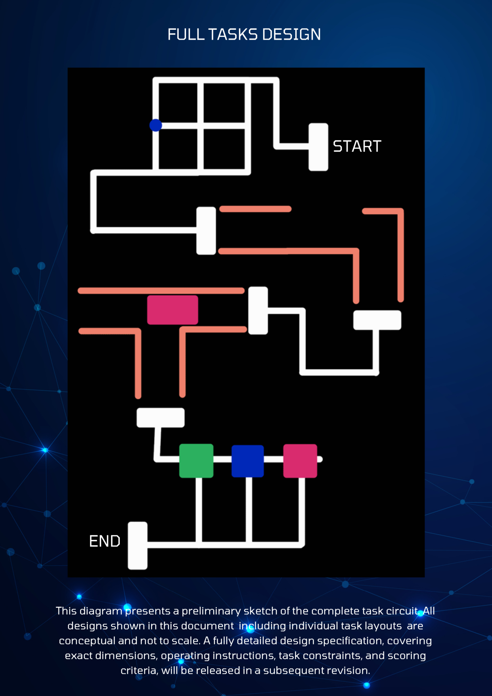
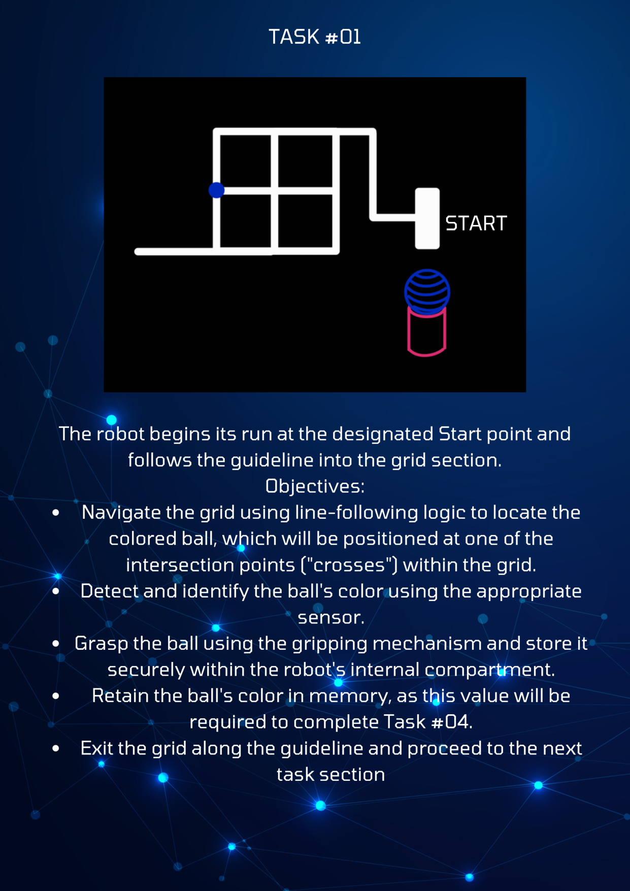
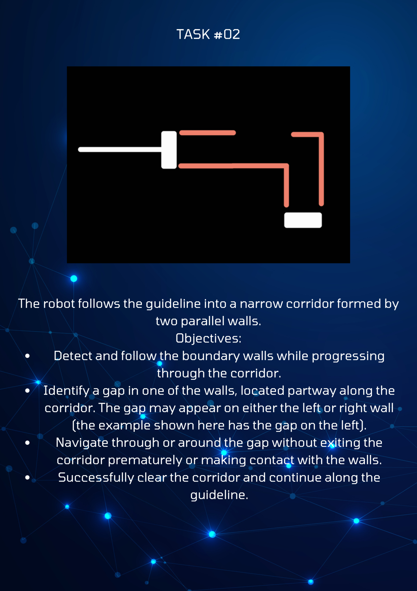
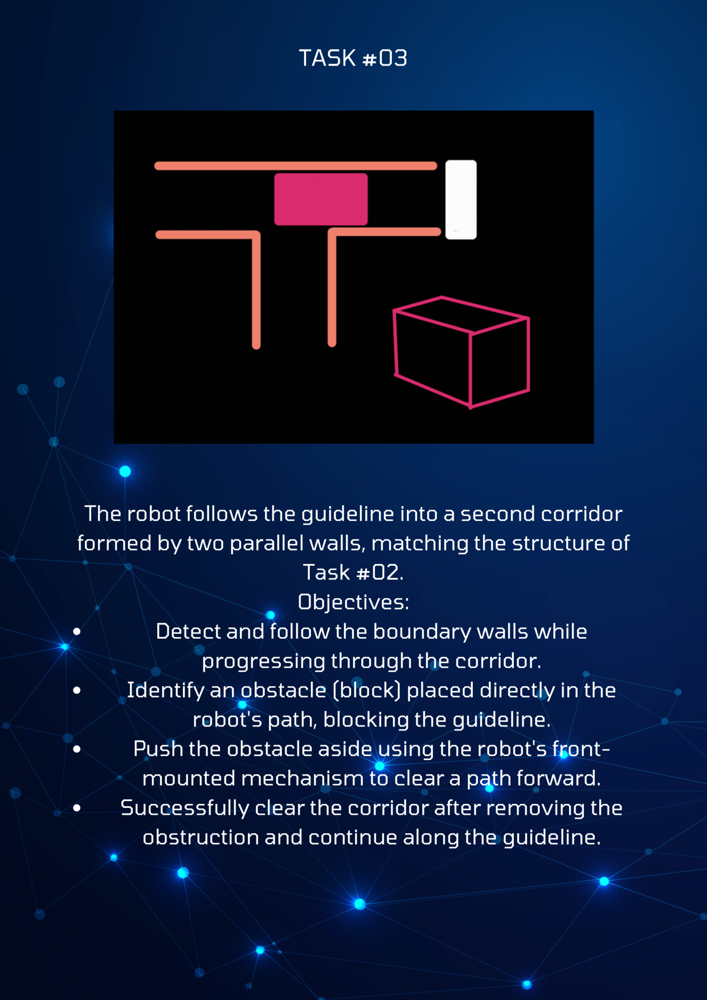
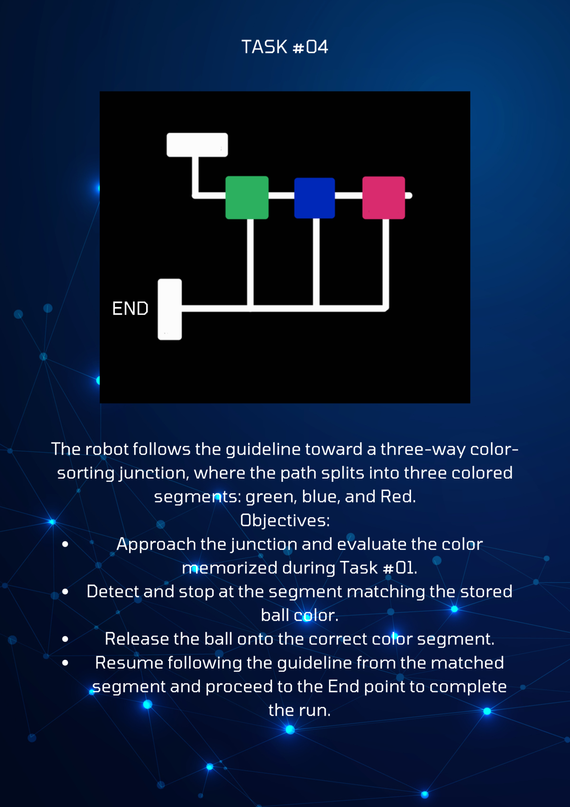

# IN24 EN2533 ROBOTIC DESIGN AND COMPETITION

## FULL TASKS DESIGN

This diagram presents a preliminary sketch of the complete task circuit. All designs shown in this document including individual task layouts are conceptual and not to scale. A fully detailed design specification, covering exact dimensions, operating instructions, task constraints, and scoring criteria, will be released in a subsequent revision.

## TASK #01

The robot begins its run at the designated Start point and follows the guideline into the grid section.

**Objectives:**
- Navigate the grid using line-following logic to locate the colored ball, which will be positioned at one of the intersection points ("crosses") within the grid.
- Detect and identify the ball's color using the appropriate sensor.
- Grasp the ball using the gripping mechanism and store it securely within the robot's internal compartment.
- Retain the ball's color in memory, as this value will be required to complete Task #04.
- Exit the grid along the guideline and proceed to the next task section

## TASK #02

The robot follows the guideline into a narrow corridor formed by two parallel walls.

**Objectives:**
- Detect and follow the boundary walls while progressing through the corridor.
- Identify a gap in one of the walls, located partway along the corridor. The gap may appear on either the left or right wall (the example shown here has the gap on the left).
- Navigate through or around the gap without exiting the corridor prematurely or making contact with the walls.
- Successfully clear the corridor and continue along the guideline.

## TASK #03

The robot follows the guideline into a second corridor formed by two parallel walls, matching the structure of Task #02.

**Objectives:**
- Detect and follow the boundary walls while progressing through the corridor.
- Identify an obstacle (block) placed directly in the robot's path, blocking the guideline.
- Push the obstacle aside using the robot's front-mounted mechanism to clear a path forward.
- Successfully clear the corridor after removing the obstruction and continue along the guideline.

## TASK #04

The robot follows the guideline toward a three-way color-sorting junction, where the path splits into three colored segments: green, blue, and Red.

**Objectives:**
- Approach the junction and evaluate the color memorized during Task #01.
- Detect and stop at the segment matching the stored ball color.
- Release the ball onto the correct color segment.
- Resume following the guideline from the matched segment and proceed to the End point to complete the run.
