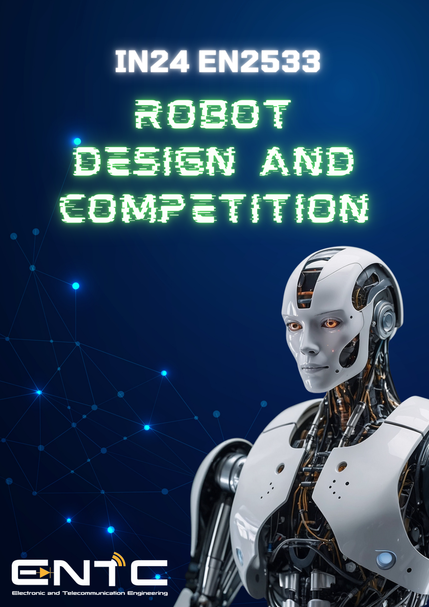
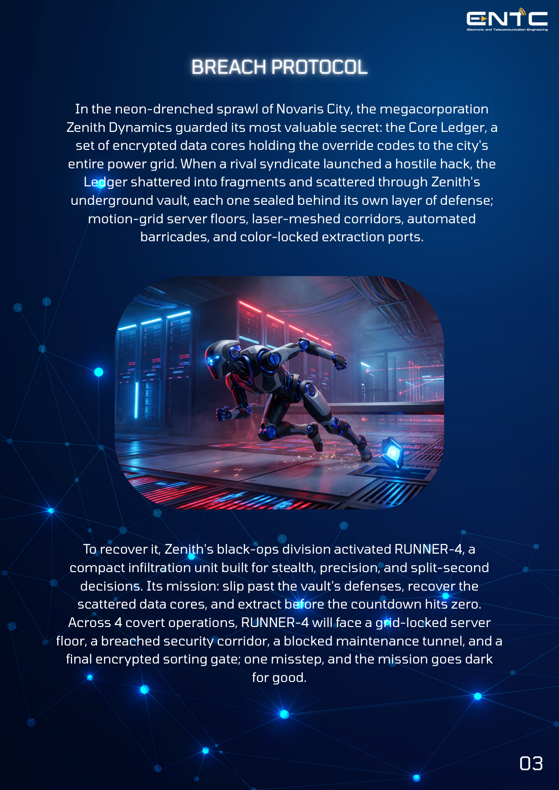
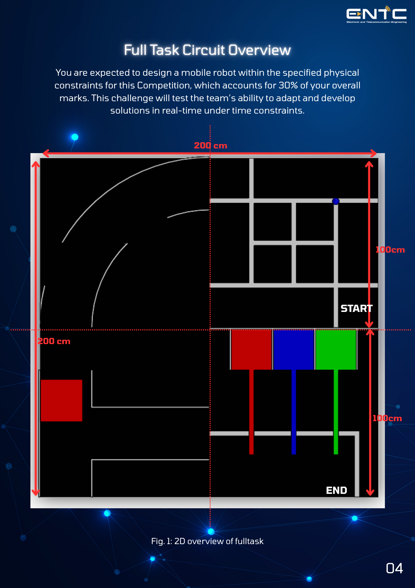
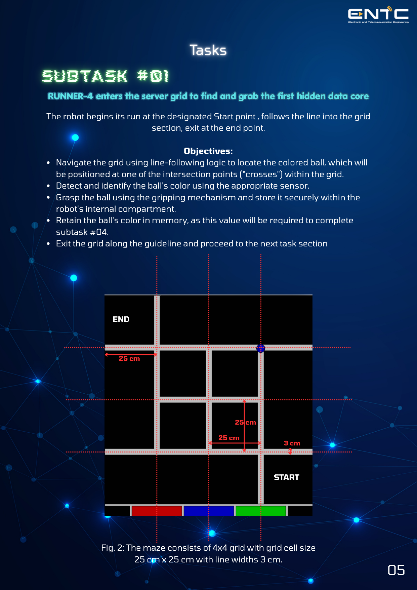
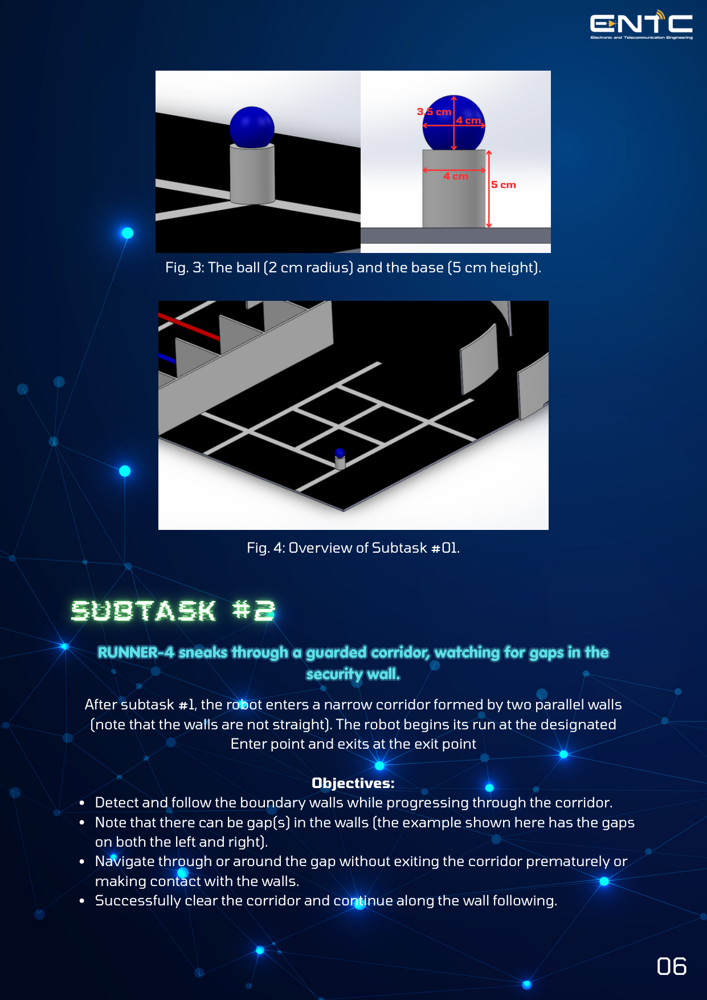
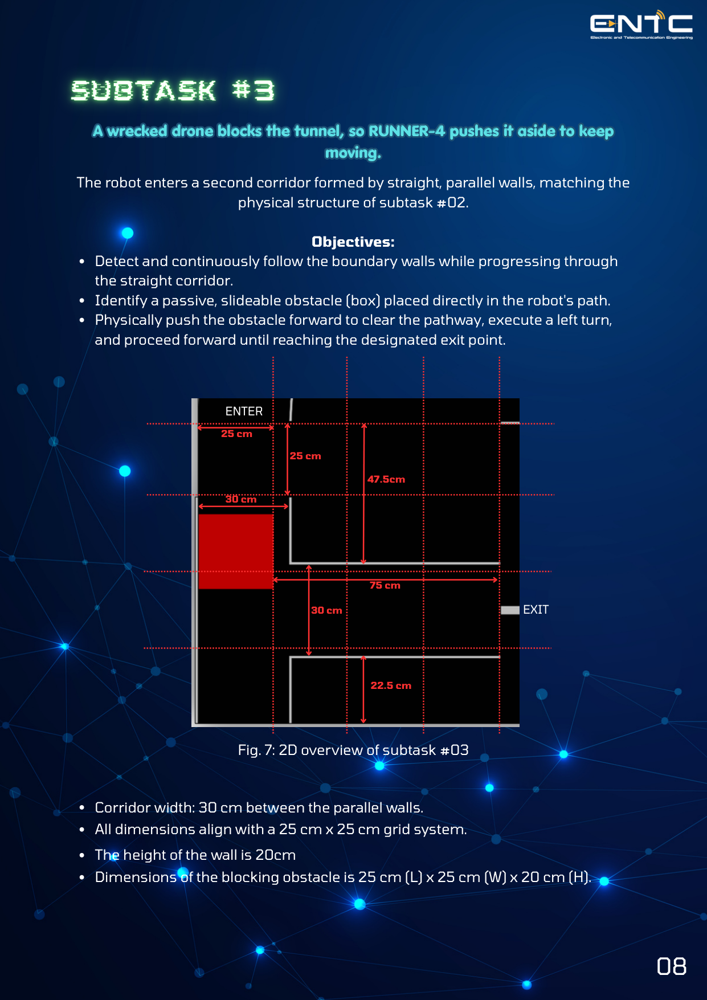
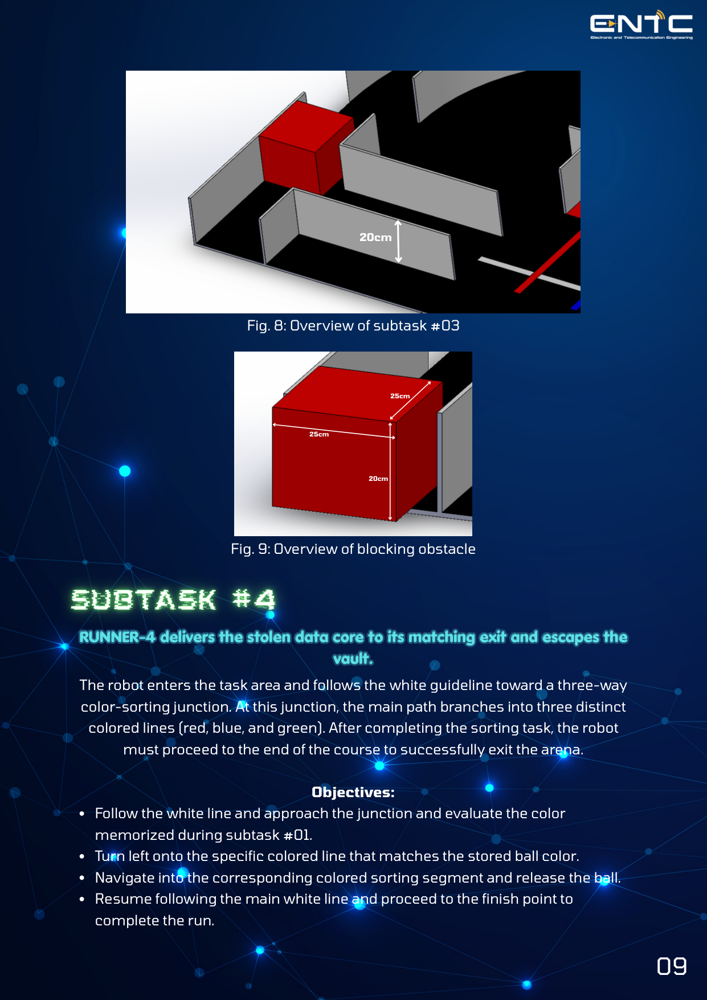
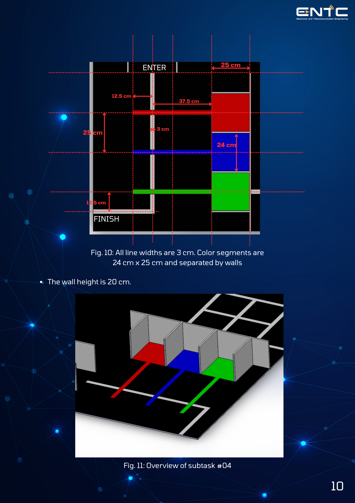
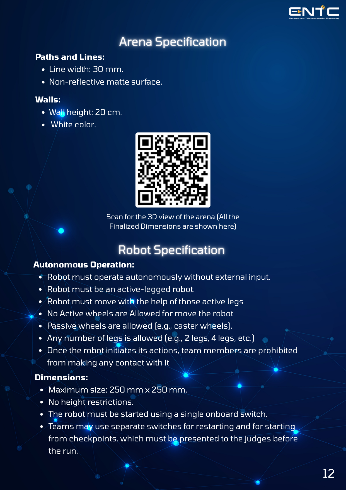
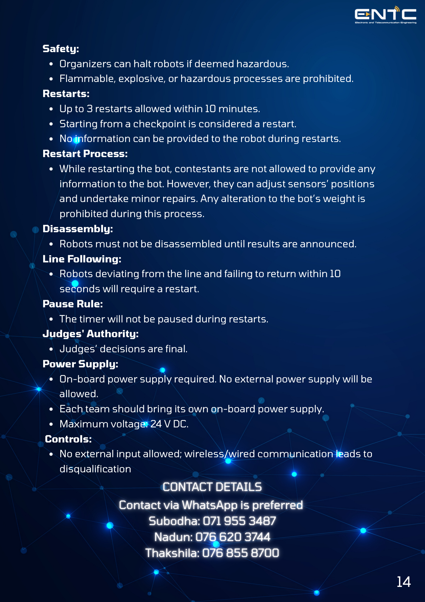

# IN24 EN2533 ROBOT DESIGN AND COMPETITION

## CONTENTS
- Introduction
- Full Task Circuit Overview
- SubTask #1
- SubTask #2
- SubTask #3
- SubTask #4
- Arena Specifications
- Robot Specifications
- Game Rules
- Contacts

## INTRODUCTION: BREACH PROTOCOL

In the neon-drenched sprawl of Novaris City, the megacorporation Zenith Dynamics guarded its most valuable secret: the Core Ledger, a set of encrypted data cores holding the override codes to the city's entire power grid. When a rival syndicate launched a hostile hack, the Ledger shattered into fragments and scattered through Zenith's underground vault, each one sealed behind its own layer of defense; motion-grid server floors, laser-meshed corridors, automated barricades, and color-locked extraction ports.

To recover it, Zenith's black-ops division activated RUNNER-4, a compact infiltration unit built for stealth, precision, and split-second decisions. Its mission: slip past the vault's defenses, recover the scattered data cores, and extract before the countdown hits zero. Across 4 covert operations, RUNNER-4 will face a grid-locked server floor, a breached security corridor, a blocked maintenance tunnel, and a final encrypted sorting gate; one misstep, and the mission goes dark for good.

## FULL TASK CIRCUIT OVERVIEW

You are expected to design a mobile robot within the specified physical constraints for this Competition, which accounts for 30% of your overall marks. This challenge will test the team’s ability to adapt and develop solutions in real-time under time constraints.

Dimensions: 
- Total Area: 200 cm x 200 cm
- Start/End Segments: 100 cm lengths

## SUBTASK #01

**RUNNER-4 enters the server grid to find and grab the first hidden data core**
The robot begins its run at the designated Start point, follows the line into the grid section, exit at the end point.

**Objectives:**
- Navigate the grid using line-following logic to locate the colored ball, which will be positioned at one of the intersection points ("crosses") within the grid.
- Detect and identify the ball's color using the appropriate sensor.
- Grasp the ball using the gripping mechanism and store it securely within the robot's internal compartment.
- Retain the ball's color in memory, as this value will be required to complete subtask #04.
- Exit the grid along the guideline and proceed to the next task section

*Grid Details:*
- The maze consists of 4x4 grid with grid cell size 25 cm x 25 cm with line widths 3 cm.
- Ball: 2 cm radius
- Base: 5 cm height, 4 cm diameter.

## SUBTASK #02

**RUNNER-4 sneaks through a guarded corridor, watching for gaps in the security wall.**
After subtask #1, the robot enters a narrow corridor formed by two parallel walls (note that the walls are not straight). The robot begins its run at the designated Enter point and exits at the exit point.

**Objectives:**
- Detect and follow the boundary walls while progressing through the corridor.
- Note that there can be gap(s) in the walls (the example shown here has the gaps on both the left and right).
- Navigate through or around the gap without exiting the corridor prematurely or making contact with the walls.
- Successfully clear the corridor and continue along the wall following.

*Corridor Details:*
- The corridor consists of curved walls with an arbitrary radius (Router and Rinner), maintaining a consistent width of 30 cm between the inner and outer walls.
- The height of the walls is 20 cm.
- All dimensions are aligned with a 25 cm x 25 cm dotted grid.

## SUBTASK #03

**A wrecked drone blocks the tunnel, so RUNNER-4 pushes it aside to keep moving.**
The robot enters a second corridor formed by straight, parallel walls, matching the physical structure of subtask #02.

**Objectives:**
- Detect and continuously follow the boundary walls while progressing through the straight corridor.
- Identify a passive, slideable obstacle (box) placed directly in the robot's path.
- Physically push the obstacle forward to clear the pathway, execute a left turn, and proceed forward until reaching the designated exit point.

*Details:*
- Corridor width: 30 cm between the parallel walls.
- All dimensions align with a 25 cm x 25 cm grid system.
- The height of the wall is 20 cm.
- Dimensions of the blocking obstacle is 25 cm (L) x 25 cm (W) x 20 cm (H).

## SUBTASK #04

**RUNNER-4 delivers the stolen data core to its matching exit and escapes the vault.**
The robot enters the task area and follows the white guideline toward a three-way color-sorting junction. At this junction, the main path branches into three distinct colored lines (red, blue, and green). After completing the sorting task, the robot must proceed to the end of the course to successfully exit the arena.

**Objectives:**
- Follow the white line and approach the junction and evaluate the color memorized during subtask #01.
- Turn left onto the specific colored line that matches the stored ball color.
- Navigate into the corresponding colored sorting segment and release the ball.
- Resume following the main white line and proceed to the finish point to complete the run.

*Details:*
- All line widths are 3 cm. Color segments are 24 cm x 25 cm and separated by walls.
- The wall height is 20 cm.

## ARENA SPECIFICATION

**Paths and Lines:**
- Line width: 30 mm.
- Non-reflective matte surface.

**Walls:**
- Wall height: 20 cm.
- White color.

## ROBOT SPECIFICATION

**Autonomous Operation:**
- Robot must operate autonomously without external input.
- Robot must be an active-legged robot.
- Robot must move with the help of those active legs.
- No Active wheels are Allowed for move the robot.
- Passive wheels are allowed (e.g., caster wheels).
- Any number of legs is allowed (e.g., 2 legs, 4 legs, etc.).
- Once the robot initiates its actions, team members are prohibited from making any contact with it.

**Dimensions:**
- Maximum size: 250 mm x 250 mm.
- No height restrictions.
- The robot must be started using a single onboard switch.
- Teams may use separate switches for restarting and for starting from checkpoints, which must be presented to the judges before the run.

## GAME RULES

**Stability:**
- The robot must demonstrate stability and stand independently at the starting zone when the run begins. Failure to meet this criterion will result in disqualification.

**Mechanisms:**
- Expansion during the run is allowed without damaging the arena.
- Robots must remain a single entity. (The robot cannot split into multiple units during gameplay.)
- It is strictly prohibited to leave behind any parts or marks while moving within the arena.

**Components:**
- Pre-made microcontroller boards and sensor kits allowed.
- Wireless modules, ready-made Lego kits, and off-the-shelf kits are prohibited.

**Starting Procedure:**
- Simple starting procedure without manual force.

**Team Limit:**
- One robot per team.

**Submission and Preparation:**
- Robots must be submitted before the competition starts.
- 2 minutes for hardware adjustments and calibration procedures, if necessary. No code modifications allowed.

**Time Limit:**
- Maximum task completion time: 15 minutes.

**Arena Damage:**
- Robots must not damage the arena.

**Equipment:**
- No external items allowed inside the arena.
- Electronic devices like laptops and personal computers must be turned off.
- The organizers retain the right to inspect these devices, their usage, and disqualify teams accordingly.

**Safety:**
- Organizers can halt robots if deemed hazardous.
- Flammable, explosive, or hazardous processes are prohibited.

**Restarts:**
- Up to 3 restarts allowed within 10 minutes.
- Starting from a checkpoint is considered a restart.
- No information can be provided to the robot during restarts.

**Restart Process:**
- While restarting the bot, contestants are not allowed to provide any information to the bot. However, they can adjust sensors’ positions and undertake minor repairs. Any alteration to the bot’s weight is prohibited during this process.

**Disassembly:**
- Robots must not be disassembled until results are announced.

**Line Following:**
- Robots deviating from the line and failing to return within 10 seconds will require a restart.

**Pause Rule:**
- The timer will not be paused during restarts.

**Judges' Authority:**
- Judges’ decisions are final.

**Power Supply:**
- On-board power supply required. No external power supply will be allowed.
- Each team should bring its own on-board power supply.
- Maximum voltage: 24 V DC.

**Controls:**
- No external input allowed; wireless/wired communication leads to disqualification.

## CONTACT DETAILS
Contact via WhatsApp is preferred
- Subodha: 071 955 3487
- Nadun: 076 620 3744
- Thakshila: 076 855 8700
