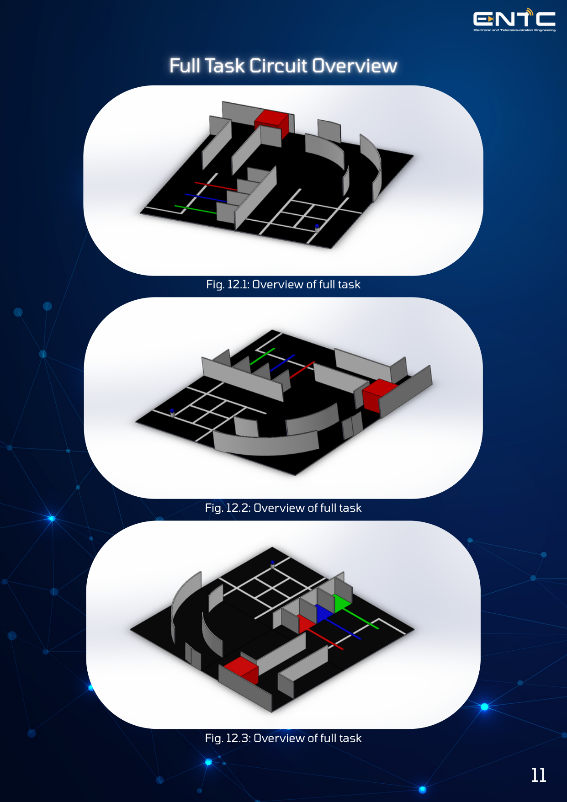
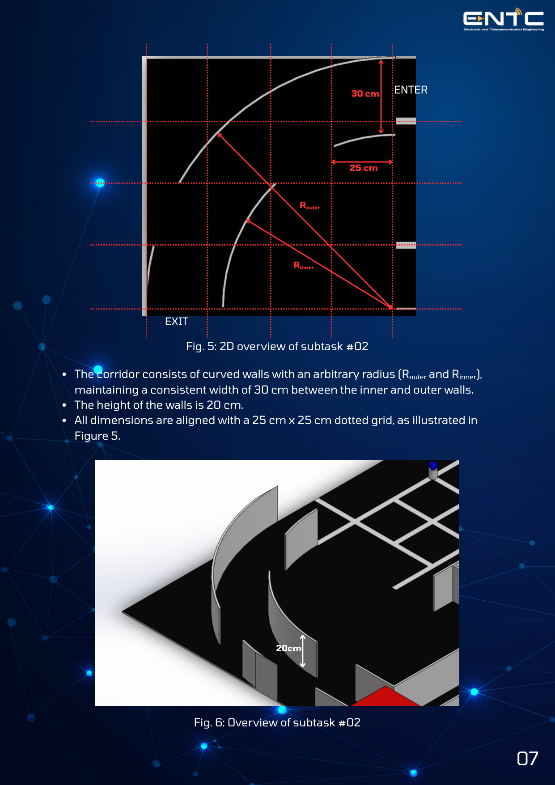
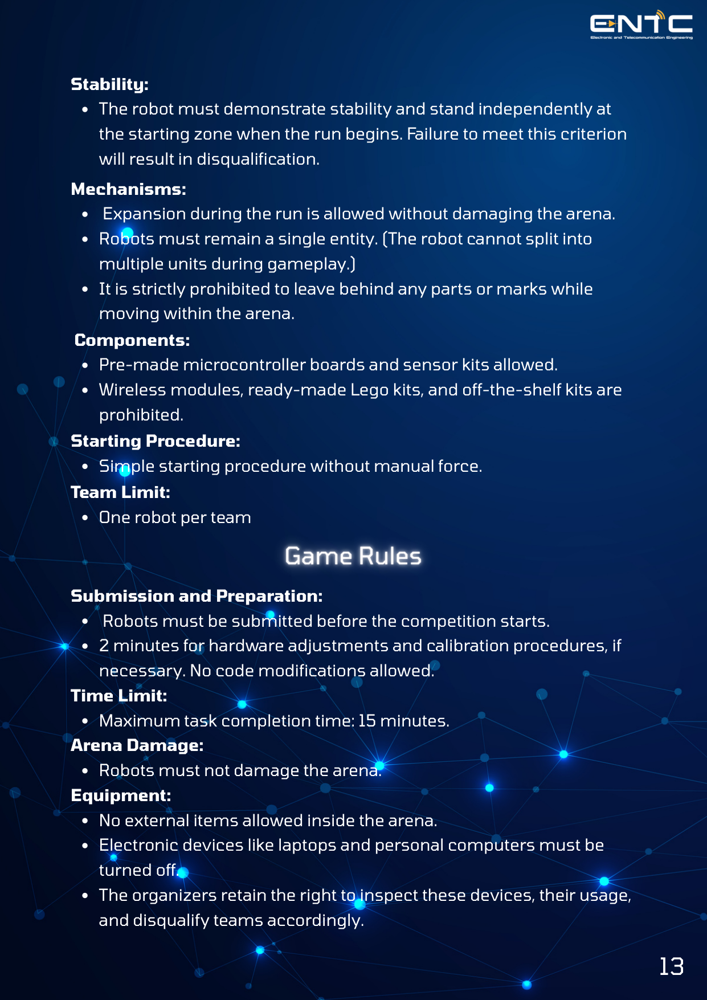

# IN24 EN2533 ROBOTIC DESIGN AND COMPETITION

## FULL TASK CIRCUIT OVERVIEW

You are expected to design a mobile robot within the specified physical constraints for this Competition, which accounts for 30% of your overall marks. This challenge will test the team’s ability to adapt and develop solutions in real-time under time constraints.

## SUBTASK #01

**RUNNER-4 enters the server grid to find and grab the first hidden data core**

The robot begins its run at the designated Start point, follows the line into the grid section, exit at the end point.

**Objectives:**
- Navigate the grid using line-following logic to locate the colored ball, which will be positioned at one of the intersection points ("crosses") within the grid.
- Detect and identify the ball's color using the appropriate sensor.
- Grasp the ball using the gripping mechanism and store it securely within the robot's internal compartment.
- Retain the ball's color in memory, as this value will be required to complete subtask #04.
- Exit the grid along the guideline and proceed to the next task section

## SUBTASK #02

**RUNNER-4 sneaks through a guarded corridor, watching for gaps in the security wall.**

After subtask #1, the robot enters a narrow corridor formed by two parallel walls (note that the walls are not straight). The robot begins its run at the designated Enter point and exits at the exit point.

**Objectives:**
- Detect and follow the boundary walls while progressing through the corridor.
- Note that there can be gap(s) in the walls (the example shown here has the gaps on both the left and right).
- Navigate through or around the gap without exiting the corridor prematurely or making contact with the walls.
- Successfully clear the corridor and continue along the wall following.

## SUBTASK #03

**A wrecked drone blocks the tunnel, so RUNNER-4 pushes it aside to keep moving.**

The robot enters a second corridor formed by straight, parallel walls, matching the physical structure of subtask #02.

**Objectives:**
- Detect and continuously follow the boundary walls while progressing through the straight corridor.
- Identify a passive, slideable obstacle (box) placed directly in the robot's path.
- Physically push the obstacle forward to clear the pathway, execute a left turn, and proceed forward until reaching the designated exit point.

## SUBTASK #04

**RUNNER-4 delivers the stolen data core to its matching exit and escapes the vault.**

The robot enters the task area and follows the white guideline toward a three-way color-sorting junction. At this junction, the main path branches into three distinct colored lines (red, blue, and green). After completing the sorting task, the robot must proceed to the end of the course to successfully exit the arena.

**Objectives:**
- Follow the white line and approach the junction and evaluate the color memorized during subtask #01.
- Turn left onto the specific colored line that matches the stored ball color.
- Navigate into the corresponding colored sorting segment and release the ball.
- Resume following the main white line and proceed to the finish point to complete the run.

## ARENA & ROBOT SPECIFICATIONS

## GAME RULES

