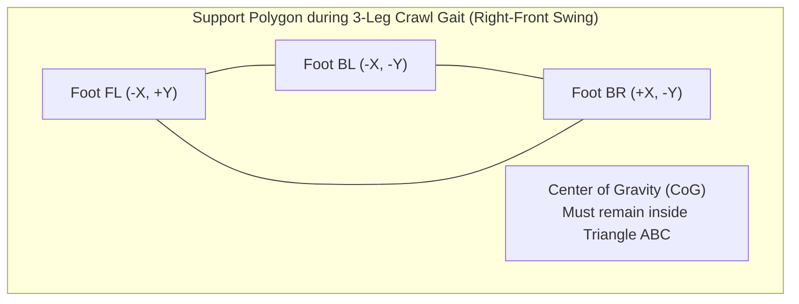

# 01. Mechanical Design, Kinematics & Physical Layout

## 1. Executive Summary & Robot Architecture

The **FusionForce Quadruped** is an autonomous 12-DOF (Degree of Freedom) 3D-printed quadrupedal robot engineered specifically to compete in the multi-stage autonomous robotics competition (`Task/tasks_circuit_v1.md`). 

### Key Capabilities
- **12 Leg Servos (3 DOF per leg):** Allows full 3D foot tip trajectory control $(x, y, z)$, body pitch/roll/yaw attitude leveling, and high-torque crawl/trot gaits.
- **2-Servo Front Manipulator & Ventral Retention Cage:** Enables grasping colored balls at grid intersections (Task #01), secure belly storage during corridor traversal (Task #02 & #03), and precise release at the color-sorting junction (Task #04).
- **Front Bumper Shield:** Protects the gripper mechanism while allowing physical displacement of obstacle blocks in narrow corridors (Task #03).
- **Low-Center-of-Gravity (CoG) Stacked Chassis:** Houses a 3S LiPo battery at the base, low-level motor/sensor electronics (STM32 Black Pill + PCA9685) in the middle tier, and high-level AI/vision processing (Raspberry Pi 4B) on the top tier.

---

## 2. Servo Selection Guide & Torque Feasibility Analysis

A critical mechanical design decision is selecting the right servo motors for the 12 leg joints and 2 arm joints.

### 2.1 Physics & Torque Derivation
When walking using a standard **Trot Gait** (2 diagonal legs in stance, 2 swinging), each stance leg supports roughly **50% of the robot's total weight**. In a **Crawl Gait** (3 stance legs, 1 swinging), each leg supports **33%**.

Let $W$ be the total operational weight of the robot (~0.85 kg nominal with hybrid servos and battery).
Let $L_{\text{ext}}$ be the maximum horizontal extension of the leg moment arm from the Hip Pitch (Femur) joint to the foot contact patch ($L_{\text{ext}} \approx 6.0\text{ cm}$).

$$\tau_{\text{static}} = \left(\frac{W}{2}\right) \times L_{\text{ext}} = 0.425\text{ kg} \times 6.0\text{ cm} = 2.55\text{ kg}\cdot\text{cm}$$

Applying a mandatory **$2.0\times$ Dynamic Safety Factor** to account for vertical acceleration, foot impact loads, inertia, and pushing obstacle blocks in Task #03:

$$\tau_{\text{required}} = 2.0 \times \tau_{\text{static}} = 5.10\text{ kg}\cdot\text{cm per lifting joint}$$

### 2.2 Why MG90 Servos Are Insufficient for Leg Lifting Joints
- **MG90 Specifications:** Rated at **1.8 to 2.2 kg·cm** at 6.0V.
- **Result:** Using MG90 servos on the Femur (Hip Pitch) and Tibia (Knee Pitch) joints results in thermal overload, continuous gear stripping, stalling, and severe positional jitter under an 0.85 kg payload.

### 2.3 Recommended Configurations

We support two distinct engineering configurations:

```
+-------------------------------------------------------------------------------+
|                      RECOMMENDED SERVO CONFIGURATIONS                          |
+-------------------------------------------------------------------------------+
| OPTION A: ALL-METAL HEAVY DUTY (Max Torque & Durability)                      |
|  - 12 x DS3218 / DS3225 (20-25 kg*cm, 60g each)                               |
|  - Total Servo Weight: ~720g | Total Robot Weight: ~1100g                     |
|  - Excellent for pushing heavy obstacle blocks; requires 10A+ UBEC.           |
+-------------------------------------------------------------------------------+
| OPTION B: LIGHTWEIGHT HYBRID (Recommended Competition Profile)                |
|  - 8 x MG996R (10 kg*cm, 55g each) -> All Femur & Tibia (Lifting Joints)      |
|  - 4 x MG90 (2.2 kg*cm, 9g each)   -> All Coxa (Hip Yaw - Low Load Joints)    |
|  - 2 x MG90 (2.2 kg*cm, 9g each)   -> Front Arm/Gripper (Light Ball Load)     |
|  - Total Servo Weight: ~494g | Total Robot Weight: ~850g                      |
|  - Saves ~226g of top/front weight; lowers overall inertia and battery draw.  |
+-------------------------------------------------------------------------------+
```

| Parameter | Option A (DS3218 / DS3225) | Option B (Hybrid MG996R + MG90) **[RECOMMENDED]** |
| :--- | :--- | :--- |
| **Femur / Tibia Servos** | DS3218 (20 kg·cm @ 6.8V) | MG996R (10 kg·cm @ 6.0V) |
| **Coxa (Hip Yaw) Servos** | DS3218 (20 kg·cm) | MG90 Micro (2.2 kg·cm @ 6.0V) |
| **Arm / Gripper Servos** | MG996R (10 kg·cm) | MG90 Micro (2.2 kg·cm @ 6.0V) |
| **Total Servo Mass** | 720g | 494g |
| **Safety Margin (Lifting)** | **~4.0 ×** | **~2.0 ×** |
| **Power Bus Draw (Peak)** | ~8.5A @ 6.0V | ~5.2A @ 6.0V |

---

## 3. Physical Layout & Component Packaging

To maintain stability during high-speed grid turns and corridor maneuvers, components are arranged in a **vertical 3-tier deck** centered around the geometric center of the four hips.

```
                      SIDE VIEW CHASSIS PACKAGING STACK
                      
       +-------------------------------------------------------------+
       |   TOP DECK: Raspberry Pi 4B (AI, OpenCV, State Machine)     |
       +-------------------------------------------------------------+
          |         |                 |                      |
       +-------------------------------------------------------------+
       |   MID DECK: STM32F401 Black Pill + PCA9685 + UBEC / Buck    |
       +-------------------------------------------------------------+
          |         |                 |                      |
       +-------------------------------------------------------------+
       |   BOTTOM DECK: 3S LiPo Battery (11.1V, 1200mAh - Low CoG)   |
       +-------------------------------------------------------------+
          /     \                                               /     \
    +--------+ +--------+                                 +--------+ +--------+
    |  LEG   | |  LEG   |  <-- 3-DOF Legs (Coxa/Femur/    |  LEG   | |  LEG   |
    |  FL    | |  BL    |      Tibia joints)              |  FR    | |  BR    |
    +--------+ +--------+                                 +--------+ +--------+
```

### 3.1 Component Placement Table

| Subsystem | Exact Physical Location | Engineering Justification |
| :--- | :--- | :--- |
| **3S LiPo Battery** | Bottom Deck (centered at $(x=0, y=0, z=5\text{ mm})$) | Heaviest single component (~115g); placing at bottom center minimizes rollover torque and maximizes static stability margin. |
| **STM32F401 + PCA9685** | Middle Deck ($(z=35\text{ mm})$) | Shortest possible PWM wire runs to the 12 leg servos; isolates logic from high-current servo cables. |
| **Raspberry Pi 4B** | Top Deck ($(z=65\text{ mm})$) | Easy access to SD card, USB ports, and CSI camera ribbon; elevates status LEDs and Wi-Fi antenna. |
| **Camera Module** | Front Center ($(x=+100\text{ mm}, y=0, z=60\text{ mm})$), tilted **-40°** downward | -40° tilt allows viewing **both** floor guidelines (30–80 cm ahead) and colored balls/wall gaps/obstacle blocks simultaneously. |
| **ToF Sensor Front (`VL53L0X`)** | Front Bumper Center ($(x=+110\text{ mm}, y=0, z=25\text{ mm})$), **0°** horizontal | Detects obstacle blocks in Task #03 ($d_{\text{front}} < 150\text{ mm}$) and wall head-on distance. |
| **ToF Sensor Left (`VL53L0X`)** | Left Front Horn ($(x=+75\text{ mm}, y=+65\text{ mm}, z=25\text{ mm})$), **+90°** left | Measures left wall clearance $d_{\text{left}}$ for corridor centering and gap detection in Task #02. |
| **ToF Sensor Right (`VL53L0X`)** | Right Front Horn ($(x=+75\text{ mm}, y=-65\text{ mm}, z=25\text{ mm})$), **-90°** right | Measures right wall clearance $d_{\text{right}}$ for PD corridor centering. |
| **2-Servo Arm & Gripper** | Front Bumper Top ($(x=+115\text{ mm}, y=0, z=45\text{ mm})$) | Reaches down to floor level ($z=0$) to grasp 40 mm diameter colored balls without obstructing front camera FOV. |
| **Ventral Ball Storage Cage** | Belly Cavity behind Gripper ($(x=+45\text{ mm}, y=0, z=15\text{ mm})$) | Arm lifts ball back and drops it into this internal chamber; passive trapdoor prevents ball from rolling out during corridor transit. |

---

## 4. Leg Anatomy, Coordinate Systems & Link Lengths

Each leg has 3 Degrees of Freedom (DOF):
1. **Coxa (Hip Yaw - $\theta_1$):** Rotates the leg assembly about the vertical Z-axis.
2. **Femur (Hip Pitch - $\theta_2$):** Elevates or depresses the thigh about the horizontal Y-axis.
3. **Tibia (Knee Pitch - $\theta_3$):** Extends or retracts the lower leg about the knee Y-axis.

```
                    3-DOF LEG KINEMATIC DIAGRAM (Side View)
                    
                             [Hip Yaw / Coxa (theta_1)]
                                        |
                             (Hip Pitch / Femur Joint)
                                  O  <-- theta_2
                                 / \
                                /   \  L_femur = 55 mm
                               /     \
                              O       \
                        (Knee Joint)   \
                          theta_3       \  L_tibia = 60 mm
                                         \
                                          O  <-- Foot Tip (x, y, z)
```

### 4.1 Standardized Link Dimensions

| Kinematic Link | Symbol | Recommended Dimension | Material & 3D Print Settings |
| :--- | :--- | :--- | :--- |
| **Coxa Offset** | $L_{\text{coxa}}$ | **30.0 mm** | PETG / ABS, 25% Infill, 4 Wall Loops |
| **Femur Length** | $L_{\text{femur}}$ | **55.0 mm** | PETG / ABS, 30% Infill, 5 Wall Loops |
| **Tibia Length** | $L_{\text{tibia}}$ | **60.0 mm** | PETG / ABS, 35% Infill, 5 Wall Loops, Rubber O-ring tip |

---

## 5. Mathematical Formulation: 3-DOF Inverse Kinematics (IK)

Given a desired foot tip coordinate $(x, y, z)$ relative to the leg's hip frame (where Z is pointing **upward**, X is **forward**, and Y is **lateral outwards**), we solve for angles $\theta_1, \theta_2, \theta_3$:

### Step 1: Coxa Angle ($\theta_1$)
The coxa angle aligns the leg plane with the target point in the horizontal XY plane:

$$\theta_1 = \arctan2(y, x)$$

The horizontal projection distance $R$ from the coxa joint to the foot tip is:

$$R = \sqrt{x^2 + y^2} - L_{\text{coxa}}$$

### Step 2: Tibia Angle ($\theta_3$ - Knee Joint)
Let $D$ be the straight-line distance from the femur joint to the foot tip in the leg plane:

$$D = \sqrt{R^2 + z^2}$$

Using the Law of Cosines on the triangle formed by $L_{\text{femur}}$, $L_{\text{tibia}}$, and $D$:

$$\cos(\gamma) = \frac{L_{\text{femur}}^2 + L_{\text{tibia}}^2 - D^2}{2 \cdot L_{\text{femur}} \cdot L_{\text{tibia}}}$$

$$\theta_3 = \pi - \arccos\left( \text{clamp}(\cos(\gamma), -1.0, 1.0) \right)$$

*(Note: We adopt a standard **knee-backward** configuration for front legs and **knee-forward** for back legs to prevent mechanical self-collision).*

### Step 3: Femur Angle ($\theta_2$ - Hip Pitch)
Let $\alpha$ be the angle of the line $D$ relative to the horizontal plane, and $\beta$ be the interior angle between $L_{\text{femur}}$ and $D$:

$$\alpha = \arctan2(-z, R)$$

$$\cos(\beta) = \frac{L_{\text{femur}}^2 + D^2 - L_{\text{tibia}}^2}{2 \cdot L_{\text{femur}} \cdot D}$$

$$\beta = \arccos\left( \text{clamp}(\cos(\beta), -1.0, 1.0) \right)$$

$$\theta_2 = \alpha - \beta$$

---

## 6. Center of Gravity (CoG) & Static Stability Margin

To prevent tipping when carrying a ball in the front arm or pushing an obstacle block, the robot's CoG must remain inside the **Support Polygon** formed by the stance feet.



### 6.1 Static Stability Margin Calculation
- During a **Crawl Gait** (one leg swinging at a time), the support polygon is a triangle.
- The **Static Stability Margin ($S_{\text{margin}}$)** is the shortest perpendicular distance from the CoG projection on the floor to any edge of the support triangle.
- **Design Target:** By centering the battery at $(x=0, y=0)$ and offsetting the body center by **-15 mm (backward shifting)** during front-leg swing phases, we achieve a minimum static stability margin of:

$$S_{\text{margin}} \ge 22.5\text{ mm}$$

This ensures zero rollover risk even when navigating 10° arena floor imperfections or sudden decelerations.
