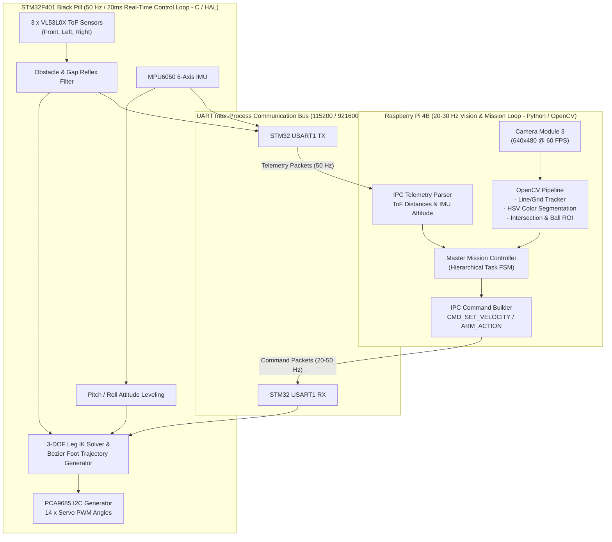
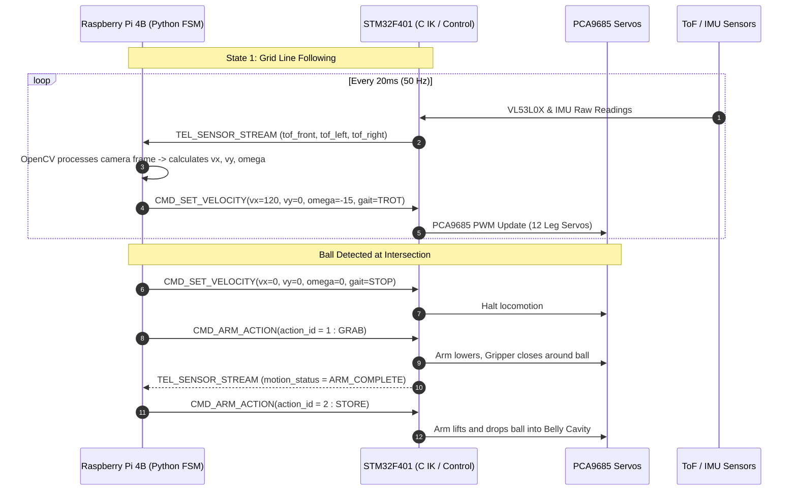
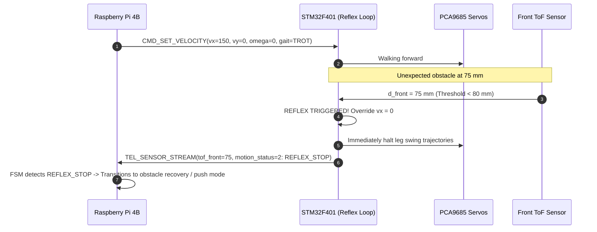

# 03. Dual-Board Software Architecture & IPC Protocol

## 1. Executive Summary & Division of Responsibilities

The software architecture divides computing responsibilities across two specialized controllers: the **Raspberry Pi 4B (The Brain)** and the **STM32F401CCEU Black Pill (The Motor Cortex)**. This separation prevents computationally heavy AI/vision tasks from introducing latency or jitter into the real-time 50Hz legged locomotion loop.



---

## 2. Processor Roles & Software Stack

### 2.1 Raspberry Pi 4B (High-Level AI & Mission Engine)
- **Operating System:** Raspberry Pi OS 64-bit / Linux.
- **Programming Language:** Python 3.10+ (with NumPy, OpenCV `cv2`, `pyserial`, and `smach`/custom state machine).
- **Execution Rate:** 20 Hz to 30 Hz asynchronous loop.
- **Core Functions:**
  1. Captures camera frames and calculates guideline centroid error $e_{\text{heading}}$ using HSV thresholding and contour moments.
  2. Identifies grid intersections (crosses) and scans intersections for colored balls in Task #01.
  3. Classifies ball color (`RED`, `GREEN`, `BLUE`) and stores the classification in persistent memory variable `stored_ball_color`.
  4. Computes high-level velocity commands $(v_x, v_y, \omega_z)$ and manipulator actions (`GRAB`, `STORE`, `RELEASE`, `PUSH`).
  5. Monitors STM32 telemetry ($d_{\text{front}}, d_{\text{left}}, d_{\text{right}}$) to manage corridor transitions and gap rejection.

### 2.2 STM32F401CCEU Black Pill (Real-Time Motion & Sensor Reflex)
- **Operating System:** Bare-metal STM32 HAL / FreeRTOS real-time scheduler.
- **Programming Language:** ANSI C99 / C++17.
- **Execution Rate:** **50 Hz (20 ms tick)** deterministic control loop timer (`TIM2`).
- **Core Functions:**
  1. Parses incoming binary UART command packets and verifies CRC8 checksums.
  2. Solves 12-servo Denavit-Hartenberg Inverse Kinematics (IK) for all four legs.
  3. Generates smooth Bezier curve walking gaits (**Trot Gait** for speed, **Crawl Gait** for torque/stability).
  4. Reads the 3 × VL53L0X ToF sensors via I2C at 50 Hz and applies a low-pass filter.
  5. **Low-Level Reflex Override:** If $d_{\text{front}} < 80\text{ mm}$ during normal line following (uncommanded obstacle), the STM32 automatically halts forward locomotion and notifies the Pi.

---

## 3. UART Inter-Process Communication (IPC) Protocol Specification

To prevent packet fragmentation and data corruption, all inter-board messages use a structured binary frame with dual sync bytes and a trailing CRC-8/MAXIM checksum.

### 3.1 Binary Frame Structure
```
+----------------+----------------+----------------+----------------+-----------------------------+----------------+
| SYNC 1 (1 Byte)| SYNC 2 (1 Byte)| CMD_ID (1 Byte)| LENGTH (1 Byte)|  PAYLOAD DATA (0..32 Bytes) | CRC-8 (1 Byte) |
|     0xAA       |     0xBB       |   0x01..0xFF   |   0x00..0x20   |     [Command specific]      |  MAXIM 0x31    |
+----------------+----------------+----------------+----------------+-----------------------------+----------------+
```

### 3.2 Command Packets (`Raspberry Pi 4B -> STM32F401`)

| Command Name | `CMD_ID` | `LENGTH` | Payload Field Definition (Data Type) | Operational Action |
| :--- | :--- | :--- | :--- | :--- |
| **`CMD_SET_VELOCITY`** | `0x01` | `0x07` | `vx` (int16 mm/s)<br>`vy` (int16 mm/s)<br>`omega` (int16 deg/s)<br>`gait_type` (uint8: 0=Stop, 1=Trot, 2=Crawl) | Sets target locomotion velocities and gait profile. |
| **`CMD_ARM_ACTION`** | `0x02` | `0x01` | `action_id` (uint8: 0=HOME, 1=GRAB, 2=STORE, 3=RELEASE, 4=PUSH_READY) | Triggers a pre-programmed arm/gripper motion sequence. |
| **`CMD_BODY_ATTITUDE`**| `0x03` | `0x03` | `pitch_offset` (int8 deg)<br>`roll_offset` (int8 deg)<br>`height_mm` (uint8 mm, default 80) | Adjusts standing ride height and body pitch/roll angle. |
| **`CMD_ESTOP`** | `0x04` | `0x00` | *No Payload* | Immediate emergency cut: resets all servos to neutral or limp. |

---

### 3.3 Telemetry Packets (`STM32F401 -> Raspberry Pi 4B`)

The STM32 streams telemetry back to the Pi at **50 Hz** (every 20 ms) so the Python state machine has up-to-date sensor data.

| Telemetry Name | `CMD_ID` | `LENGTH` | Payload Field Definition (Data Type) | Description |
| :--- | :--- | :--- | :--- | :--- |
| **`TEL_SENSOR_STREAM`** | `0x81` | `0x0B` | `tof_left_mm` (uint16)<br>`tof_right_mm` (uint16)<br>`tof_front_mm` (uint16)<br>`imu_pitch` (int8 deg)<br>`imu_roll` (int8 deg)<br>`battery_mv` (uint16 mV)<br>`motion_status` (uint8: 0=IDLE, 1=WALKING, 2=REFLEX_STOP) | Primary high-rate stream containing all ToF distances, body attitude, battery voltage, and reflex flags. |

---

## 4. IPC Sequence & Reflex Timing Diagrams

### 4.1 Normal Mission Execution Sequence (Grid Navigation & Ball Pick)



---

### 4.2 Hardware Reflex Override Sequence (Uncommanded Obstacle Protection)

If an obstacle appears suddenly in front of the robot (e.g., during corridor traversal), the STM32 hardware reflex overrides PI velocity commands within **20 ms** to prevent collision.


