# 04. Autonomous Task State Machine (HFSM)

## 1. Executive Summary & Mission Workflow

To successfully complete the multi-stage competition track (`Task/tasks_circuit_v1.md`), the Raspberry Pi 4B executes a **Hierarchical Finite State Machine (HFSM)**. Each top-level mission state encapsulates specialized control logic, sensor weighting, and error recovery handlers.

```mermaid
stateDiagram-v2
    [*] --> STATE_0_START_TO_GRID : Push Start Button (PA0)
    
    state STATE_0_START_TO_GRID {
        [*] --> LineFollow_Entry
        LineFollow_Entry --> CheckGridTransition : Grid Marker Detected
    }
    
    STATE_0_START_TO_GRID --> STATE_1_GRID_SEARCH_AND_PICKUP : Enters Grid Arena
    
    state STATE_1_GRID_SEARCH_AND_PICKUP {
        [*] --> Grid_LineFollow
        Grid_LineFollow --> Intersection_Scan : Intersection Cross Detected
        Intersection_Scan --> Color_Classify : Ball ROI Found
        Color_Classify --> Arm_Grab_Sequence : Color Stored in Memory
        Arm_Grab_Sequence --> Belly_Store_Sequence : Gripper Confirmed
        Belly_Store_Sequence --> Exit_Grid_Guideline : Ball Secure in Belly
    }
    
    STATE_1_GRID_SEARCH_AND_PICKUP --> STATE_2_CORRIDOR_WALL_FOLLOWING : Exits Grid along Guideline
    
    state STATE_2_CORRIDOR_WALL_FOLLOWING {
        [*] --> Corridor_Entry
        Corridor_Entry --> PD_Wall_Centering : Dual ToF Active
        PD_Wall_Centering --> Gap_Rejection_Hold : Sudden d_left or d_right > 400mm
        Gap_Rejection_Hold --> PD_Wall_Centering : Wall Re-acquired
        PD_Wall_Centering --> Corridor_Exit : Guideline Re-emerges
    }
    
    STATE_2_CORRIDOR_WALL_FOLLOWING --> STATE_3_CORRIDOR_OBSTACLE_CLEARING : Enters Second Corridor
    
    state STATE_3_CORRIDOR_OBSTACLE_CLEARING {
        [*] --> Corridor_2_Follow
        Corridor_2_Follow --> Obstacle_Detect : d_front < 150mm
        Obstacle_Detect --> Engage_Push_Stance : Lower Front Bumper
        Engage_Push_Stance --> High_Torque_Push : Crawl Gait Active
        High_Torque_Push --> Resume_Guideline : Obstacle Cleared
    }
    
    STATE_3_CORRIDOR_OBSTACLE_CLEARING --> STATE_4_COLOR_SORTING_JUNCTION : Approaches 3-Way Split
    
    state STATE_4_COLOR_SORTING_JUNCTION {
        [*] --> Evaluate_Stored_Color
        Evaluate_Stored_Color --> Navigate_Red_Branch : stored_ball_color == RED
        Evaluate_Stored_Color --> Navigate_Green_Branch : stored_ball_color == GREEN
        Evaluate_Stored_Color --> Navigate_Blue_Branch : stored_ball_color == BLUE
        Navigate_Red_Branch --> Release_Ball_Belly : Reaches Color Drop Box
        Navigate_Green_Branch --> Release_Ball_Belly
        Navigate_Blue_Branch --> Release_Ball_Belly
    }
    
    STATE_4_COLOR_SORTING_JUNCTION --> STATE_5_FINISH_LINE_RUN : Ball Deposited
    
    state STATE_5_FINISH_LINE_RUN {
        [*] --> Resume_Matched_Guideline
        Resume_Matched_Guideline --> Halt_At_End_Box : End Box Detected
    }
    
    STATE_5_FINISH_LINE_RUN --> [*] : Mission Complete (Trot -> Stop)
```

---

## 2. Detailed State Definitions & Entry/Exit Conditions

### 2.1 `STATE_0_START_TO_GRID` (Start Box to Grid Entry)
- **Objective:** Start from the designated Start Box and follow the guideline into the grid section.
- **Entry Condition:** Hardware start button pressed (`PA0_WKUP` == HIGH).
- **Active Algorithms:** High-speed OpenCV Line Following (HSV/Binary centroid tracking) + **Trot Gait** ($v_x = 150\text{ mm/s}$).
- **Exit Condition:** Vision pipeline detects the first horizontal grid intersection cross line.

---

### 2.2 `STATE_1_GRID_SEARCH_AND_PICKUP` (Task #01: Ball Search, Memory & Storage)
- **Objective:** Navigate grid nodes, locate the colored ball at an intersection cross, identify/memorize its color, grasp it, and store it securely in the belly compartment.
- **Entry Condition:** First grid cross line detected.
- **Sub-States & Workflow:**
  1. **`SUBSTATE_GRID_NAV`**: Follows grid lines; stops at intersections to check for ball presence in camera ROI.
  2. **`SUBSTATE_COLOR_CLASSIFY`**: Calculates HSV histogram of the detected ball.
     - Saves result into persistent global variable: `stored_ball_color` (`RED`, `GREEN`, or `BLUE`).
  3. **`SUBSTATE_ARM_GRAB`**:
     - Sends `CMD_ARM_ACTION(1=GRAB)` to STM32.
     - Arm pitch lowers ($z=0$), Gripper jaws close around the 40 mm ball.
  4. **`SUBSTATE_BELLY_STORE`**:
     - Sends `CMD_ARM_ACTION(2=STORE)` to STM32.
     - Arm elevates and retracts over the front deck, dropping the ball into the **ventral storage cage**.
- **Exit Condition:** Ball retention sensor/camera confirms ball in belly cage; robot resumes guideline toward Corridor 1.

---

### 2.3 `STATE_2_CORRIDOR_WALL_FOLLOWING` (Task #02: Narrow Corridor & Gap Rejection)
- **Objective:** Navigate between two parallel walls and ignore a sudden wall gap on the left or right without exiting prematurely or striking walls.
- **Entry Condition:** Guideline enters corridor boundary walls.
- **Active Algorithms:**
  - **Dual-ToF PD Centering:** Calculates lateral error $e = d_{\text{left}} - d_{\text{right}}$.
  - **Wall Gap Rejection Filter (Crucial Competition Reflex):**
    - If a gap appears on the left wall ($d_{\text{left}} > 400\text{ mm}$), the robot **temporarily disables dual-wall centering** and switches to **Single-Wall Following** using only the solid right wall ($d_{\text{right}}$ offset control), or holds the last valid heading gyro angle until the gap is cleared.
- **Exit Condition:** Both $d_{\text{left}}$ and $d_{\text{right}}$ open up ($> 600\text{ mm}$) and the floor guideline re-appears.

---

### 2.4 `STATE_3_CORRIDOR_OBSTACLE_CLEARING` (Task #03: Obstacle Displacement)
- **Objective:** Enter the second corridor, identify a path-blocking obstacle block, push it aside using the front mechanism, and clear the corridor.
- **Entry Condition:** Guideline enters second corridor.
- **Sub-States & Workflow:**
  1. **`SUBSTATE_CORRIDOR_FOLLOW`**: Follows corridor via ToF PD control.
  2. **`SUBSTATE_OBSTACLE_DETECT`**: Front ToF sensor triggers $d_{\text{front}} < 150\text{ mm}$.
  3. **`SUBSTATE_PUSH_STANCE`**:
     - Sends `CMD_ARM_ACTION(4=PUSH_READY)` -> Gripper closes and lowers flush against the front bumper to form a solid pushing face.
     - Switches STM32 gait from Trot to **High-Torque Crawl Gait** ($v_x = 80\text{ mm/s}$).
  4. **`SUBSTATE_BULLDOZE`**: Drives forward for 2.5 seconds or until $d_{\text{front}} > 300\text{ mm}$, pushing the block out of the guideline path.
- **Exit Condition:** Obstacle cleared; corridor exit reached.

---

### 2.5 `STATE_4_COLOR_SORTING_JUNCTION` (Task #04: Color Sorting & Delivery)
- **Objective:** Approach the 3-way color-sorting junction (Green, Blue, Red), evaluate `stored_ball_color`, stop at the matching segment, and release the ball.
- **Entry Condition:** Camera detects the 3-way colored segment junction marker.
- **Sub-States & Workflow:**
  1. **`SUBSTATE_MEMORY_EVAL`**: Checks `stored_ball_color`.
  2. **`SUBSTATE_BRANCH_SELECT`**:
     - If `stored_ball_color == RED`: Steers +45° to Red segment line.
     - If `stored_ball_color == GREEN`: Follows center Green segment line.
     - If `stored_ball_color == BLUE`: Steers -45° to Blue segment line.
  3. **`SUBSTATE_BALL_RELEASE`**:
     - Stops at segment delivery box.
     - Sends `CMD_ARM_ACTION(3=RELEASE)` -> Ventral trapdoor opens / arm tilts ball forward onto the colored segment.
- **Exit Condition:** Ball release completed and confirmed by camera ROI empty check.

---

### 2.6 `STATE_5_FINISH_LINE_RUN` (Completion to End Point)
- **Objective:** Resume guideline following from the matched color segment to the designated End Point and stop.
- **Entry Condition:** `CMD_ARM_ACTION(0=HOME)` complete after ball release.
- **Active Algorithms:** High-speed Trot line following ($v_x = 180\text{ mm/s}$).
- **Exit Condition:** End Box transverse marker line detected -> Sends `CMD_SET_VELOCITY(0,0,0, STOP)`.

---

## 3. State Transition Matrix & Error Recovery Handlers

| Current State | Primary Event / Trigger | Target State | Error Condition / Timeout Recovery |
| :--- | :--- | :--- | :--- |
| **`STATE_0`** | Grid cross line detected | **`STATE_1`** | *Timeout (10s):* If no grid cross found, switch to wide spiral search. |
| **`STATE_1`** | Ball stored & Grid exit line reached | **`STATE_2`** | *Ball Pick Fail:* If gripper misses ball, back up 100 mm and retry grab sequence (max 2 retries). |
| **`STATE_2`** | Wall distances open up ($>600\text{ mm}$) | **`STATE_3`** | *Corridor Jam:* If $d_{\text{front}} < 60\text{ mm}$ unexpectedly, reverse 80 mm and re-align using IMU heading. |
| **`STATE_3`** | Obstacle pushed & corridor cleared | **`STATE_4`** | *Stall / High Current:* If pushing stalls robot (>3s with no IMU movement), pulse reverse/forward to dislodge block. |
| **`STATE_4`** | Ball released onto matched zone | **`STATE_5`** | *Color Read Error:* If `stored_ball_color` is invalid/null, default to center Green delivery zone. |
| **`STATE_5`** | End Box marker detected | **`MISSION_COMPLETE`**| Stops all timers and sets status LED to pulsing Blue. |
