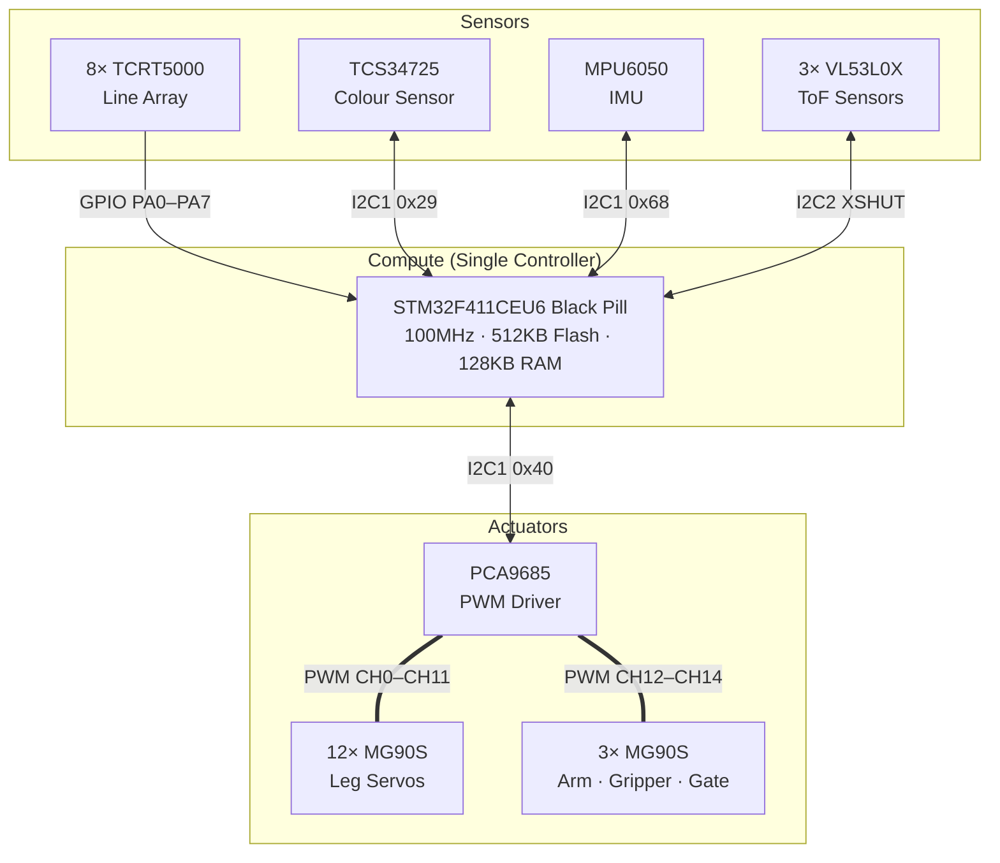

# HARDWARE ARCHITECTURE

## 1. Overview
The hardware architecture of the RUNNER-4 quadruped robot is designed around a **single-controller embedded paradigm**. All perception, decision-making, and real-time control are handled by a single STM32F411CEU6 microcontroller. This eliminates the Raspberry Pi layer, reducing weight, power draw, and system complexity.

## 2. Compute Layer
- **Sole Controller**: STM32F411CEU6 (Black Pill). Responsible for bare-metal C programming, Mission State Machine, Inverse Kinematics, gait generation, sensor fusion, and safety watchdogs. Runs at 100MHz with hardware FPU.

## 3. Sensor Layer

| Sensor | Interface | Address/Pins | Purpose |
|--------|-----------|-------------|---------|
| **8-Channel TCRT5000 IR Line Array** | GPIO Digital | PA0–PA7 (8 pins) | Line following, intersection detection, junction identification |
| **TCS34725 RGBC Colour Sensor** | I2C1 | 0x29 | Ball colour ID (arm 0°) + Floor zone colour ID (arm −70°) |
| **MPU6050 IMU** | I2C1 | 0x68 | 6-axis gyro/accelerometer for postural stability and pitch/roll |
| **VL53L0X ToF (Front)** | I2C2 | 0x30 (remap) | Obstacle/ball pedestal proximity detection |
| **VL53L0X ToF (Left)** | I2C2 | 0x31 (remap) | Left wall distance for corridor centering |
| **VL53L0X ToF (Right)** | I2C2 | 0x32 (remap) | Right wall distance for corridor centering |

### Line Array Details
- Type: 8× TCRT5000 reflective IR, digital output
- Array width: ~70mm; sensor spacing: ~8.75mm
- Mount position: Front-underside of body, 5–8mm above floor, centred on robot midline
- Logic: HIGH = white/reflective surface detected; LOW = black surface

### Colour Sensor Details
- Type: TCS34725 RGBC, I2C, 0x29 on I2C1
- Mount position: Gripper arm tip
- **Mode A** (arm at 0° horizontal): Reads ball colour at 1–2cm range when arm lowers to pedestal height
- **Mode B** (arm at −70° downward): Reads floor colour zone at 1–3cm range at 3-way junction
- Built-in white LED illuminator controlled via STM32 PC0 for consistent lighting

## 4. Actuation Layer
- **Servo Driver**: PCA9685 16-channel 12-bit PWM controller on I2C1 (0x40).
- **Leg Servos**: 12× MG90S (metal gear). CH0–CH11 on PCA9685. Coxa, Femur, Tibia for all four legs.
- **Arm Servo**: 1× MG90S. CH12. Controls gripper arm pitch (0° ball mode / −70° floor mode / home).
- **Gripper Servo**: 1× MG90S. CH13. Opens/closes claw around 40mm ball.
- **Storage Gate Servo**: 1× MG90S. CH14. Locks ball in internal compartment; releases by gravity.

## 5. Mechanical Integration
- **Chassis**: Custom 3D-printed PETG body. 3-tier deck: battery (bottom), STM32+PCA9685 (mid), sensor headers (top).
- **Leg Design**: 3-DOF per leg (Coxa yaw ±45°, Femur pitch ±60°, Tibia pitch 0°–135°).
- **Front Bumper**: Flat, rigid PETG plate (50%+ infill) at front-bottom, ground to 50mm height.
- **Line Array Bracket**: 3D-printed mount holds TCRT5000 array at 5–8mm above floor.
- **Arm Tip Mount**: Small 3D-printed shroud holds TCS34725 at gripper arm tip, with partial light shield.

## 6. Block Diagram

## 7. I2C Bus Summary

| Bus | Pins | Speed | Devices |
|-----|------|-------|---------|
| **I2C1** | PB6 (SCL) / PB7 (SDA) | 400kHz | PCA9685 (0x40), MPU6050 (0x68), TCS34725 (0x29) |
| **I2C2** | PB10 (SCL) / PB3 (SDA) | 400kHz | VL53L0X Front (0x30), Left (0x31), Right (0x32) |
