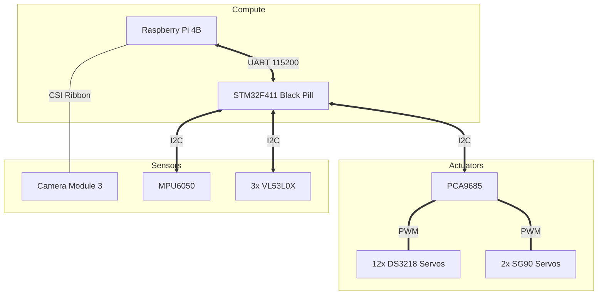

# HARDWARE ARCHITECTURE

## 1. Overview
The hardware architecture of the FusionForce quadruped robot is designed around a dual-controller paradigm. It integrates computer vision, 14 degrees of freedom (DOF) in actuation, and multiple I2C sensor peripherals.

## 2. Compute Layer
- **High-Level Controller**: Raspberry Pi 4B (4GB or 8GB). Responsible for Linux, OpenCV, Python scripting, and decision-making.
- **Low-Level Controller**: STM32F411CEU6 (Black Pill). Responsible for bare-metal C programming, Inverse Kinematics, gait generation, and safety watchdogs. Runs at 84MHz.

## 3. Sensor Layer
- **Vision**: Raspberry Pi Camera Module 3. Connected via CSI ribbon cable directly to the Pi. Used for line following and color recognition.
- **Inertial Measurement**: MPU6050 (6-axis gyro/accelerometer). Connected to STM32 via I2C. Used for postural stability and pitch/roll detection.
- **Distance Measurement**: 3x VL53L0X Time-of-Flight (ToF) sensors. Mounted front, left, and right. Connected to STM32 via I2C (using TCA9548A multiplexer if I2C addresses conflict). Used for wall-following and obstacle detection.

## 4. Actuation Layer
- **Servo Driver**: PCA9685 16-channel 12-bit PWM controller. Connected to STM32 via I2C.
- **Leg Servos**: 12x DS3218 (or similar high-torque 20kg+ metal gear servos). Assigned to Coxa, Femur, and Tibia joints for all four legs.
- **Gripper Servos**: 2x SG90 or MG90S micro-servos. One for opening/closing the claw, one for pitch (lifting the ball).

## 5. Mechanical Integration
- **Chassis**: Custom 3D-printed body, designed symmetrically to maintain a centralized Center of Gravity (CoG).
- **Leg Design**: 3-DOF per leg.
- **Front Bumper**: A flat, rigid 3D-printed plate attached below the gripper to facilitate sliding the Task 03 block without leg entanglement.

## 6. Block Diagram

