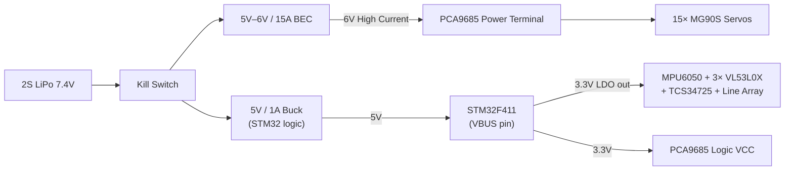

# POWER ARCHITECTURE

## 1. Objective
A quadruped robot is highly susceptible to power instability. 15 servos moving simultaneously can draw massive current spikes, temporarily pulling battery voltage down. The STM32 and sensors must be isolated from this unstable rail.

The primary rule of this architecture is **strict isolation between servo power and logic power**, tied together only by a common star ground.

## 2. Power Sources and Regulators
- **Primary Source**: 2S LiPo Battery (7.4V nominal, 8.4V max, 1300–2200mAh, 25C+). Within 24V DC competition limit.
- **Servo Regulator**: 5V–6V / 15A Switching BEC (UBEC). Steps 7.4V down to a high-current 6V for MG90S servos at maximum torque.
- **Logic Regulator**: STM32 board's onboard 3.3V LDO. Powered via STM32 VBUS pin (5V from battery via small 5V/1A buck or BEC secondary tap). Powers STM32 + all 3.3V sensors.

> [!NOTE]
> The separate 5V/3A buck converter previously used for the Raspberry Pi has been removed. Raspberry Pi is not part of this design. The logic subsystem (STM32 + all sensors) draws only ~250mA at 3.3V — the STM32's own LDO handles this with significant headroom.

## 3. Power Distribution Tree

## 4. Current & Voltage Analysis

| Component | Typical (mA) | Peak (mA) |
|-----------|-------------|-----------|
| 12× MG90S leg servos | 2400 | 8400 |
| 3× MG90S mechanism (arm/grip/gate) | 300 | 2100 |
| STM32F411 | 50 | 100 |
| MPU6050 | 5 | 10 |
| 3× VL53L0X | 15 | 20 |
| TCS34725 (with LED active) | 65 | 65 |
| 8× TCRT5000 line array | 100 | 120 |
| PCA9685 logic | 10 | 15 |
| **TOTAL** | **~2945** | **~10830** |

Realistic peak during walking: **4–6A** (not all servos stall simultaneously).

> [!NOTE]
> The Raspberry Pi 4B (1500mA typical, 2500mA peak) and its 5V/3A buck converter are removed. This reduces average system current by approximately 1.5A and saves ~73g of hardware.

## 5. Runtime Estimate

| Parameter | Value |
|-----------|-------|
| Battery | 2S LiPo 1300mAh |
| Average draw (at 7.4V) | ~2.1A |
| Estimated runtime | **~37 minutes** |
| Competition time limit | 15 minutes |
| Margin | **2.5× safety margin** |

## 6. Grounding Topology (CRITICAL)
For I2C and GPIO signals to work reliably, all devices must share the same reference voltage.

**Rule:** Connect the GND of the BEC output, the 5V buck output, the STM32, the PCA9685 logic GND, and all sensor GNDs to a single star ground point.

A ground loop between BEC (high-current servo switching) and the logic rail causes false I2C signals and GPIO glitches. Use star topology; use separate thick wire (≥18AWG) for servo ground return.

## 7. Protection & Safety

| Protection | Implementation |
|-----------|----------------|
| **Kill Switch** | Latching switch ≥15A on main battery positive wire |
| **Servo Fuse** | 10A automotive blade fuse between BEC and PCA9685 V+ terminal |
| **Decoupling Cap** | 4700µF electrolytic across PCA9685 V+ / GND to absorb current spikes |
| **Battery Monitor** | STM32 ADC (PC1) via resistor divider (e.g., 10kΩ/3.3kΩ → 0–3.3V range for 0–8.4V battery) |
| **Low Battery Alert** | Firmware: <6.8V → LED flash; <6.4V → halt servos |
| **LiPo Alarm** | External buzzer alarm on balance lead (audible when any cell <3.3V) — use during testing |
