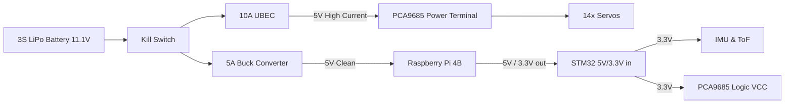

# POWER ARCHITECTURE

## 1. Objective
A quadruped robot is highly susceptible to power instability. 14 servos moving simultaneously can draw massive current spikes, pulling the battery voltage down momentarily. If the Raspberry Pi or STM32 shares this unstable rail, they will reboot (brownout). 

The primary rule of this architecture is **strict isolation between logic power and motor power**, tied together only by a common ground.

## 2. Power Sources and Regulators
- **Primary Source**: 3S LiPo Battery (11.1V Nominal, 12.6V Max, ~2200mAh 30C+).
- **Motor Regulator**: 5V 10A UBEC (Universal Battery Eliminator Circuit). Drops 11.1V to a high-current 5.0V.
- **Logic Regulator**: 5V 5A Buck Converter. Drops 11.1V to a clean, isolated 5.0V for the Raspberry Pi.

## 3. Power Distribution Tree

## 4. Current & Voltage Analysis (Estimates)
- **12x DS3218 Servos**: ~200mA idle each, up to ~2A stall current. Typical dynamic walking load: 4A to 6A total.
- **2x SG90 Gripper**: ~100mA idle, ~500mA stall.
- **Raspberry Pi 4B**: ~600mA idle, up to 3A under heavy CPU/Camera load.
- **Total Peak System Current**: ~9A (well within the limits of the separated regulators and a 30C LiPo).

## 5. Grounding Topology (CRITICAL)
For the I2C and UART signals to work, the Raspberry Pi, STM32, and PCA9685 must share a reference voltage.
**Rule:** You must connect the Ground (`GND`) of the UBEC output, the Buck Converter output, the Pi, the STM32, and the PCA9685 together in a "Star" topology to prevent ground loops.

## 6. Protection & Safety
- **Fuses**: It is recommended to place a 10A automotive blade fuse between the UBEC and the PCA9685 power terminal. If a leg jams and stalls multiple servos, the fuse will blow before the servos or wiring melt.
- **Battery Monitor**: A cheap LiPo voltage alarm should be connected to the balance lead of the battery. If any cell drops below 3.3V, the alarm sounds, indicating the robot must be shut down immediately to prevent permanent battery damage.
- **Kill Switch**: A physical latching switch rated for at least 15A must be installed on the main battery positive wire before it splits to the UBEC and Buck converter.
