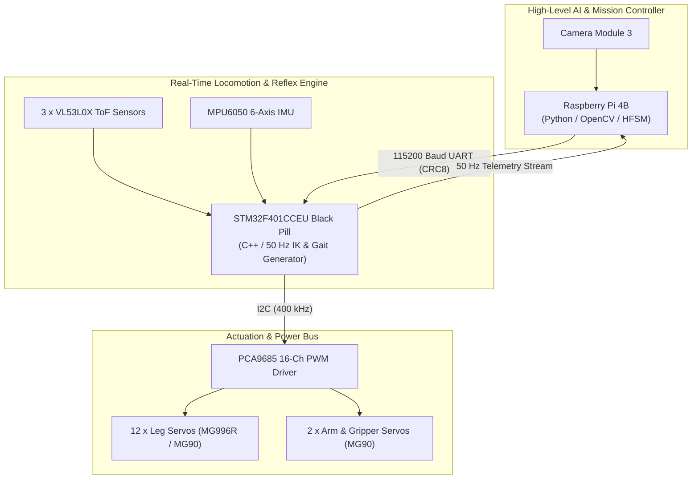

# FusionForce-Robotics: Autonomous Quadruped Engineering Documentation Suite

Welcome to the official engineering documentation suite for the **FusionForce 12-Servo Quadruped Robot** designed for the EN2533 Autonomous Robotics Competition (`Task/tasks_circuit_v1.md`).

---

## Complete Documentation Index

This directory contains six comprehensive engineering specifications covering every mechanical, electrical, firmware, algorithmic, and operational aspect of the robot:

| Doc # | Engineering Document Title | Description & Core Topics Covered |
| :---: | :--- | :--- |
| **01** | [**01_Mechanical_Design_and_Chassis_Layout.md**](file:///c:/Users/ADMIN/Desktop/FusionForce-Robotics/docs/01_Mechanical_Design_and_Chassis_Layout.md) | **12-DOF Quadruped Anatomy & CAD:** Servo torque feasibility (MG90 vs. MG996R vs. DS3218), 3-tier chassis deck layout, Center of Gravity (CoG) static stability margin equations, and 3-DOF Denavit-Hartenberg / Trigonometric Inverse Kinematics (IK) derivation. |
| **02** | [**02_Electrical_and_Power_Distribution.md**](file:///c:/Users/ADMIN/Desktop/FusionForce-Robotics/docs/02_Electrical_and_Power_Distribution.md) | **Power & Wiring Schematics:** Star-grounded power tree (5V/10A Servo UBEC vs. 5V/5A Logic Buck), complete pinouts for Raspberry Pi 4B $\leftrightarrow$ STM32F401 Black Pill UART, PCA9685 I2C servo driver, and 3 × VL53L0X ToF sensor multiplexing. |
| **03** | [**03_Dual_Board_Software_Architecture_and_IPC.md**](file:///c:/Users/ADMIN/Desktop/FusionForce-Robotics/docs/03_Dual_Board_Software_Architecture_and_IPC.md) | **Dual-Controller Architecture & UART Protocol:** Raspberry Pi 4B AI/Vision loop (~25 Hz) vs. STM32F401 Real-Time Motion loop (50 Hz), custom binary Hex frame with CRC8 verification, command/telemetry definitions, and Mermaid sequence diagrams. |
| **04** | [**04_Autonomous_Task_State_Machine.md**](file:///c:/Users/ADMIN/Desktop/FusionForce-Robotics/docs/04_Autonomous_Task_State_Machine.md) | **Hierarchical Finite State Machine (HFSM):** End-to-end competition track execution from Start to Finish (`STATE_0` to `STATE_5`), wall gap rejection filter, ball memory retention, and transition matrix with timeout recovery handlers. |
| **05** | [**05_Algorithmic_Implementations_and_Control_Logic.md**](file:///c:/Users/ADMIN/Desktop/FusionForce-Robotics/docs/05_Algorithmic_Implementations_and_Control_Logic.md) | **Algorithms & Working Reference Code:** OpenCV line following centroid equations, HSV color calibration ranges, PD wall following with gap outlier rejection, Bezier foot step trajectory equations, and full Python/C++ reference scripts. |
| **06** | [**06_System_Integration_and_Testing_Guide.md**](file:///c:/Users/ADMIN/Desktop/FusionForce-Robotics/docs/06_System_Integration_and_Testing_Guide.md) | **Calibration & Integration Testing:** Servo zero-point trimming, ToF cross-talk calibration, Camera HSV tuning, and 4 rigorous benchtop/track unit integration test checklists. |

---

## System Architecture Overview

---

## Connection to the Team Learning Curriculum

For foundational theory, mathematical proofs, and basic C/Python tutorials that underpin this architecture, refer to our master curriculum syllabus:
👉 **[Go to the Robot Curriculum Syllabus](../Robot_Curriculum/README.md)**
- **Module 1: Mechanical Engineering** $\rightarrow$ Kinematics & torque math for `01_Mechanical_Design_and_Chassis_Layout.md`.
- **Module 2: Embedded Systems** $\rightarrow$ STM32 PWM, UART, and I2C for `02_Electrical_and_Power_Distribution.md` and `03_Dual_Board_Software_Architecture_and_IPC.md`.
- **Module 3: Pi Logic & State Machines** $\rightarrow$ Finite State Machines for `04_Autonomous_Task_State_Machine.md`.
- **Module 4: Computer Vision** $\rightarrow$ OpenCV & HSV for `05_Algorithmic_Implementations_and_Control_Logic.md`.
- **Module 5: Integration & Testing** $\rightarrow$ Testing protocols for `06_System_Integration_and_Testing_Guide.md`.
