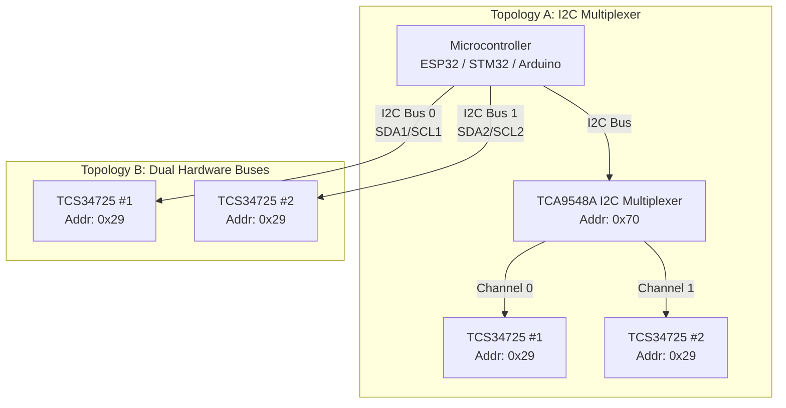
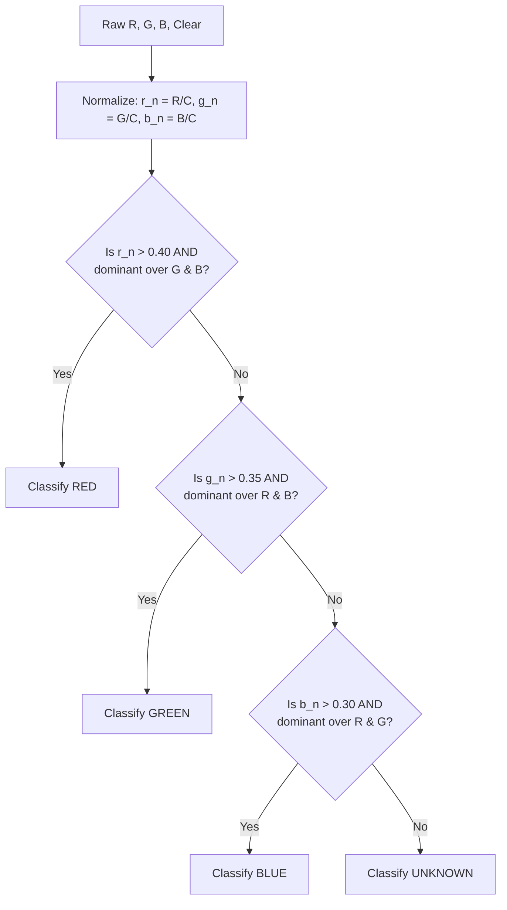

# RUNNER-4 | Dual Color Sensor System
## Full Technical Report — Dual TCS34725 Implementation
### FusionForce Robotics — EN2533 BREACH PROTOCOL

> [!IMPORTANT]
> **System Upgrade: Dual TCS34725 Configuration**
> The system has been upgraded to utilize **two TCS34725 color sensors**. Because the TCS34725 has a fixed I2C address (`0x29`), connecting two sensors requires specific hardware topologies to prevent address collisions.
> Additionally, the classification algorithm has been upgraded from simple raw RGB output to a **Ratio-Dominance Classifier** to vastly improve reliability under varying arena lighting conditions.

---

## Table of Contents
1. [Dual Sensor Architecture & I2C Topologies](#1-dual-sensor-architecture--i2c-topologies)
2. [Improved Colour Classification Algorithm](#2-improved-colour-classification-algorithm)
3. [Optimised Hardware Circuit & Wiring](#3-optimised-hardware-circuit--wiring)
4. [Implementation Code (Arduino/C++)](#4-implementation-code-arduinoc)
5. [Single Sensor Alternative Code](#5-single-sensor-alternative-code)
6. [Tuning & Calibration Guide](#6-tuning--calibration-guide)

---

## 1. Dual Sensor Architecture & I2C Topologies

To resolve the I2C address conflict (both sensors strictly use `0x29`), you must use one of two topologies depending on your microcontroller's capabilities.



### Topology Comparison
| Topology | Pros | Cons | Best For |
|----------|------|------|----------|
| **Multiplexer (TCA9548A)** | Universal, works on Uno/Nano. Expandable to 8 sensors. | Requires extra component. Slight software overhead to switch channels. | Standard Arduino Uno, Nano, Mega. |
| **Dual Hardware Buses** | No extra components needed. Extremely fast. | Requires an advanced microcontroller with ≥2 hardware I2C buses. | ESP32, STM32, Teensy, RP2040. |

---

## 2. Improved Colour Classification Algorithm

The previous code simply printed raw RGB values, which are highly susceptible to ambient light changes, voltage drops, and distance variations. The improved system uses the **Ratio-Dominance Algorithm**, which normalizes the values against the clear (overall brightness) channel.



### Why Ratio-Dominance?
- **Distance Independent:** By dividing by the Clear (C) channel, the brightness/distance factor is canceled out.
- **Ambient Rejection:** If ambient light increases equally, the normalized ratio stays relatively constant.
- **Low Compute Cost:** Avoids floating-point trigonometry (unlike RGB-to-HSV conversions), saving CPU cycles.

---

## 3. Optimised Hardware Circuit & Wiring

Assuming **Topology B (Dual Hardware Buses)** for advanced MCUs (e.g., ESP32, STM32), which allows customizing the SDA/SCL pins as you demonstrated in your initial code:

| Component | Sensor 1 (I2C Bus 0) | Sensor 2 (I2C Bus 1) | Notes |
|-----------|----------------------|----------------------|-------|
| **VCC** | 3.3V | 3.3V | Add 100nF decoupling capacitors near sensors |
| **GND** | GND | GND | Common ground |
| **SDA** | SDA_1 (e.g., Pin 8) | SDA_2 (e.g., Pin 18) | Use 4.7 kΩ pull-ups if not on breakout board |
| **SCL** | SCL_1 (e.g., Pin 10) | SCL_2 (e.g., Pin 19) | Use 4.7 kΩ pull-ups if not on breakout board |
| **LED** | LED_1 (e.g., Pin 4) | LED_2 (e.g., Pin 5) | Connect to GPIO to toggle LED and save power/prevent cross-talk |

---

## 4. Implementation Code (Arduino/C++)

This code implements the **Ratio-Dominance classifier** and handles **Dual Hardware I2C buses**. 
*Note: If you are using a standard Arduino Uno, you cannot use `Wire1`. You will need an I2C multiplexer and switch the active channel before interacting with the sensor object.*

```cpp
#include <Wire.h>
#include "Adafruit_TCS34725.h"

// ==========================================
// PIN DEFINITIONS
// ==========================================
// Sensor 1 (I2C Bus 0)
#define SDA1_PIN 8
#define SCL1_PIN 10
#define LED1_PIN 4

// Sensor 2 (I2C Bus 1) - Adjust pins for your specific MCU
#define SDA2_PIN 18
#define SCL2_PIN 19
#define LED2_PIN 5

// ==========================================
// SENSOR INITIALIZATION
// ==========================================
// 50ms integration time (20Hz max rate), 4X gain
Adafruit_TCS34725 tcs1 = Adafruit_TCS34725(TCS34725_INTEGRATIONTIME_50MS, TCS34725_GAIN_4X);
Adafruit_TCS34725 tcs2 = Adafruit_TCS34725(TCS34725_INTEGRATIONTIME_50MS, TCS34725_GAIN_4X);

// Enum for readable color identification
enum ColorID { COLOR_UNKNOWN, COLOR_RED, COLOR_GREEN, COLOR_BLUE };

void setup() {
  Serial.begin(115200);
  
  // 1. Initialize LED Pins
  pinMode(LED1_PIN, OUTPUT);
  pinMode(LED2_PIN, OUTPUT);
  
  // Keep LEDs off initially
  digitalWrite(LED1_PIN, LOW); 
  digitalWrite(LED2_PIN, LOW);

  // 2. Initialize Dual I2C Buses
  Wire.begin(SDA1_PIN, SCL1_PIN);
  Wire1.begin(SDA2_PIN, SCL2_PIN); // Requires MCU with TwoWire support (e.g., ESP32, STM32)
  
  // 3. Begin Sensors
  if (tcs1.begin(TCS34725_ADDRESS, &Wire)) {
    Serial.println("Found Sensor 1!");
  } else {
    Serial.println("Sensor 1 missing! Check wiring on Bus 0.");
    while (1);
  }

  if (tcs2.begin(TCS34725_ADDRESS, &Wire1)) {
    Serial.println("Found Sensor 2!");
  } else {
    Serial.println("Sensor 2 missing! Check wiring on Bus 1.");
    // while (1); // Halts execution on failure
  }
}

// ==========================================
// RATIO-DOMINANCE CLASSIFIER
// ==========================================
ColorID classifyColor(uint16_t r, uint16_t g, uint16_t b, uint16_t c) {
  if (c == 0) return COLOR_UNKNOWN; // Avoid divide by zero

  // Normalize colors based on overall intensity (clear channel)
  float r_n = (float)r / c;
  float g_n = (float)g / c;
  float b_n = (float)b / c;

  // Thresholds based on Technical Report. MUST be tuned to competition arena lighting.
  if (r_n > 0.40 && r_n > g_n * 1.4 && r_n > b_n * 1.4) return COLOR_RED;
  if (g_n > 0.35 && g_n > r_n * 1.2 && g_n > b_n * 1.2) return COLOR_GREEN;
  if (b_n > 0.30 && b_n > r_n * 1.2 && b_n > g_n * 1.2) return COLOR_BLUE;

  return COLOR_UNKNOWN;
}

String getColorName(ColorID id) {
  if(id == COLOR_RED) return "RED";
  if(id == COLOR_GREEN) return "GREEN";
  if(id == COLOR_BLUE) return "BLUE";
  return "UNKNOWN";
}

// ==========================================
// MAIN LOOP
// ==========================================
void loop() {
  uint16_t r, g, b, c;

  // --- Process Sensor 1 ---
  digitalWrite(LED1_PIN, HIGH);
  delay(60); // 50ms integration + 10ms safety margin
  tcs1.getRawData(&r, &g, &b, &c);
  digitalWrite(LED1_PIN, LOW); // Save power and prevent optical cross-talk
  
  ColorID c1 = classifyColor(r, g, b, c);
  Serial.print("Sensor 1: ["); Serial.print(getColorName(c1)); Serial.print("]\t");

  // --- Process Sensor 2 ---
  digitalWrite(LED2_PIN, HIGH);
  delay(60);
  tcs2.getRawData(&r, &g, &b, &c);
  digitalWrite(LED2_PIN, LOW);
  
  ColorID c2 = classifyColor(r, g, b, c);
  Serial.print("Sensor 2: ["); Serial.print(getColorName(c2)); Serial.println("]");

  delay(500); // Main loop delay
}
```

---

## 5. Single Sensor Alternative Code

If you ever need to fallback or test a single sensor using the same ratio-dominance algorithm, you can use the following snippet. It uses the standard `Wire` library without requiring multiplexing or dual hardware buses.

```cpp
#include <Wire.h>
#include "Adafruit_TCS34725.h"

// ==========================================
// PIN DEFINITIONS
// ==========================================
#define SDA_PIN 8
#define SCL_PIN 10
#define LED_PIN 4

// 50ms integration time (20Hz max rate), 4X gain
Adafruit_TCS34725 tcs = Adafruit_TCS34725(TCS34725_INTEGRATIONTIME_50MS, TCS34725_GAIN_4X);

enum ColorID { COLOR_UNKNOWN, COLOR_RED, COLOR_GREEN, COLOR_BLUE };

void setup() {
  Serial.begin(115200);
  
  pinMode(LED_PIN, OUTPUT);
  digitalWrite(LED_PIN, LOW); // Keep LED off initially

  Wire.begin(SDA_PIN, SCL_PIN);
  if (tcs.begin()) {
    Serial.println("Found TCS34725 sensor!");
  } else {
    Serial.println("No TCS34725 found... check your wiring.");
    while (1); 
  }
}

ColorID classifyColor(uint16_t r, uint16_t g, uint16_t b, uint16_t c) {
  if (c == 0) return COLOR_UNKNOWN;

  float r_n = (float)r / c;
  float g_n = (float)g / c;
  float b_n = (float)b / c;

  if (r_n > 0.40 && r_n > g_n * 1.4 && r_n > b_n * 1.4) return COLOR_RED;
  if (g_n > 0.35 && g_n > r_n * 1.2 && g_n > b_n * 1.2) return COLOR_GREEN;
  if (b_n > 0.30 && b_n > r_n * 1.2 && b_n > g_n * 1.2) return COLOR_BLUE;

  return COLOR_UNKNOWN;
}

String getColorName(ColorID id) {
  if(id == COLOR_RED) return "RED";
  if(id == COLOR_GREEN) return "GREEN";
  if(id == COLOR_BLUE) return "BLUE";
  return "UNKNOWN";
}

void loop() {
  uint16_t r, g, b, c;

  digitalWrite(LED_PIN, HIGH);
  delay(60); // 50ms integration + 10ms safety margin
  tcs.getRawData(&r, &g, &b, &c);
  digitalWrite(LED_PIN, LOW); // Save power and prevent optical cross-talk
  
  ColorID color = classifyColor(r, g, b, c);
  Serial.print("Detected Color: ["); Serial.print(getColorName(color)); Serial.println("]");

  delay(500); // Main loop delay
}
```

---

## 6. Tuning & Calibration Guide

Since no two arenas have exactly the same lighting, you must tune the coefficients in the `classifyColor()` function during your 2-minute pre-competition window.

### Tuning Procedure
1. **Physical Positioning:** Place the sensor at its final operational height (e.g., 10mm from the floor or ball).
2. **Raw Analysis:** Temporarily log the normalized ratios (`r_n`, `g_n`, `b_n`) via serial output for the target colours.
3. **Adjust the Parameters:**
   - **Base Thresholds** (e.g., `r_n > 0.40`): Controls how strongly a color must be present. Lower this if the color detection is missing pale objects.
   - **Dominance Multipliers** (e.g., `r_n > g_n * 1.4`): Controls how much stronger the target channel must be compared to the others. Increase this multiplier to avoid false positives (e.g., preventing a yellow object from being misclassified as red).
