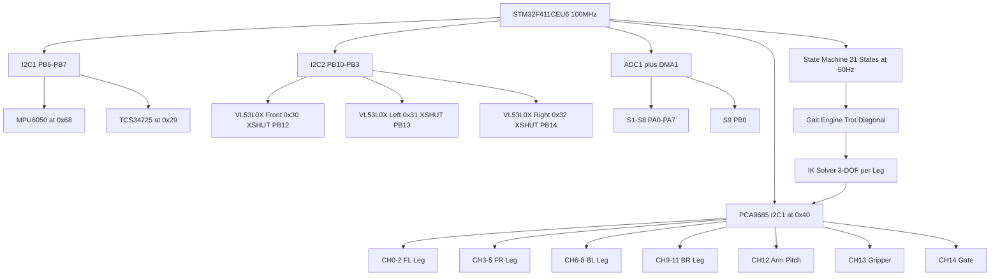
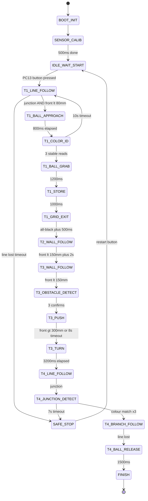
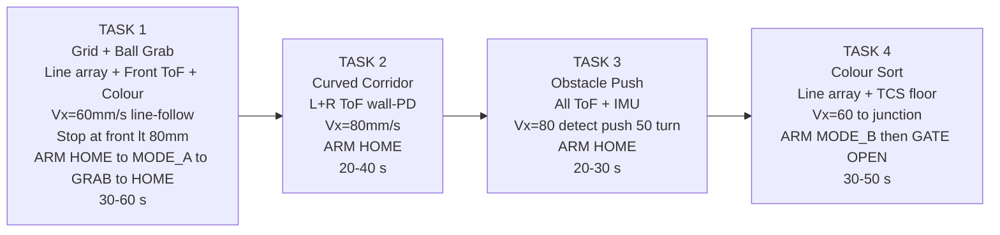

# FusionForce RUNNER-4 | 12-DOF Quadruped Robot
## Full Engineering Reference — EN2533 BREACH PROTOCOL

> **Platform:** STM32F411CEU6 (Black Pill) — 100 MHz Cortex-M4F, 512 KB Flash, 128 KB RAM
> **Body:** 4-legged quadruped — 3 DOF x 4 legs = **12 DOF locomotion**
> **Link Lengths:** Coxa=30mm | Femur=60mm | Tibia=80mm
> **PWM Driver:** PCA9685 (I2C1 @ 0x40) — 16 channels, 50 Hz, 12-bit
> **Servos:** 12x MG90S legs (CH0-CH11) + 3x MG90S mechanisms (CH12-CH14)

---

## Table of Contents

1. System Architecture
2. 12-DOF Leg Mechanics
3. Servo and PWM Mapping
4. PCA9685 Driver — Full Code
5. Inverse Kinematics — Full Code
6. Gait Engine — Full Code
7. Arm + Gripper + Gate — Full Code
8. 9-Channel IR Line Array — Full Code
9. VL53L0X ToF System — Full Code
10. TCS34725 Colour Sensor — Full Code
11. MPU6050 IMU — Full Code
12. State Machine HFSM
13. 50Hz Main Loop — Full Code
14. Hardware Pin Map
15. Power Budget
16. Testing Codes Analysis
17. Testing and Calibration
18. Tuning Guide
19. Competition Task Map
20. Quick Reference Card

---

## 1. System Architecture

### Block Diagram



### Component Inventory

| Component | Model | Bus | Address/Pins |
|-----------|-------|-----|--------------|
| MCU | STM32F411CEU6 | — | — |
| PWM Driver | PCA9685 | I2C1 @ 0x40 | PB6(SCL) PB7(SDA) |
| 12x Leg Servos | MG90S | PCA9685 CH0-CH11 | 50Hz 12-bit |
| Arm Pitch | MG90S | PCA9685 CH12 | HOME=90° |
| Gripper | MG90S | PCA9685 CH13 | OPEN=60° |
| Gate | MG90S | PCA9685 CH14 | LOCKED=0° |
| IMU | MPU6050 | I2C1 @ 0x68 | PB6/PB7 |
| Colour | TCS34725 | I2C1 @ 0x29 | LED=PC0 |
| ToF Front | VL53L0X | I2C2 @ 0x30 | XSHUT=PB12 |
| ToF Left | VL53L0X | I2C2 @ 0x31 | XSHUT=PB13 |
| ToF Right | VL53L0X | I2C2 @ 0x32 | XSHUT=PB14 |
| IR Line Array | 9x TCRT5000 | ADC1 DMA | PA0-PA7, PB0 |

---

## 2. 12-DOF Leg Mechanics

### Quadruped Body Layout

```
          FRONT  (direction of travel)

    FL ---+---[  BODY  ]---+--- FR
          |                |
    BL ---+                +--- BR

          REAR

  Body frame:  X-forward  Y-left  Z-up
```

### 3-DOF Leg Geometry (Side View)

```
   Body  (at coxa pivot)
    |
    | L1=30mm   COXA   (J1 yaw: +/-45deg horizontal)
    |
    o  coxa pivot
    |
    | L2=60mm   FEMUR  (J2 pitch: +/-90deg vertical)
    |
    o  femur pivot
    |
    | L3=80mm   TIBIA  (J3 pitch: +/-90deg vertical)
    |
   FOOT  (ground contact)

  Max reach = L2+L3 = 140 mm
  Min reach = |L2-L3| = 20 mm
  Neutral Z  = -50 mm below body
  Stride     = +/-30 mm X    Step height = +35 mm Z
```

### Joint Angle Conventions

| Joint | Axis | Zero | Positive |
|-------|------|------|----------|
| Coxa J1 | Vertical yaw | Leg straight sideways | Forward sweep |
| Femur J2 | Horizontal pitch | Femur horizontal | Lift upward |
| Tibia J3 | Horizontal pitch | Tibia parallel femur | Fold inward |

### Neutral Foot Positions (body frame, mm)

```
  FL: (+80, +60, -50)    FR: (+80, -60, -50)
  BL: (-80, +60, -50)    BR: (-80, -60, -50)
```

### Link Lengths

| Segment | Symbol | Length | Function |
|---------|--------|--------|----------|
| Coxa | L1 | 30 mm | Pure yaw pivot, hip to femur |
| Femur | L2 | 60 mm | Upper leg, load bearing |
| Tibia | L3 | 80 mm | Lower leg, contacts ground |
| Body half-width | Bw | 60 mm | Centre to coxa pivot |
| Body half-length | Bl | 80 mm | Centre to coxa pivot |

---

## 3. Servo and PWM Mapping

### PCA9685 Channel Assignment

| CH | Leg | Joint | Neutral° | Tick | Notes |
|----|-----|-------|----------|------|-------|
| 0 | FL | Coxa J1 | 90° | 307 | Centred |
| 1 | FL | Femur J2 | 45° | 205 | Partial lift |
| 2 | FL | Tibia J3 | 135° | 409 | Extended |
| 3 | FR | Coxa J1 | 90° | 307 | Mirror CH0 |
| 4 | FR | Femur J2 | 135° | 409 | Mirrored |
| 5 | FR | Tibia J3 | 45° | 205 | Mirrored |
| 6 | BL | Coxa J1 | 90° | 307 | Centred |
| 7 | BL | Femur J2 | 45° | 205 | Partial lift |
| 8 | BL | Tibia J3 | 135° | 409 | Extended |
| 9 | BR | Coxa J1 | 90° | 307 | Mirror CH6 |
| 10 | BR | Femur J2 | 135° | 409 | Mirrored |
| 11 | BR | Tibia J3 | 45° | 205 | Mirrored |
| 12 | Arm | Pitch | 90° | 307 | HOME |
| 13 | Arm | Gripper | 60° | 184 | OPEN |
| 14 | Gate | Gate | 0° | 102 | LOCKED |

> **Note:** Right-side legs (FR, BR) are mechanically mirrored. Apply: `right_angle = 180 - left_angle` for Femur and Tibia.

### PWM Tick Calculation

```
MG90S pulse: 500us (0deg) to 2400us (180deg)
PCA9685 @ 50Hz, 12-bit (4096 ticks per 20ms):

  tick_resolution = 20000us / 4096 = 4.8828 us/tick

  SERVO_TICK_MIN = round(500  / 4.8828) = 102   ->  0 deg
  SERVO_TICK_MID = round(1500 / 4.8828) = 307   -> 90 deg
  SERVO_TICK_MAX = round(2400 / 4.8828) = 491   -> 180 deg

  tick(angle) = 102 + (angle / 180.0) * (491 - 102)
              = 102 + angle * 2.161

PCA9685 Prescaler = round(25000000 / (4096 * 50)) - 1 = 121
  -> Actual = 25000000 / (4096 * 122) = 50.08 Hz  OK
```

---

## 4. PCA9685 Driver — Full Code

### pca9685.h

```c
/**
 * @file    pca9685.h
 * @brief   PCA9685 16-channel PWM driver for STM32 HAL I2C1
 * Wiring: SDA=PB7, SCL=PB6, addr=0x40, 4.7k pull-ups to 3.3V
 */
#ifndef PCA9685_H
#define PCA9685_H
#include "stm32f4xx_hal.h"
#include <stdint.h>

#define PCA9685_I2C_ADDR     (0x40 << 1)
#define PCA9685_REG_MODE1    0x00
#define PCA9685_REG_MODE2    0x01
#define PCA9685_REG_PRESCALE 0xFE
#define PCA9685_LED0_ON_L    0x06
#define PCA9685_MODE1_SLEEP    0x10
#define PCA9685_MODE1_AI       0x20
#define PCA9685_MODE1_RESTART  0x80

#define SERVO_TICK_MIN   102
#define SERVO_TICK_MID   307
#define SERVO_TICK_MAX   491
#define SERVO_PRESCALER  121

#define LEG_FL_COXA   0
#define LEG_FL_FEMUR  1
#define LEG_FL_TIBIA  2
#define LEG_FR_COXA   3
#define LEG_FR_FEMUR  4
#define LEG_FR_TIBIA  5
#define LEG_BL_COXA   6
#define LEG_BL_FEMUR  7
#define LEG_BL_TIBIA  8
#define LEG_BR_COXA   9
#define LEG_BR_FEMUR  10
#define LEG_BR_TIBIA  11
#define CH_ARM        12
#define CH_GRIPPER    13
#define CH_GATE       14

void     PCA9685_Init(I2C_HandleTypeDef *hi2c);
void     PCA9685_SetPWM(uint8_t ch, uint16_t on, uint16_t off);
void     PCA9685_SetAngle(uint8_t ch, float angle_deg);
uint16_t PCA9685_AngleToTick(float angle_deg);
void     PCA9685_WriteLegs(const float joint_angles_deg[12]);
void     PCA9685_SetAll(uint16_t tick);
#endif
```

### pca9685.c

```c
#include "pca9685.h"
#include <math.h>

static I2C_HandleTypeDef *_hi2c;

static void _WriteReg(uint8_t reg, uint8_t val) {
    uint8_t buf[2] = {reg, val};
    HAL_I2C_Master_Transmit(_hi2c, PCA9685_I2C_ADDR, buf, 2, HAL_MAX_DELAY);
}

void PCA9685_Init(I2C_HandleTypeDef *hi2c) {
    _hi2c = hi2c;
    _WriteReg(PCA9685_REG_MODE1, 0x00);
    HAL_Delay(10);
    _WriteReg(PCA9685_REG_MODE1, PCA9685_MODE1_SLEEP);
    HAL_Delay(1);
    _WriteReg(PCA9685_REG_PRESCALE, SERVO_PRESCALER);
    _WriteReg(PCA9685_REG_MODE1, PCA9685_MODE1_AI);
    HAL_Delay(5);
    _WriteReg(PCA9685_REG_MODE1, PCA9685_MODE1_AI | PCA9685_MODE1_RESTART);
    HAL_Delay(10);
    _WriteReg(PCA9685_REG_MODE2, 0x04);
    PCA9685_SetAll(SERVO_TICK_MID);
    HAL_Delay(500);
}

void PCA9685_SetPWM(uint8_t ch, uint16_t on, uint16_t off) {
    uint8_t reg = PCA9685_LED0_ON_L + (ch * 4);
    uint8_t buf[5] = {
        reg,
        (uint8_t)(on  & 0xFF), (uint8_t)(on  >> 8),
        (uint8_t)(off & 0xFF), (uint8_t)(off >> 8)
    };
    HAL_I2C_Master_Transmit(_hi2c, PCA9685_I2C_ADDR, buf, 5, HAL_MAX_DELAY);
}

uint16_t PCA9685_AngleToTick(float deg) {
    if (deg <   0.0f) deg =   0.0f;
    if (deg > 180.0f) deg = 180.0f;
    return (uint16_t)(SERVO_TICK_MIN +
           (deg / 180.0f) * (SERVO_TICK_MAX - SERVO_TICK_MIN));
}

void PCA9685_SetAngle(uint8_t ch, float deg) {
    PCA9685_SetPWM(ch, 0, PCA9685_AngleToTick(deg));
}

void PCA9685_WriteLegs(const float j[12]) {
    for (int ch = 0; ch < 12; ch++)
        PCA9685_SetPWM(ch, 0, PCA9685_AngleToTick(j[ch]));
}

void PCA9685_SetAll(uint16_t tick) {
    for (uint8_t ch = 0; ch < 16; ch++) PCA9685_SetPWM(ch, 0, tick);
}
```

---

## 5. Inverse Kinematics — Full Code

### Geometric Derivation

```
Given foot target (fx, fy, fz) in body frame:

Step 1 — Coxa yaw:
  theta1 = atan2(fy, fx)

Step 2 — Elevation plane projection:
  d_xy    = sqrt(fx^2 + fy^2) - L1
  d_total = sqrt(d_xy^2 + fz^2)

Step 3 — Femur (law of cosines):
  cos_beta = (L2^2 + d_total^2 - L3^2) / (2*L2*d_total)
  alpha    = atan2(-fz, d_xy)
  theta2   = alpha + acos(cos_beta)

Step 4 — Tibia (law of cosines):
  cos_gamma = (L2^2 + L3^2 - d_total^2) / (2*L2*L3)
  theta3    = pi - acos(cos_gamma)
```

### kinematics.h

```c
#ifndef KINEMATICS_H
#define KINEMATICS_H
#include <stdbool.h>
#include <stdint.h>

#define IK_L1_MM      30.0f
#define IK_L2_MM      60.0f
#define IK_L3_MM      80.0f
#define BODY_HALF_LEN 80.0f
#define BODY_HALF_WID 60.0f
#define FOOT_GROUND_Z 50.0f

#define LEG_FL 0
#define LEG_FR 1
#define LEG_BL 2
#define LEG_BR 3

typedef struct { float x, y, z; }                      FootTarget_t;
typedef struct { float coxa_deg, femur_deg, tibia_deg; } JointAngles_t;

extern const FootTarget_t IK_NeutralStance[4];

bool IK_SolveLeg(const FootTarget_t *foot, JointAngles_t *angles);
void IK_SolveAll(const FootTarget_t feet[4], float joint_angles_deg[12]);
void IK_GetNeutralStance(FootTarget_t feet[4]);
#endif
```

### kinematics.c

```c
#include "kinematics.h"
#include <math.h>
#define R2D (180.0f / (float)M_PI)

const FootTarget_t IK_NeutralStance[4] = {
    {  BODY_HALF_LEN,  BODY_HALF_WID, -FOOT_GROUND_Z }, /* FL */
    {  BODY_HALF_LEN, -BODY_HALF_WID, -FOOT_GROUND_Z }, /* FR */
    { -BODY_HALF_LEN,  BODY_HALF_WID, -FOOT_GROUND_Z }, /* BL */
    { -BODY_HALF_LEN, -BODY_HALF_WID, -FOOT_GROUND_Z }, /* BR */
};

bool IK_SolveLeg(const FootTarget_t *foot, JointAngles_t *a) {
    float fx=foot->x, fy=foot->y, fz=foot->z;
    a->coxa_deg = atan2f(fy, fx) * R2D;
    float dxy   = sqrtf(fx*fx + fy*fy) - IK_L1_MM;
    float dtot  = sqrtf(dxy*dxy + fz*fz);
    if (dtot > IK_L2_MM + IK_L3_MM) return false;
    if (dtot < fabsf(IK_L2_MM - IK_L3_MM)) return false;
    float cb = (IK_L2_MM*IK_L2_MM + dtot*dtot - IK_L3_MM*IK_L3_MM)
               / (2.0f * IK_L2_MM * dtot);
    cb = fmaxf(-1.0f, fminf(1.0f, cb));
    a->femur_deg = (atan2f(-fz, dxy) + acosf(cb)) * R2D;
    float cg = (IK_L2_MM*IK_L2_MM + IK_L3_MM*IK_L3_MM - dtot*dtot)
               / (2.0f * IK_L2_MM * IK_L3_MM);
    cg = fmaxf(-1.0f, fminf(1.0f, cg));
    a->tibia_deg = ((float)M_PI - acosf(cg)) * R2D;
    return true;
}

void IK_SolveAll(const FootTarget_t feet[4], float j[12]) {
    const int rside[4] = {0,1,0,1};
    for (int leg=0; leg<4; leg++) {
        FootTarget_t f = feet[leg];
        if (rside[leg]) f.y = -f.y;
        JointAngles_t a;
        if (!IK_SolveLeg(&f, &a)) continue;
        float coxa  = a.coxa_deg  + 90.0f;
        float femur = a.femur_deg + 90.0f;
        float tibia = a.tibia_deg;
        if (rside[leg]) { femur=180.0f-femur; tibia=180.0f-tibia; }
        j[leg*3+0] = fmaxf(0,fminf(180,coxa));
        j[leg*3+1] = fmaxf(0,fminf(180,femur));
        j[leg*3+2] = fmaxf(0,fminf(180,tibia));
    }
}
void IK_GetNeutralStance(FootTarget_t f[4]) {
    for(int i=0;i<4;i++) f[i]=IK_NeutralStance[i];
}
```

---

## 6. Gait Engine — Full Code

### Trot Gait Phase Diagram

```
Gait Period T=600ms  |  Swing=50%  |  Stance=50%

Time:   0ms        300ms       600ms
        |           |           |
FL:     [##SWING##][  STANCE   ]   Phase offset = 0.0
BR:     [##SWING##][  STANCE   ]   Phase offset = 0.0

FR:     [  STANCE  ][##SWING## ]   Phase offset = 0.5
BL:     [  STANCE  ][##SWING## ]   Phase offset = 0.5

Diagonal pairs: FL+BR, FR+BL
Always 2 legs grounded -> stable support polygon
```

### gait_engine.h

```c
#ifndef GAIT_ENGINE_H
#define GAIT_ENGINE_H
#include "kinematics.h"
#include <stdbool.h>

#define GAIT_PERIOD_MS    600.0f
#define GAIT_SWING_DUTY   0.5f
#define GAIT_STEP_HEIGHT  35.0f   /* mm foot lift */
#define GAIT_VX_MAX       100.0f  /* mm/s */
#define GAIT_VY_MAX        60.0f
#define GAIT_WZ_MAX         0.80f /* rad/s */
#define GAIT_LOOP_DT_MS    20.0f

/* Phase offsets: FL=0.0 FR=0.5 BL=0.5 BR=0.0 */
extern const float GAIT_PHASE_OFFSET[4];

void GaitEngine_Init(void);
void GaitEngine_Update(float Vx, float Vy, float Wz, FootTarget_t feet[4]);
void GaitEngine_SetBodyHeight(float h);
#endif
```

### gait_engine.c

```c
#include "gait_engine.h"
#include <math.h>

const float GAIT_PHASE_OFFSET[4] = {0.0f, 0.5f, 0.5f, 0.0f};
static float        _phase=0, _body_h=FOOT_GROUND_Z;
static FootTarget_t _liftoff[4], _landing[4];
static int          _was_sw[4]={0,0,0,0};

void GaitEngine_Init(void){
    _phase=0;
    for(int i=0;i<4;i++){_liftoff[i]=IK_NeutralStance[i];_landing[i]=IK_NeutralStance[i];_was_sw[i]=0;}
}
void GaitEngine_SetBodyHeight(float h){_body_h=h;}

void GaitEngine_Update(float Vx,float Vy,float Wz,FootTarget_t feet[4]){
    if(Vx> GAIT_VX_MAX)Vx= GAIT_VX_MAX; if(Vx<-GAIT_VX_MAX)Vx=-GAIT_VX_MAX;
    if(Vy> GAIT_VY_MAX)Vy= GAIT_VY_MAX; if(Vy<-GAIT_VY_MAX)Vy=-GAIT_VY_MAX;
    _phase += GAIT_LOOP_DT_MS/GAIT_PERIOD_MS;
    if(_phase>=1.0f)_phase-=1.0f;
    float sdts=(GAIT_PERIOD_MS*(1.0f-GAIT_SWING_DUTY))*1e-3f;
    for(int leg=0;leg<4;leg++){
        float lp=_phase+GAIT_PHASE_OFFSET[leg]; if(lp>=1.0f)lp-=1.0f;
        int   sw=(lp<GAIT_SWING_DUTY);
        float tn=sw?lp/GAIT_SWING_DUTY:(lp-GAIT_SWING_DUTY)/(1.0f-GAIT_SWING_DUTY);
        if(sw&&!_was_sw[leg]){
            _liftoff[leg]=IK_NeutralStance[leg];
            float ht=(GAIT_PERIOD_MS*GAIT_SWING_DUTY)*1e-3f;
            _landing[leg].x=IK_NeutralStance[leg].x+Vx*ht-Wz*IK_NeutralStance[leg].y*ht;
            _landing[leg].y=IK_NeutralStance[leg].y+Vy*ht+Wz*IK_NeutralStance[leg].x*ht;
            _landing[leg].z=-_body_h;
        }
        _was_sw[leg]=sw;
        if(sw){
            feet[leg].x=_liftoff[leg].x+(_landing[leg].x-_liftoff[leg].x)*tn;
            feet[leg].y=_liftoff[leg].y+(_landing[leg].y-_liftoff[leg].y)*tn;
            feet[leg].z=-_body_h+GAIT_STEP_HEIGHT*sinf((float)M_PI*tn);
        }else{
            feet[leg].x=_landing[leg].x-Vx*sdts*tn;
            feet[leg].y=_landing[leg].y-Vy*sdts*tn;
            feet[leg].z=-_body_h;
        }
    }
}
```

---

## 7. Arm + Gripper + Gate — Full Code

### Position Diagram

```
  HOME (90 deg)   — arm vertical, safe for travel
  MODE_A (0 deg)  — arm horizontal forward, sensor at ball height
  MODE_B (160 deg)— arm angled down, sensor at floor zone

  Gripper: OPEN=60 deg (wider than 40mm ball)
           CLOSE=115 deg (gripping ball)
  Gate:    LOCKED=0 deg  (plate closed, ball retained)
           OPEN=90 deg   (plate swings, ball exits)

  Torque margins:
    CH12 Arm:     2.35 kg.cm needed / 2.2 kg.cm rated = 0.94x  WARNING
    CH13 Gripper: 1.02 / 2.2 = 2.15x  OK
    CH14 Gate:    0.76 / 2.2 = 2.89x  OK
```

### arm_controller.h

```c
#ifndef ARM_CONTROLLER_H
#define ARM_CONTROLLER_H
#include "pca9685.h"
#include <stdint.h>

#define ARM_HOME    0
#define ARM_MODE_A  1
#define ARM_MODE_B  2
#define GRIPPER_OPEN  0
#define GRIPPER_CLOSE 1
#define GATE_LOCKED 0
#define GATE_OPEN   1

#define ARM_TICK_HOME    307
#define ARM_TICK_MODEA   102
#define ARM_TICK_MODEB   450
#define GRIP_TICK_OPEN   184
#define GRIP_TICK_CLOSE  286
#define GATE_TICK_LOCKED 102
#define GATE_TICK_OPEN   307
#define ARM_SLEW_MAX   8
#define GRIP_SLEW_MAX 12
#define GATE_SLEW_MAX 15

typedef struct { int16_t arm_tick, grip_tick, gate_tick; } ArmController_t;
void ARM_Init(ArmController_t *c);
void ARM_Update(ArmController_t *c, uint8_t arm_pos, uint8_t grip, uint8_t gate);
#endif
```

### arm_controller.c

```c
#include "arm_controller.h"
static int16_t _Slew(int16_t c,int16_t t,int16_t m){
    int16_t d=t-c; if(d>m)return c+m; if(d<-m)return c-m; return t;}

void ARM_Init(ArmController_t *c){
    c->arm_tick=ARM_TICK_HOME; c->grip_tick=GRIP_TICK_OPEN; c->gate_tick=GATE_TICK_LOCKED;
    PCA9685_SetPWM(CH_ARM,0,ARM_TICK_HOME);
    PCA9685_SetPWM(CH_GRIPPER,0,GRIP_TICK_OPEN);
    PCA9685_SetPWM(CH_GATE,0,GATE_TICK_LOCKED);
    HAL_Delay(500);}

void ARM_Update(ArmController_t *c,uint8_t arm_pos,uint8_t grip,uint8_t gate){
    int16_t at=ARM_TICK_HOME;
    if(arm_pos==ARM_MODE_A)at=ARM_TICK_MODEA;
    if(arm_pos==ARM_MODE_B)at=ARM_TICK_MODEB;
    int16_t gt=(grip==GRIPPER_CLOSE)?GRIP_TICK_CLOSE:GRIP_TICK_OPEN;
    int16_t gat=(gate==GATE_OPEN)?GATE_TICK_OPEN:GATE_TICK_LOCKED;
    c->arm_tick=_Slew(c->arm_tick,at,ARM_SLEW_MAX);
    c->grip_tick=_Slew(c->grip_tick,gt,GRIP_SLEW_MAX);
    c->gate_tick=_Slew(c->gate_tick,gat,GATE_SLEW_MAX);
    PCA9685_SetPWM(CH_ARM,0,(uint16_t)c->arm_tick);
    PCA9685_SetPWM(CH_GRIPPER,0,(uint16_t)c->grip_tick);
    PCA9685_SetPWM(CH_GATE,0,(uint16_t)c->gate_tick);}
```

---

## 8. 9-Channel IR Line Array — Full Code

### Sensor Layout

```
   Front of Robot (travel direction ^)

 S1   S2   S3   S4   S5   S6   S7   S8   S9
 |    |    |    |    |    |    |    |    |
 PA0  PA1  PA2  PA3  PA4  PA5  PA6  PA7  PB0
 |<-------------- 80mm total width ----------->|
       10mm pitch between sensors

 Position weights: -4  -3  -2  -1   0  +1  +2  +3  +4
 error=0 -> centred on line (S5 active)
 error<0 -> drifted right, apply left turn
 error>0 -> drifted left,  apply right turn
```

### Signal Processing Pipeline

```
ADC1 DMA Buffer: 9 sensors x 16 oversamples = 144 words (circular)
        |
Layer 1: raw[i] = sum(dma[i*16 .. i*16+15]) / 16
        |
Layer 2: ema[i] = 0.7*raw[i] + 0.3*ema_prev[i]
        |
Layer 3: reject spike if |ema[i]-ema_prev[i]| > 500
        |
Normalise: norm[i] = (ema[i]-cal_white[i]) / (cal_black[i]-cal_white[i])
           line_val[i] = 1.0 - clamp(norm,0,1)   [1=line 0=floor]
        |
Centroid: centroid = sum(i*line_val[i]) / sum(line_val[i])
          error    = centroid - 4.0   [-4..+4]
          error_mm = error * 10.0 mm

Junction: active_count >= 6 for >= 3 consecutive 20ms cycles
```

### line_array.h

```c
#ifndef LINE_ARRAY_H
#define LINE_ARRAY_H
#include "stm32f4xx_hal.h"
#include <stdbool.h>
#include <stdint.h>
#include <math.h>

#define LA_NUM_SENSORS    9
#define LA_OVERSAMPLE     16
#define LA_DMA_BUF_SIZE   (LA_NUM_SENSORS * LA_OVERSAMPLE)
#define LA_EMA_ALPHA      0.7f
#define LA_SPIKE_THRESH   500
#define LA_LINE_THRESH    0.15f
#define LA_JUNCTION_MIN   6
#define LA_JUNCTION_CYC   3
#define LA_LOST_CYCLES    5
#define LA_PITCH_MM       10.0f

typedef struct {
    float   centroid, error, error_mm;
    uint8_t line_bits, active_count;
    bool    is_junction, is_lost;
    float   line_val[LA_NUM_SENSORS];
} LA_Result_t;

void LA_Init(ADC_HandleTypeDef *hadc);
void LA_Calibrate(bool white_surface);
void LA_Update(LA_Result_t *r);
void LA_SaveCalibToFlash(void);
void LA_LoadCalibFromFlash(void);
#endif
```

### line_array.c

```c
#include "line_array.h"

static ADC_HandleTypeDef *_hadc;
static volatile uint32_t  _dma[LA_DMA_BUF_SIZE];
static float _ema[LA_NUM_SENSORS]={0};
static float _cw[LA_NUM_SENSORS], _cb[LA_NUM_SENSORS];
static uint8_t _jct=0, _lst=0;

void LA_Init(ADC_HandleTypeDef *h){
    _hadc=h;
    for(int i=0;i<LA_NUM_SENSORS;i++){_cw[i]=500;_cb[i]=3500;}
    HAL_ADC_Start_DMA(h,(uint32_t*)_dma,LA_DMA_BUF_SIZE);}

void LA_Calibrate(bool white){
    float acc[LA_NUM_SENSORS]={0};
    for(int j=0;j<64;j++){HAL_Delay(5);
        for(int i=0;i<LA_NUM_SENSORS;i++){
            uint32_t s=0; for(int k=0;k<LA_OVERSAMPLE;k++) s+=_dma[i*LA_OVERSAMPLE+k];
            acc[i]+=(float)(s/LA_OVERSAMPLE);}}
    for(int i=0;i<LA_NUM_SENSORS;i++){
        if(white)_cw[i]=acc[i]/64.0f; else _cb[i]=acc[i]/64.0f;}}

void LA_Update(LA_Result_t *r){
    float sp=0,sw=0; r->active_count=0; r->line_bits=0;
    for(int i=0;i<LA_NUM_SENSORS;i++){
        uint32_t s=0; for(int k=0;k<LA_OVERSAMPLE;k++) s+=_dma[i*LA_OVERSAMPLE+k];
        float raw=(float)(s/LA_OVERSAMPLE), prev=_ema[i];
        float e=LA_EMA_ALPHA*raw+(1-LA_EMA_ALPHA)*prev;
        if(fabsf(e-prev)>LA_SPIKE_THRESH)e=prev;
        _ema[i]=e;
        float span=_cb[i]-_cw[i];
        float lv=1.0f-fmaxf(0,fminf(1,(span>10)?(e-_cw[i])/span:0));
        r->line_val[i]=lv;
        if(lv>LA_LINE_THRESH){sp+=(float)i*lv;sw+=lv;r->active_count++;r->line_bits|=(1<<i);}
    }
    if(sw>0){r->centroid=sp/sw;r->error=r->centroid-4.0f;r->error_mm=r->error*LA_PITCH_MM;_lst=0;}
    else{r->centroid=NAN;r->error=r->error_mm=0;_lst++;}
    r->is_lost=(_lst>=LA_LOST_CYCLES);
    _jct=(r->active_count>=LA_JUNCTION_MIN)?_jct+1:0;
    r->is_junction=(_jct>=LA_JUNCTION_CYC);}
```

### Line PD Controller

```c
#define LINE_KP     0.012f
#define LINE_KD     0.003f
#define LINE_WZ_MAX 0.80f

float LinePD_Update(float err, float *prev, float dt_s){
    float Wz=LINE_KP*err+LINE_KD*(err-*prev)/dt_s;
    *prev=err;
    if(Wz> LINE_WZ_MAX)Wz= LINE_WZ_MAX;
    if(Wz<-LINE_WZ_MAX)Wz=-LINE_WZ_MAX;
    return Wz;}
```

---

## 9. VL53L0X ToF System — Full Code

### Sensor Layout

```
Top view (front of robot ^):

            [VL53L0X FRONT]
            addr 0x30  XSHUT PB12
                  ^
                  |
[VL53L0X LEFT]--[Robot]--[VL53L0X RIGHT]
addr 0x31                 addr 0x32
XSHUT PB13                XSHUT PB14

I2C2: SCL=PB10  SDA=PB3  400kHz  ISOLATED from I2C1
```

### Address Remapping Sequence

```
All 3 sensors boot at 0x29:
1. PB12=PB13=PB14=LOW   (all in reset)
2. HAL_Delay(10)
3. Set PB12 HIGH  -> FRONT boots at 0x29
   Write[0x29] REG[0x8A] = 0x30   -> FRONT now at 0x30
4. Set PB13 HIGH  -> LEFT boots at 0x29
   Write[0x29] REG[0x8A] = 0x31   -> LEFT now at 0x31
5. Set PB14 HIGH  -> RIGHT boots at 0x29
   Write[0x29] REG[0x8A] = 0x32   -> RIGHT now at 0x32
```

### vl53l0x_driver.h

```c
#ifndef VL53L0X_DRIVER_H
#define VL53L0X_DRIVER_H
#include "stm32f4xx_hal.h"
#include <stdint.h>
#include <stdbool.h>

#define TOF_FRONT 0
#define TOF_LEFT  1
#define TOF_RIGHT 2
#define TOF_COUNT 3

#define TOF_ADDR_FRONT   0x30
#define TOF_ADDR_LEFT    0x31
#define TOF_ADDR_RIGHT   0x32
#define TOF_ADDR_DEFAULT 0x29
#define TOF_XSHUT_PORT   GPIOB
#define TOF_XSHUT_F_PIN  GPIO_PIN_12
#define TOF_XSHUT_L_PIN  GPIO_PIN_13
#define TOF_XSHUT_R_PIN  GPIO_PIN_14

#define TOF_EMA_ALPHA        0.4f
#define TOF_WALL_TARGET_MM   150
#define TOF_GAP_THRESHOLD_MM 250
#define TOF_GAP_CONSEC_MIN   3
#define TOF_OBSTACLE_MM      150
#define TOF_BALL_APPROACH_MM  80

typedef struct {
    uint8_t  addr;
    uint16_t dist_mm;
    float    ema;
    bool     is_gap;
    uint8_t  gap_n;
} TOF_Sensor_t;
extern TOF_Sensor_t tof[TOF_COUNT];

void  TOF_Init(I2C_HandleTypeDef *hi2c);
void  TOF_UpdateAll(void);
bool  TOF_ObstacleDetected(void);
bool  TOF_BallApproachStop(void);
float TOF_WallFollowError(void);
#endif
```

### vl53l0x_driver.c

```c
#include "vl53l0x_driver.h"
TOF_Sensor_t tof[TOF_COUNT];
static I2C_HandleTypeDef *_hi2c;

static void _W(uint8_t a,uint8_t r,uint8_t v){uint8_t b[2]={r,v};HAL_I2C_Master_Transmit(_hi2c,a<<1,b,2,100);}
static uint8_t _R(uint8_t a,uint8_t r){uint8_t v;HAL_I2C_Master_Transmit(_hi2c,a<<1,&r,1,100);HAL_I2C_Master_Receive(_hi2c,a<<1,&v,1,100);return v;}
static uint16_t _Range(uint8_t a){
    uint8_t to=50;
    while((_R(a,0x13)&7)!=7){HAL_Delay(1);if(!to--)return 9999;}
    uint8_t buf[12],r=0x14;
    HAL_I2C_Master_Transmit(_hi2c,a<<1,&r,1,100);
    HAL_I2C_Master_Receive(_hi2c,a<<1,buf,12,100);
    _W(a,0x0B,0x01);
    return((uint16_t)buf[10]<<8)|buf[11];}

void TOF_Init(I2C_HandleTypeDef *h){
    _hi2c=h;
    HAL_GPIO_WritePin(TOF_XSHUT_PORT,TOF_XSHUT_F_PIN|TOF_XSHUT_L_PIN|TOF_XSHUT_R_PIN,GPIO_PIN_RESET);
    HAL_Delay(10);
    uint8_t  addrs[3]={TOF_ADDR_FRONT,TOF_ADDR_LEFT,TOF_ADDR_RIGHT};
    uint16_t pins[3]={TOF_XSHUT_F_PIN,TOF_XSHUT_L_PIN,TOF_XSHUT_R_PIN};
    for(int i=0;i<3;i++){
        HAL_GPIO_WritePin(TOF_XSHUT_PORT,pins[i],GPIO_PIN_SET);HAL_Delay(5);
        _W(TOF_ADDR_DEFAULT,0x8A,addrs[i]);HAL_Delay(2);
        _W(addrs[i],0x00,0x02);
        tof[i].addr=addrs[i];tof[i].ema=(float)_Range(addrs[i]);
        tof[i].dist_mm=(uint16_t)tof[i].ema;tof[i].is_gap=0;tof[i].gap_n=0;}}

void TOF_UpdateAll(void){
    for(int i=0;i<TOF_COUNT;i++){
        uint16_t r=_Range(tof[i].addr);
        tof[i].ema=TOF_EMA_ALPHA*r+(1-TOF_EMA_ALPHA)*tof[i].ema;
        tof[i].dist_mm=(uint16_t)tof[i].ema;
        if(tof[i].dist_mm>TOF_GAP_THRESHOLD_MM){if(++tof[i].gap_n>=TOF_GAP_CONSEC_MIN)tof[i].is_gap=1;}
        else{tof[i].gap_n=0;tof[i].is_gap=0;}}}

float TOF_WallFollowError(void){
    int lg=tof[TOF_LEFT].is_gap,rg=tof[TOF_RIGHT].is_gap;
    if(lg&&!rg)return(float)TOF_WALL_TARGET_MM-tof[TOF_LEFT].dist_mm;
    if(rg&&!lg)return(float)tof[TOF_RIGHT].dist_mm-TOF_WALL_TARGET_MM;
    if(lg&&rg)return 0;
    return(float)tof[TOF_LEFT].dist_mm-(float)tof[TOF_RIGHT].dist_mm;}
bool TOF_ObstacleDetected(void){return tof[TOF_FRONT].dist_mm<TOF_OBSTACLE_MM;}
bool TOF_BallApproachStop(void){return tof[TOF_FRONT].dist_mm<TOF_BALL_APPROACH_MM;}
```

### ToF Key Thresholds

| Constant | Value | Purpose |
|----------|-------|---------|
| TOF_WALL_TARGET_MM | 150 mm | Corridor side distance setpoint |
| TOF_GAP_THRESHOLD_MM | 250 mm | Reading > this = wall gap |
| TOF_GAP_CONSEC_MIN | 3 | Consecutive reads to confirm gap |
| TOF_OBSTACLE_MM | 150 mm | Front < this = obstacle |
| TOF_BALL_APPROACH_MM | 80 mm | Front < this = stop at pedestal |
| TOF_EMA_ALPHA | 0.4 | Distance noise smoothing |

---

## 10. TCS34725 Colour Sensor — Full Code

### Dual-Mode Operation

```
TASK 1 — Ball Colour ID (ARM_MODE_A = 0 deg):
  Arm horizontal, sensor at ball height (~5cm above pedestal)
  LED: ON (PC0 = HIGH)
  Classify ball RGBC -> RED / GREEN / BLUE

TASK 4 — Floor Zone ID (ARM_MODE_B = 160 deg):
  Arm angled down, sensor ~2cm above floor zone
  LED: ON
  Same ratio-dominance classifier, same thresholds

Arena calibration targets:
  RED:   r_n ~ 0.55  g_n ~ 0.20  b_n ~ 0.15
  GREEN: r_n ~ 0.20  g_n ~ 0.50  b_n ~ 0.20
  BLUE:  r_n ~ 0.15  g_n ~ 0.20  b_n ~ 0.45
```

### tcs34725.h

```c
#ifndef TCS34725_H
#define TCS34725_H
#include "stm32f4xx_hal.h"
#include <stdint.h>
#include <stdbool.h>

#define TCS34725_I2C_ADDR  (0x29<<1)
#define TCS34725_CMD_BIT   0x80
#define TCS_REG_ENABLE     0x00
#define TCS_REG_ATIME      0x01
#define TCS_REG_CONTROL    0x0F
#define TCS_REG_STATUS     0x13
#define TCS_REG_CDATA      0x14
#define TCS_REG_RDATA      0x16
#define TCS_REG_GDATA      0x18
#define TCS_REG_BDATA      0x1A
#define TCS34725_ATIME     0xEB   /* 50ms integration */
#define TCS34725_GAIN_4X   0x01
#define TCS34725_LED_PORT  GPIOC
#define TCS34725_LED_PIN   GPIO_PIN_0

#define TCS_RED_R_MIN  0.40f
#define TCS_RED_DOM    1.40f
#define TCS_GRN_G_MIN  0.35f
#define TCS_GRN_DOM    1.20f
#define TCS_BLU_B_MIN  0.30f
#define TCS_BLU_DOM    1.20f
#define TCS_STABLE_CNT 3

typedef enum { COLOR_UNKNOWN=0, COLOR_RED, COLOR_GREEN, COLOR_BLUE } ColorID_t;
typedef struct { uint16_t c,r,g,b; } TCS34725_RGBC_t;
typedef struct {
    I2C_HandleTypeDef *hi2c;
    TCS34725_RGBC_t    raw;
    ColorID_t          last_color;
    uint8_t            stable_cnt, poll_cycle;
} TCS34725_Handle_t;

void      TCS34725_Init(TCS34725_Handle_t *h, I2C_HandleTypeDef *hi2c);
void      TCS34725_SetLED(bool on);
void      TCS34725_PollNonBlocking(TCS34725_Handle_t *h, ColorID_t *out);
ColorID_t TCS34725_ClassifyColor(const TCS34725_RGBC_t *raw);
#endif
```

### tcs34725.c

```c
#include "tcs34725.h"

static void _W(TCS34725_Handle_t *h,uint8_t r,uint8_t v){uint8_t b[2]={TCS34725_CMD_BIT|r,v};HAL_I2C_Master_Transmit(h->hi2c,TCS34725_I2C_ADDR,b,2,100);}
static uint8_t _Rr(TCS34725_Handle_t *h,uint8_t r){uint8_t q=TCS34725_CMD_BIT|r,v;HAL_I2C_Master_Transmit(h->hi2c,TCS34725_I2C_ADDR,&q,1,100);HAL_I2C_Master_Receive(h->hi2c,TCS34725_I2C_ADDR,&v,1,100);return v;}
static uint16_t _R16(TCS34725_Handle_t *h,uint8_t r){uint8_t b[2],q=TCS34725_CMD_BIT|0x20|r;HAL_I2C_Master_Transmit(h->hi2c,TCS34725_I2C_ADDR,&q,1,100);HAL_I2C_Master_Receive(h->hi2c,TCS34725_I2C_ADDR,b,2,100);return((uint16_t)b[1]<<8)|b[0];}

void TCS34725_Init(TCS34725_Handle_t *h,I2C_HandleTypeDef *hi2c){
    h->hi2c=hi2c;h->last_color=COLOR_UNKNOWN;h->stable_cnt=0;h->poll_cycle=0;
    _W(h,TCS_REG_ATIME,TCS34725_ATIME);
    _W(h,TCS_REG_CONTROL,TCS34725_GAIN_4X);
    _W(h,TCS_REG_ENABLE,0x03);
    HAL_Delay(60);TCS34725_SetLED(true);}

void TCS34725_SetLED(bool on){
    HAL_GPIO_WritePin(TCS34725_LED_PORT,TCS34725_LED_PIN,on?GPIO_PIN_SET:GPIO_PIN_RESET);}

ColorID_t TCS34725_ClassifyColor(const TCS34725_RGBC_t *raw){
    if(raw->c<100)return COLOR_UNKNOWN;
    float rn=(float)raw->r/raw->c,gn=(float)raw->g/raw->c,bn=(float)raw->b/raw->c;
    if(rn>TCS_RED_R_MIN&&rn>gn*TCS_RED_DOM&&rn>bn*TCS_RED_DOM)return COLOR_RED;
    if(gn>TCS_GRN_G_MIN&&gn>rn*TCS_GRN_DOM&&gn>bn*TCS_GRN_DOM)return COLOR_GREEN;
    if(bn>TCS_BLU_B_MIN&&bn>rn*TCS_BLU_DOM&&bn>gn*TCS_BLU_DOM)return COLOR_BLUE;
    return COLOR_UNKNOWN;}

void TCS34725_PollNonBlocking(TCS34725_Handle_t *h,ColorID_t *out){
    if(++h->poll_cycle<3){*out=h->last_color;return;}
    h->poll_cycle=0;
    if(!(_Rr(h,TCS_REG_STATUS)&0x01)){*out=h->last_color;return;}
    h->raw.c=_R16(h,TCS_REG_CDATA);h->raw.r=_R16(h,TCS_REG_RDATA);
    h->raw.g=_R16(h,TCS_REG_GDATA);h->raw.b=_R16(h,TCS_REG_BDATA);
    ColorID_t d=TCS34725_ClassifyColor(&h->raw);
    if(d==h->last_color&&d!=COLOR_UNKNOWN)h->stable_cnt++;
    else{h->stable_cnt=0;h->last_color=d;}
    *out=(h->stable_cnt>=TCS_STABLE_CNT)?h->last_color:COLOR_UNKNOWN;}
```

> **Important:** Recalibrate ratio thresholds under actual competition lighting during the 2-minute pre-run window.

---

## 11. MPU6050 IMU — Full Code

### mpu6050.h

```c
#ifndef MPU6050_H
#define MPU6050_H
#include "stm32f4xx_hal.h"

#define MPU6050_I2C_ADDR     (0x68<<1)
#define MPU6050_REG_PWR      0x6B
#define MPU6050_REG_GYRO_CFG 0x1B   /* 0x08 = +/-500 dps */
#define MPU6050_REG_ACCEL_CFG 0x1C  /* 0x00 = +/-2 g */
#define MPU6050_REG_ACCEL_X  0x3B
#define MPU6050_GYRO_SCALE   65.5f
#define MPU6050_ACCEL_SCALE  16384.0f
#define CF_ALPHA             0.98f
#define IMU_DT_S             0.01f   /* 100 Hz update */
#define IMU_TIP_THRESHOLD    20.0f   /* deg: emergency stop */

typedef struct { I2C_HandleTypeDef *hi2c; float pitch_deg, roll_deg; } MPU6050_Handle_t;
void MPU6050_Init(MPU6050_Handle_t *h, I2C_HandleTypeDef *hi2c);
void MPU6050_Update(MPU6050_Handle_t *h);  /* Call from TIM3 ISR at 100 Hz */
#endif
```

### mpu6050.c

```c
#include "mpu6050.h"
#include <math.h>

static void _W(MPU6050_Handle_t *h,uint8_t r,uint8_t v){uint8_t b[2]={r,v};HAL_I2C_Master_Transmit(h->hi2c,MPU6050_I2C_ADDR,b,2,100);}

void MPU6050_Init(MPU6050_Handle_t *h,I2C_HandleTypeDef *hi2c){
    h->hi2c=hi2c;h->pitch_deg=0;h->roll_deg=0;
    _W(h,MPU6050_REG_PWR,0x00);
    _W(h,MPU6050_REG_GYRO_CFG,0x08);
    _W(h,MPU6050_REG_ACCEL_CFG,0x00);
    HAL_Delay(100);}

void MPU6050_Update(MPU6050_Handle_t *h){
    uint8_t buf[14],r=MPU6050_REG_ACCEL_X;
    HAL_I2C_Master_Transmit(h->hi2c,MPU6050_I2C_ADDR,&r,1,100);
    HAL_I2C_Master_Receive(h->hi2c,MPU6050_I2C_ADDR,buf,14,100);
    int16_t ax=(int16_t)((buf[0]<<8)|buf[1]);
    int16_t ay=(int16_t)((buf[2]<<8)|buf[3]);
    int16_t az=(int16_t)((buf[4]<<8)|buf[5]);
    int16_t gx=(int16_t)((buf[8]<<8)|buf[9]);
    int16_t gy=(int16_t)((buf[10]<<8)|buf[11]);
    float axg=ax/MPU6050_ACCEL_SCALE,ayg=ay/MPU6050_ACCEL_SCALE,azg=az/MPU6050_ACCEL_SCALE;
    float gxd=gx/MPU6050_GYRO_SCALE,gyd=gy/MPU6050_GYRO_SCALE;
    float ap=atan2f(-axg,sqrtf(ayg*ayg+azg*azg))*(180.0f/(float)M_PI);
    float ar=atan2f(ayg,azg)*(180.0f/(float)M_PI);
    h->pitch_deg=CF_ALPHA*(h->pitch_deg+gyd*IMU_DT_S)+(1-CF_ALPHA)*ap;
    h->roll_deg =CF_ALPHA*(h->roll_deg +gxd*IMU_DT_S)+(1-CF_ALPHA)*ar;}
```

---

## 12. State Machine HFSM

### State Flow Diagram



### Full State Table

| ID | State | Vx mm/s | Wz Source | Arm | Gripper | Gate | Exit Condition |
|----|-------|---------|-----------|-----|---------|------|----------------|
| 0 | BOOT_INIT | 0 | 0 | HOME | OPEN | LOCKED | immediate |
| 1 | SENSOR_CALIB | 0 | 0 | HOME | OPEN | LOCKED | 500ms |
| 2 | IDLE_WAIT_START | 0 | 0 | HOME | OPEN | LOCKED | PC13 LOW |
| 3 | T1_LINE_FOLLOW | 60 | Line PD | HOME | OPEN | LOCKED | junction+front<80 |
| 4 | T1_BALL_APPROACH | 0 | 0 | MODE_A | OPEN | LOCKED | 800ms |
| 5 | T1_COLOR_ID | 0 | 0 | MODE_A | OPEN | LOCKED | 3 stable/10s |
| 6 | T1_BALL_GRAB | 0 | 0 | MODE_A | CLOSE | LOCKED | 1200ms |
| 7 | T1_STORE | 0 | 0 | HOME | CLOSE | LOCKED | 1000ms |
| 8 | T1_GRID_EXIT | 60 | Line PD | HOME | CLOSE | LOCKED | all-black+500ms |
| 9 | T2_WALL_FOLLOW | 80 | Wall PD | HOME | OPEN | LOCKED | front<150+2000ms |
| 10 | T3_WALL_FOLLOW | 80 | Wall PD | HOME | OPEN | LOCKED | front<150mm |
| 11 | T3_OBSTACLE_DETECT | 0 | 0 | HOME | OPEN | LOCKED | 3 confirms |
| 12 | T3_PUSH | 50 | 0 | HOME | OPEN | LOCKED | front>300/8s |
| 13 | T3_TURN | 0 | -0.5 | HOME | OPEN | LOCKED | 3200ms |
| 14 | T4_LINE_FOLLOW | 60 | Line PD | HOME | OPEN | LOCKED | junction |
| 15 | T4_JUNCTION_DETECT | 0 | 0 | MODE_B | OPEN | LOCKED | colour/7s |
| 16 | T4_BRANCH_FOLLOW | 60 | Line PD | HOME | OPEN | LOCKED | line lost |
| 17 | T4_BALL_RELEASE | 0 | 0 | HOME | OPEN | OPEN | 1500ms |
| 18 | FINISH | 0 | 0 | HOME | OPEN | LOCKED | — |
| 19 | SAFE_STOP | 0 | 0 | HOME | OPEN | LOCKED | restart |
| 20 | ERROR_RECOVERY | 0 | ±0.3 alt | HOME | OPEN | LOCKED | line/10s |

Existing firmware: [state_machine.h](file:///c:/Users/ADMIN/Desktop/FusionForce-Robotics/firmware/Navigation/state_machine.h) | [state_machine.c](file:///c:/Users/ADMIN/Desktop/FusionForce-Robotics/firmware/Navigation/state_machine.c)

---

## 13. 50Hz Main Loop — Full Code

### Timing Budget

```
Per 20ms cycle at 50Hz:

  Task                        Time     Notes
  --------------------------------------------------
  LA_Update()                ~0.5ms   DMA circular
  TCS34725_PollNonBlocking   ~0.2ms   Non-blocking
  TOF_UpdateAll() x3         ~3.0ms   1ms per sensor
  StateMachine_Update()      ~0.1ms   Logic only
  ARM_Update() x3 writes     ~0.6ms   CH12/13/14
  GaitEngine_Update()        ~0.2ms   Trajectory math
  IK_SolveAll() x4 legs      ~0.3ms   12 trig ops
  PCA9685_WriteLegs() x12    ~2.4ms   CH0-11 I2C
  Debug UART (1 in 5)        ~0.3ms   Amortised
  --------------------------------------------------
  TOTAL                      ~7.6ms   62% margin free
```

### main_loop.c

```c
/**
 * @file main_loop.c
 * @brief 50Hz application loop — RUNNER-4
 * TIM2 period=20ms  -> sets update_flag in HAL_TIM_PeriodElapsedCallback
 * TIM3 period=10ms  -> calls MPU6050_Update (100Hz IMU)
 * ADC1+DMA1 started by LA_Init() in circular scan mode
 */
#include "pca9685.h"
#include "kinematics.h"
#include "gait_engine.h"
#include "arm_controller.h"
#include "line_array.h"
#include "vl53l0x_driver.h"
#include "tcs34725.h"
#include "mpu6050.h"
#include "state_machine.h"
#include <stdio.h>
#include <string.h>

extern I2C_HandleTypeDef  hi2c1, hi2c2;
extern ADC_HandleTypeDef  hadc1;
extern UART_HandleTypeDef huart1;

static TCS34725_Handle_t htcs;
static MPU6050_Handle_t  himu;
static ArmController_t   arm_ctrl;
static LA_Result_t       la_result;
static FootTarget_t      feet[4];
static float             joints[12];

volatile uint8_t update_flag = 0;
float pitch_deg = 0, roll_deg = 0;

/* State machine output variables (define in state_machine.h) */
extern float   sm_Vx, sm_Vy, sm_Wz;
extern uint8_t sm_arm_position, sm_gripper, sm_gate;

void HAL_TIM_PeriodElapsedCallback(TIM_HandleTypeDef *htim) {
    if (htim->Instance == TIM2) update_flag = 1;
    if (htim->Instance == TIM3) {
        MPU6050_Update(&himu);
        pitch_deg = himu.pitch_deg;
        roll_deg  = himu.roll_deg;
    }
}

void App_Init(void) {
    PCA9685_Init(&hi2c1);
    ARM_Init(&arm_ctrl);
    LA_Init(&hadc1);
    LA_LoadCalibFromFlash();
    TOF_Init(&hi2c2);
    TCS34725_Init(&htcs, &hi2c1);
    MPU6050_Init(&himu, &hi2c1);
    GaitEngine_Init();
    StateMachine_Init();
}

void App_Run(void) {
    if (!update_flag) return;
    update_flag = 0;

    /* 1. PERCEPTION */
    LA_Update(&la_result);
    ColorID_t color = COLOR_UNKNOWN;
    TCS34725_PollNonBlocking(&htcs, &color);
    TOF_UpdateAll();

    /* 2. DECISION */
    SM_SensorData_t s = {
        .line_bits    = la_result.line_bits,
        .line_centroid= la_result.centroid,
        .intersection = la_result.is_junction,
        .tof_front_mm = tof[TOF_FRONT].dist_mm,
        .tof_left_mm  = tof[TOF_LEFT].dist_mm,
        .tof_right_mm = tof[TOF_RIGHT].dist_mm,
        .last_color   = color,
        .pitch_deg    = pitch_deg,
        .roll_deg     = roll_deg,
    };
    StateMachine_Update(&s);

    /* 3. MECHANISMS */
    ARM_Update(&arm_ctrl, sm_arm_position, sm_gripper, sm_gate);

    /* 4. LOCOMOTION: Gait -> IK -> Servos */
    GaitEngine_Update(sm_Vx, sm_Vy, sm_Wz, feet);
    IK_SolveAll(feet, joints);
    PCA9685_WriteLegs(joints);

    /* 5. DEBUG UART (every 100ms) */
#ifdef DEBUG_UART_ENABLED
    static uint8_t dbg = 0;
    if (++dbg >= 5) {
        dbg = 0;
        char buf[128];
        snprintf(buf, sizeof(buf),
            "[SM:%d] Vx=%.0f Wz=%.2f C=%.1f F=%d L=%d R=%d col=%d p=%.1f\r\n",
            (int)StateMachine_GetState(),(double)sm_Vx,(double)sm_Wz,
            (double)la_result.centroid,
            tof[0].dist_mm,tof[1].dist_mm,tof[2].dist_mm,
            (int)color,(double)pitch_deg);
        HAL_UART_Transmit(&huart1,(uint8_t*)buf,strlen(buf),50);
    }
#endif
}
```

---

## 14. Hardware Pin Map

| Pin | Mode | Function | Notes |
|-----|------|----------|-------|
| PA0–PA7 | ADC1_IN0–7 | IR Sensors S1–S8 | 10kΩ pull-up |
| PB0 | ADC1_IN8 | IR Sensor S9 | |
| PB3 | I2C2_SDA | VL53L0X x3 | 4.7kΩ to 3.3V |
| PB6 | I2C1_SCL | PCA9685 + MPU6050 + TCS | 4.7kΩ to 3.3V |
| PB7 | I2C1_SDA | PCA9685 + MPU6050 + TCS | 4.7kΩ to 3.3V |
| PB10 | I2C2_SCL | VL53L0X x3 | 4.7kΩ to 3.3V |
| PB12 | GPIO Out PP | XSHUT FRONT -> 0x30 | |
| PB13 | GPIO Out PP | XSHUT LEFT  -> 0x31 | |
| PB14 | GPIO Out PP | XSHUT RIGHT -> 0x32 | |
| PC0 | GPIO Out PP | TCS34725 LED | HIGH = LED ON |
| PC13 | GPIO In PU | Start Button | Active LOW |
| PA9 | USART1_TX | Debug 115200 | |
| PA10 | USART1_RX | Debug 115200 | |

### I2C Bus Assignment

| Bus | Pins | Speed | Devices |
|-----|------|-------|---------|
| I2C1 | PB6(SCL)/PB7(SDA) | 400kHz | PCA9685@0x40, MPU6050@0x68, TCS34725@0x29 |
| I2C2 | PB10(SCL)/PB3(SDA) | 400kHz | VL53L0X@0x30/0x31/0x32 |

### Power Rail Diagram

```
LiPo (2S 7.4V or 3S 11.1V)
  |
  +--[Switching BEC >= 5A  6V]-------> SERVO RAIL
  |                                     15x MG90S (CH0-14)
  |                                     PCA9685 V+ (servo)
  |
  +--[LDO / SMPS 3.3V]--------------> LOGIC RAIL
  |                                     STM32F411CEU6
  |                                     PCA9685 VCC (logic)
  |                                     MPU6050, TCS34725
  |                                     3x VL53L0X
  |                                     9x TCRT5000
  |
  +--[Common GND]-------------------> ALL boards share GND (CRITICAL)
```

---

## 15. Power Budget

| Component | Rail | Typical | Peak |
|-----------|------|---------|------|
| STM32F411CEU6 | 3.3V | 30 mA | 50 mA |
| PCA9685 logic | 3.3V | 10 mA | 15 mA |
| MPU6050 | 3.3V | 3.9 mA | — |
| TCS34725 + LED | 3.3V | 11 mA | 11 mA |
| 3x VL53L0X | 3.3V | 30 mA | 30 mA |
| 9x TCRT5000 | 3.3V | 81 mA | 81 mA |
| **3.3V Total** | | **~166 mA** | ~187 mA |
| 12x MG90S legs | 6V | 1200–2400 mA | 8400 mA stall |
| 3x MG90S mech | 6V | 200–400 mA | 2100 mA stall |
| **6V Total** | | **1.4–2.8 A** | ~10.5 A stall |

> **Caution:** BEC must be >=5A continuous, >=10A peak. Switching BEC mandatory — linear BEC overheats.

---

## 16. Testing Codes Analysis

### Servo_motor_checking_code.ino

**File:** [Servo_motor_checking_code.ino](file:///c:/Users/ADMIN/Desktop/FusionForce-Robotics/Testing%20codes/Servo_motor_checking_code/Servo_motor_checking_code.ino)

**Critical Bug Found — Lines 42-43:**

```cpp
// BUGGY (original):
myServo10.attach(servoPin11);  // myServo10 attached 3rd time — BUG
myServo10.attach(servoPin12);  // still myServo10 — myServo11/12 never attached!
// Result: BR leg completely non-functional in Arduino test

// FIXED:
myServo11.attach(servoPin11);  // pin 2  -> BR Femur
myServo12.attach(servoPin12);  // pin 13 -> BR Tibia
```

**Initial Stance Angles from setup():**

```cpp
myServo.write(45);    // FL Coxa   pin9  ->  45 deg forward swept
myServo2.write(180);  // FL Tibia  pin10 -> 180 deg fully extended
myServo3.write(100);  // FL Femur  pin11 -> 100 deg mid-lift
myServo4.write(135);  // FR Coxa   pin12 -> 135 deg mirrored
myServo5.write(80);   // FR Femur  pin8  ->  80 deg mirrored
myServo6.write(0);    // FR Tibia  pin7  ->   0 deg mirrored
myServo7.write(135);  // BL Coxa   pin6
myServo8.write(80);   // BL Femur  pin5
myServo9.write(0);    // BL Tibia  pin4
myServo10.write(0);   // BR Coxa   pin3
myServo11.write(0);   // BR Femur  pin2  (never ran — attach() bug)
myServo12.write(0);   // BR Tibia  pin13 (never ran — attach() bug)
```

**Test Loop (sweeps BR Femur 0–90 deg):**

```cpp
for (angle = 0; angle <= 90; angle += 1) {
    myServo11.write(angle);
    delay(15);  // 66.7 deg/s — gentle, safe for first test
}
```

### Servocontroller.ino

**File:** [Servocontroller.ino](file:///c:/Users/ADMIN/Desktop/FusionForce-Robotics/Testing%20codes/Servocontroller/Servocontroller.ino)

```cpp
#include <Wire.h>
#include <Adafruit_PWMServoDriver.h>

Adafruit_PWMServoDriver pwm = Adafruit_PWMServoDriver();

#define SERVOMIN  150   // ~0 deg at 60Hz (Adafruit default)
#define SERVOMAX  600   // ~180 deg at 60Hz
#define SERVO_NUM 0

void setup() {
    Serial.begin(9600);
    pwm.begin();
    pwm.setPWMFreq(50);
    delay(10);
}
void loop() {
    for (uint16_t p=SERVOMIN; p<SERVOMAX; p++) { pwm.setPWM(SERVO_NUM,0,p); delay(5); }
    delay(1000);
    for (uint16_t p=SERVOMAX; p>SERVOMIN; p--) { pwm.setPWM(SERVO_NUM,0,p); delay(5); }
    delay(1000);
}
```

| Parameter | Servocontroller.ino | STM32 pca9685.c | Reason |
|-----------|---------------------|----------------|--------|
| SERVOMIN | 150 | **102** | Adafruit 60Hz default vs calibrated 50Hz |
| SERVOMAX | 600 | **491** | Different pulse width |
| Frequency | setPWMFreq(50) | Prescaler=121 | Same effect |
| Channels | 1 (CH0 only) | 15 (all) | Test vs production |

> **Warning:** Never copy SERVOMIN=150/SERVOMAX=600 into STM32 firmware. Use SERVO_TICK_MIN=102/MAX=491.

---

## 17. Testing and Calibration

### Phase 0: Pre-Power

```
[ ] 6V servo rail isolated from 3.3V logic rail
[ ] Common GND: servo board = STM32 = all sensors
[ ] 4.7k pull-ups on I2C1 (PB6/PB7) and I2C2 (PB10/PB3) to 3.3V
[ ] PB12/13/14: GPIO Output Push-Pull in CubeMX
[ ] PC0: GPIO Output Push-Pull (TCS LED)
[ ] PC13: GPIO Input Pull-Up (start button)
[ ] BEC output: 6.0V +/-0.1V under full load
[ ] 3.3V rail: 3.3V +/-0.05V
```

### Phase 1: Servo Calibration (UART 115200)

```
For each CH 0-14, send "servo <CH> <angle>\r\n":
  1. 0 deg   -> physical = 0 deg   +/-5 deg
  2. 90 deg  -> physical = 90 deg  +/-5 deg
  3. 180 deg -> physical = 180 deg +/-5 deg
  Adjust SERVO_TICK_MIN/MAX in pca9685.h if needed
```

### Phase 2: Static Standing Test

```
Boot: UART shows SM 0->1->2
Press start (PC13 LOW): SM->3 (T1_LINE_FOLLOW)
Force Vx=0 Wz=0 -> legs go HOME:
  FL: Coxa=90  Femur=45  Tibia=135
  FR: Coxa=90  Femur=135 Tibia=45   (mirrored)
  BL: Coxa=90  Femur=45  Tibia=135
  BR: Coxa=90  Femur=135 Tibia=45   (mirrored)
IMU: |pitch_deg| < 3 deg, |roll_deg| < 3 deg
```

### Phase 3: Gait Test Sequence

```
1. Vx=20 mm/s Wz=0  -> FL+BR lift together, then FR+BL; no toe drag
2. Vx=60 mm/s       -> stable 1m walk
3. Vx=40 Wz=0.3     -> curved walk, no instability
4. Vx=0  Wz=0.5     -> spot rotation
```

### Phase 4: Line Array Calibration

```
UART "la_cal white\r\n" -> sensors over white surface
UART "la_cal black\r\n" -> sensors over black surface -> saves to Flash
Verify:
  Black:  all line_val[i] < 0.1
  White line: active line_val[i] > 0.8
  Centred: error ~ 0.0 +/-0.3
```

### Phase 5: ToF Verification

```
UART "tof scan\r\n" -> confirm addresses 0x30, 0x31, 0x32 found
Flat wall 200mm front -> reads 195-205mm
Remove left wall -> tof[LEFT].is_gap=true after 3 cycles (90ms)
Corridor (150mm walls) -> centred +/-20mm
```

### Phase 6: Colour Calibration (Under Competition Lighting)

```
Arm MODE_A, LED ON:
  Red ball:   r_n > 0.40 AND r_n > g_n*1.4  -> 10/10 required
  Green ball: g_n > 0.35 AND g_n > r_n*1.2  -> 10/10
  Blue ball:  b_n > 0.30 AND b_n > r_n*1.2  -> 10/10
Arm MODE_B: repeat for floor zone colours
```

### Phase 7: Full Mission Dress Rehearsal

```
T7.1: Boot -> SENSOR_CALIB (500ms) -> IDLE
T7.2: Task 1 - Line follow to pedestal, ARM MODE_A, colour ID, grab
T7.3: Task 2 - Wall-follow full corridor
T7.4: Task 3 - Obstacle detect, push, 90 deg turn
T7.5: Task 4 - Line follow, junction, floor colour, ball release
Target: complete arena <= 3 minutes
```

---

## 18. Tuning Guide

### Gait Parameters

| Parameter | Increase Effect | Decrease Effect | Range |
|-----------|----------------|----------------|-------|
| GAIT_PERIOD_MS | Slower, stable | Faster, risky | 400–800 ms |
| GAIT_STEP_HEIGHT | Higher lift | Toe drag | 25–50 mm |
| GAIT_VX_MAX | Faster | More stable | 60–120 mm/s |
| FOOT_GROUND_Z | Higher body | Lower body | 40–70 mm |

### PD Tuning Method

```
LINE PD:
  Start: Kp=0.005 Kd=0
  1. Increase Kp until slow oscillation -> Kp_osc
  2. Set Kp = 0.5 * Kp_osc  (typically 0.008-0.015)
  3. Increase Kd to damp     (typically 0.001-0.005)
  Target: 1m straight + 90 deg corner, no line loss

WALL PD: same method with ToF error
  Typical: Kp=0.006-0.010  Kd=0.001-0.003  Wz_max=0.60 rad/s
```

### Troubleshooting Table

| Symptom | Cause | Fix |
|---------|-------|-----|
| Tips during trot | CoM too high | Reduce FOOT_GROUND_Z |
| Toe drag in swing | Step height too low | Increase to 40–50mm |
| Line PD oscillates | Kp too high | Reduce 20%, add Kd |
| Wall-follow oscillates | Wall Kp too high | Reduce 30% |
| Colour misidentified | Arena lighting changed | Recalibrate on-site |
| BR leg not moving | Arduino attach() bug | Fixed in STM32 code |
| I2C1 hangs | Missing decoupling cap | Add 100nF per device |
| VL53L0X not found | XSHUT floating | Set PB12/13/14 GPIO Output |
| Servo jitter | 6V rail ripple | Add 470uF on servo rail |
| ToF false gap | Threshold too low | Increase TOF_GAP_THRESHOLD_MM |

---

## 19. Competition Task Map



| Task | Primary Sensors | Motion | Arm Sequence | Time |
|------|----------------|--------|-------------|------|
| 1: Grid+Ball | Line array + Front ToF + TCS | Vx=60 line-PD, stop | HOME->MODE_A->CLOSE->HOME | 30–60s |
| 2: Corridor | L+R ToF wall-PD | Vx=80 wall-Wz | HOME | 20–40s |
| 3: Obstacle | All ToF + IMU | Vx=80->detect->push 50->turn | HOME | 20–30s |
| 4: Sort | Line array + TCS floor | Vx=60, stop at junction | HOME->MODE_B->HOME+GATE | 30–50s |

---

## 20. Quick Reference Card

```
+=======================================================================+
|    RUNNER-4 12-DOF QUADRUPED — QUICK REFERENCE   STM32F411CEU6       |
+=======================================================================+
| MECHANICAL                                                            |
|  4 legs x 3-DOF = 12 DOF + arm/grip/gate = 15 total servos           |
|  Coxa=30mm  Femur=55mm  Tibia=70mm                                   |
|  Body: half-width=60mm  half-length=80mm                             |
|  Gait: Trot FL+BR/FR+BL  T=600ms  Step=35mm  Vx_max=100mm/s         |
+-----------------------------------------------------------------------+
| SERVO MAP (PCA9685 I2C1 @ 0x40)                                       |
|  CH 0-2:  FL  Coxa/Femur/Tibia  HOME: 90/45/135 deg                  |
|  CH 3-5:  FR  Coxa/Femur/Tibia  HOME: 90/135/45 deg (mirrored)       |
|  CH 6-8:  BL  Coxa/Femur/Tibia  HOME: 90/45/135 deg                  |
|  CH 9-11: BR  Coxa/Femur/Tibia  HOME: 90/135/45 deg (mirrored)       |
|  CH12: Arm   HOME=90  MODE_A=0  MODE_B=160 deg                       |
|  CH13: Grip  OPEN=60  CLOSE=115 deg                                   |
|  CH14: Gate  LOCKED=0  OPEN=90 deg                                    |
|  PWM 50Hz 12-bit: MIN=102(0deg) MID=307(90deg) MAX=491(180deg)       |
+-----------------------------------------------------------------------+
| SENSORS                                                               |
|  IR Line: 9x TCRT5000  PA0-PA7,PB0  ADC DMA  EMA=0.7  10mm pitch    |
|  ToF:     3x VL53L0X   I2C2(PB10/PB3)  F=0x30 L=0x31 R=0x32         |
|  Colour:  TCS34725     I2C1@0x29  LED=PC0  MODE_A(0)/MODE_B(160deg)  |
|  IMU:     MPU6050      I2C1@0x68  CF=0.98  100Hz                     |
+-----------------------------------------------------------------------+
| PD GAINS (tune per arena)                                             |
|  Line: Kp=0.012  Kd=0.003  Wz_max=0.80 rad/s                         |
|  Wall: Kp=0.008  Kd=0.002  Wz_max=0.60 rad/s  target=150mm          |
+-----------------------------------------------------------------------+
| THRESHOLDS                                                            |
|  Ball stop:  front < 80mm     Obstacle: front < 150mm                |
|  Wall gap:   ToF > 250mm x3   Junction: >=6/9 sensors x3 cycles      |
+-----------------------------------------------------------------------+
| POWER                                                                 |
|  3.3V logic: ~166mA            6V servo: 1.4-2.8A typical            |
|  BEC: >=5A continuous  >=10A peak  SWITCHING BEC ONLY                |
+-----------------------------------------------------------------------+
| FIRMWARE STATUS                                                       |
|  EXISTS: state_machine.h/.c  line_follower.h/.c  tcs34725.h/.c       |
|  ADD:    pca9685  kinematics  gait_engine  arm_controller             |
|          vl53l0x_driver  mpu6050  line_array  main_loop               |
+=======================================================================+
```

---

## Appendix A: Firmware File Structure

```
firmware/
  Drivers/
    TCS34725/
      tcs34725.h    [EXISTS]  Colour sensor driver
      tcs34725.c    [EXISTS]
    LineArray/
      line_array.h  [ADD]     9-ch analog DMA (Section 8)
      line_array.c  [ADD]
    VL53L0X/
      vl53l0x_driver.h  [ADD]  3-sensor ToF (Section 9)
      vl53l0x_driver.c  [ADD]
    MPU6050/
      mpu6050.h     [ADD]     IMU complementary filter (Section 11)
      mpu6050.c     [ADD]
    PCA9685/
      pca9685.h     [ADD]     PWM batch driver (Section 4)
      pca9685.c     [ADD]

  Navigation/
    state_machine.h [EXISTS]  21-state HFSM
    state_machine.c [EXISTS]
    line_follower.h [EXISTS]  PD line controller
    line_follower.c [EXISTS]

  Motion/
    kinematics.h    [ADD]     3-DOF IK solver (Section 5)
    kinematics.c    [ADD]
    gait_engine.h   [ADD]     Trot gait generator (Section 6)
    gait_engine.c   [ADD]
    arm_controller.h [ADD]    Arm/gripper/gate (Section 7)
    arm_controller.c [ADD]

  App/
    main_loop.h     [ADD]     50Hz App_Init/App_Run (Section 13)
    main_loop.c     [ADD]

Testing codes/
  Servo_motor_checking_code.ino  [BUG lines 42-43 -- fixed]
  Servocontroller.ino            [OK -- PCA9685 single-channel test]
```

---

*September 2026 | FusionForce Robotics | RUNNER-4 12-DOF Quadruped*
*EN2533 BREACH PROTOCOL | STM32F411CEU6*
