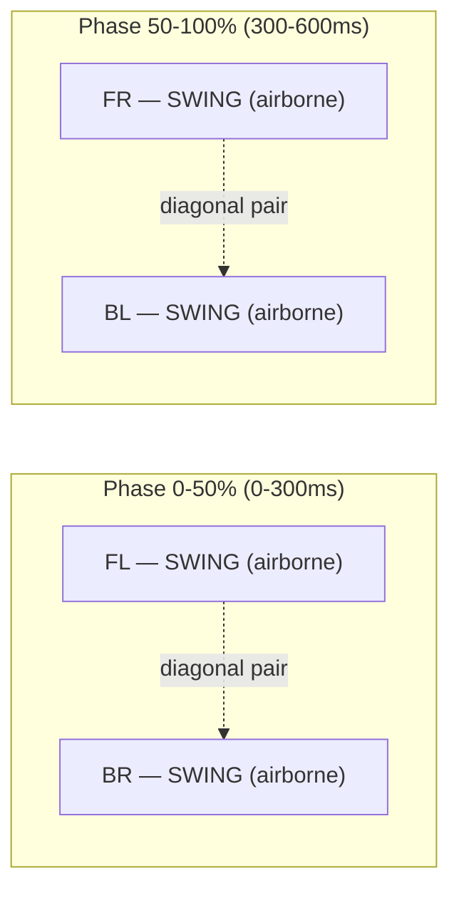

# RUNNER-4 — 12-Motor Movement Reference
## 12-DOF Quadruped Locomotion Engine | STM32F411CEU6 + PCA9685

> **Hardware:** STM32F411CEU6 | PCA9685 @ I2C1 0x40 | 12x MG90S servos
> **Links:** Coxa = 30 mm | Femur = 60 mm | Tibia = 80 mm
> **Max reach:** 140 mm | **Neutral stance depth:** 50 mm below body

---

## 1. Motor Layout — All 12 Channels

### Physical Leg Positions

```
              FRONT (direction of travel ->)

   LEFT                                          RIGHT

   FL Leg                                        FR Leg
   +-- CH0  Coxa  J1 (yaw)                  CH3  Coxa  J1 (yaw)  --+
   +-- CH1  Femur J2 (pitch)                CH4  Femur J2 (pitch) --+
   +-- CH2  Tibia J3 (pitch)                CH5  Tibia J3 (pitch) --+

              [===== BODY =====]

   BL Leg                                        BR Leg
   +-- CH6  Coxa  J1 (yaw)                  CH9  Coxa  J1 (yaw)  --+
   +-- CH7  Femur J2 (pitch)                CH10 Femur J2 (pitch) --+
   +-- CH8  Tibia J3 (pitch)                CH11 Tibia J3 (pitch) --+

   REAR
```

### 3-DOF Per Leg — Joint Diagram (Side View)

```
   BODY
    |
    | 30mm  COXA  (J1 — yaw, horizontal swing ±45°)
    |
    ● coxa pivot
    |
    | 60mm  FEMUR (J2 — pitch, vertical ±90°)
    |
    ● femur pivot
    |
    | 80mm  TIBIA (J3 — pitch, vertical ±90°)
    |
   FOOT  (ground contact point)

   Max reach from coxa = 60 + 80 = 140 mm
   Min reach from coxa = |60 - 80| = 20 mm
```

---

## 2. PCA9685 Channel Table — All 12 Leg Motors

| CH | Leg | Joint | DOF | Neutral | Min | Max | Mirror? |
|----|-----|-------|-----|---------|-----|-----|---------|
| 0 | FL | Coxa | Yaw J1 | 90° | 45° | 135° | No |
| 1 | FL | Femur | Pitch J2 | 45° | 0° | 135° | No |
| 2 | FL | Tibia | Pitch J3 | 135° | 45° | 180° | No |
| 3 | FR | Coxa | Yaw J1 | 90° | 45° | 135° | **Yes** |
| 4 | FR | Femur | Pitch J2 | 135° | 45° | 180° | **Yes** |
| 5 | FR | Tibia | Pitch J3 | 45° | 0° | 135° | **Yes** |
| 6 | BL | Coxa | Yaw J1 | 90° | 45° | 135° | No |
| 7 | BL | Femur | Pitch J2 | 45° | 0° | 135° | No |
| 8 | BL | Tibia | Pitch J3 | 135° | 45° | 180° | No |
| 9 | BR | Coxa | Yaw J1 | 90° | 45° | 135° | **Yes** |
| 10 | BR | Femur | Pitch J2 | 135° | 45° | 180° | **Yes** |
| 11 | BR | Tibia | Pitch J3 | 45° | 0° | 135° | **Yes** |

> **Mirror Rule (FR, BR):** `angle_servo = 180° - angle_left_side`
> Applied to Femur (J2) and Tibia (J3). Coxa is NOT mirrored.

### PWM Tick Reference

```
MG90S at 50Hz, 12-bit (4096 ticks per 20ms period):
  SERVO_TICK_MIN = 102  -->   0°   (500us pulse)
  SERVO_TICK_MID = 307  -->  90°  (1500us pulse)
  SERVO_TICK_MAX = 491  --> 180°  (2400us pulse)

  tick = 102 + (angle / 180.0) * 389
  angle = (tick - 102) * 180.0 / 389

  PCA9685 Prescaler register = 121 -> 50.08Hz actual
```

---

## 3. Neutral Stance Positions

### Foot Coordinates (body frame, mm)

```
  Body origin at geometric centre, Z-up:

  FL: x=+80  y=+60  z=-50   (front-left)
  FR: x=+80  y=-60  z=-50   (front-right)
  BL: x=-80  y=+60  z=-50   (back-left)
  BR: x=-80  y=-60  z=-50   (back-right)

  All feet 50mm below body (z=-50)
  Feet splayed 120mm wide (y=+/-60)
  Feet 160mm front-to-back (x=+/-80)
```

### Neutral Joint Angles

```
  LEFT side (FL, BL):          RIGHT side (FR, BR):
  Coxa  J1 = 90°               Coxa  J1 = 90°
  Femur J2 = 45°               Femur J2 = 135°  (180-45, mirrored)
  Tibia J3 = 135°              Tibia J3 = 45°   (180-135, mirrored)

  PCA9685 ticks at neutral:
  CH0/3/6/9  (Coxa)  = 307
  CH1/7      (Femur) = 205   CH4/10 (Femur right) = 409
  CH2/8      (Tibia) = 409   CH5/11 (Tibia right) = 205
```

---

## 4. Inverse Kinematics — 3-DOF Geometric Solver

### Derivation (per leg)

```
Given target foot position (fx, fy, fz) in body frame:

  L1 = 30mm (Coxa)
  L2 = 60mm (Femur)
  L3 = 80mm (Tibia)

STEP 1 — Coxa yaw angle (horizontal plane):
  theta1 = atan2(fy, fx)                        [rad]

STEP 2 — Collapse to elevation plane:
  d_xy    = sqrt(fx^2 + fy^2) - L1              [horizontal reach past coxa]
  d_total = sqrt(d_xy^2 + fz^2)                 [femur-pivot to foot distance]

  Reachability check:
    d_total must be in [|L2-L3|, L2+L3] = [20mm, 140mm]

STEP 3 — Femur pitch angle (law of cosines):
  cos_beta = (L2^2 + d_total^2 - L3^2) / (2 * L2 * d_total)
  alpha    = atan2(-fz, d_xy)                    [elevation angle to foot]
  theta2   = alpha + acos(cos_beta)              [femur angle from horizontal]

STEP 4 — Tibia pitch angle (law of cosines):
  cos_gamma = (L2^2 + L3^2 - d_total^2) / (2 * L2 * L3)
  theta3    = pi - acos(cos_gamma)               [tibia fold angle]

STEP 5 — Convert to servo degrees:
  coxa_servo  = theta1 * (180/pi) + 90           [centre = 90°]
  femur_servo = theta2 * (180/pi) + 90
  tibia_servo = theta3 * (180/pi)

  For right-side legs (FR, BR):
    femur_servo = 180 - femur_servo
    tibia_servo = 180 - tibia_servo
```

### IK Workspace Diagram

```
  Elevation view (single leg, looking from side):

  coxa pivot (origin)
      |
      |  d_xy (horizontal)
      +----------->
      |             \
   fz |              \ d_total (60-140mm)
  (vertical)         \
      |                * foot target
      v

  Reachable zone (shaded):
  20mm < d_total < 140mm from coxa pivot
  Any z from +60mm (raised) to -80mm (stretched down)
  Coxa yaw: -45° to +45° from neutral (±45° sweep)
```

### kinematics.h — Complete Header

```c
#ifndef KINEMATICS_H
#define KINEMATICS_H
#include <stdbool.h>

/* ---- Link Lengths (mm) ---- */
#define IK_L1_MM       30.0f   /* Coxa  */
#define IK_L2_MM       60.0f   /* Femur */
#define IK_L3_MM       80.0f   /* Tibia */

/* ---- Body Geometry (mm) ---- */
#define BODY_HALF_LEN  80.0f   /* centre to front/rear coxa pivot */
#define BODY_HALF_WID  60.0f   /* centre to left/right coxa pivot */
#define FOOT_GROUND_Z  50.0f   /* nominal stance depth below body */

/* ---- Leg Indices ---- */
#define LEG_FL  0
#define LEG_FR  1
#define LEG_BL  2
#define LEG_BR  3

/* ---- Structures ---- */
typedef struct { float x, y, z; }                       FootTarget_t;
typedef struct { float coxa_deg, femur_deg, tibia_deg; } JointAngles_t;

/* Neutral foot positions for all 4 legs */
extern const FootTarget_t IK_NeutralStance[4];

/* ---- API ---- */
/* Solve one leg. Returns false if target is out of reach. */
bool IK_SolveLeg(const FootTarget_t *foot, JointAngles_t *angles);

/* Solve all 4 legs -> flat array of 12 servo degrees (CH0-CH11) */
void IK_SolveAll(const FootTarget_t feet[4], float joint_angles_deg[12]);

/* Fill feet[4] with neutral stance positions */
void IK_GetNeutralStance(FootTarget_t feet[4]);

#endif /* KINEMATICS_H */
```

### kinematics.c — Complete Implementation

```c
#include "kinematics.h"
#include <math.h>

#define R2D  (180.0f / (float)M_PI)
#define D2R  ((float)M_PI / 180.0f)

/* Neutral foot positions in body frame (mm) */
const FootTarget_t IK_NeutralStance[4] = {
    /* LEG_FL */ {  BODY_HALF_LEN,  BODY_HALF_WID, -FOOT_GROUND_Z },
    /* LEG_FR */ {  BODY_HALF_LEN, -BODY_HALF_WID, -FOOT_GROUND_Z },
    /* LEG_BL */ { -BODY_HALF_LEN,  BODY_HALF_WID, -FOOT_GROUND_Z },
    /* LEG_BR */ { -BODY_HALF_LEN, -BODY_HALF_WID, -FOOT_GROUND_Z },
};

/**
 * @brief Solve IK for one leg.
 * @param foot  Target foot position in body frame (mm).
 *              For right-side legs, pass Y already negated before calling.
 * @param angles Output joint angles in degrees (body-frame, not servo-frame).
 * @return true if reachable, false if target is out of workspace.
 */
bool IK_SolveLeg(const FootTarget_t *foot, JointAngles_t *angles) {
    float fx = foot->x, fy = foot->y, fz = foot->z;

    /* --- Step 1: Coxa yaw --- */
    angles->coxa_deg = atan2f(fy, fx) * R2D;

    /* --- Step 2: Elevation plane --- */
    float d_xy  = sqrtf(fx*fx + fy*fy) - IK_L1_MM;
    float d_tot = sqrtf(d_xy*d_xy + fz*fz);

    /* Reachability: must be within [20, 140] mm */
    if (d_tot > (IK_L2_MM + IK_L3_MM)) return false;   /* too far */
    if (d_tot < fabsf(IK_L2_MM - IK_L3_MM)) return false; /* too close */

    /* --- Step 3: Femur angle --- */
    float cos_beta = (IK_L2_MM*IK_L2_MM + d_tot*d_tot - IK_L3_MM*IK_L3_MM)
                     / (2.0f * IK_L2_MM * d_tot);
    cos_beta = fmaxf(-1.0f, fminf(1.0f, cos_beta)); /* clamp numerical error */
    float alpha = atan2f(-fz, d_xy);
    angles->femur_deg = (alpha + acosf(cos_beta)) * R2D;

    /* --- Step 4: Tibia angle --- */
    float cos_gamma = (IK_L2_MM*IK_L2_MM + IK_L3_MM*IK_L3_MM - d_tot*d_tot)
                      / (2.0f * IK_L2_MM * IK_L3_MM);
    cos_gamma = fmaxf(-1.0f, fminf(1.0f, cos_gamma));
    angles->tibia_deg = ((float)M_PI - acosf(cos_gamma)) * R2D;

    return true;
}

/**
 * @brief Solve IK for all 4 legs and produce 12 servo angles.
 * @param feet          Target foot positions [FL, FR, BL, BR].
 * @param joint_angles_deg  Output: 12 servo angles [Coxa0,Femur1,Tibia2, ...x4]
 *                          In same order as PCA9685 channels CH0-CH11.
 */
void IK_SolveAll(const FootTarget_t feet[4], float joint_angles_deg[12]) {
    /* Right-side legs are physically mirrored */
    const int is_right[4] = { 0, 1, 0, 1 }; /* FL=0 FR=1 BL=0 BR=1 */

    for (int leg = 0; leg < 4; leg++) {
        FootTarget_t f = feet[leg];

        /* Mirror Y for right-side legs so IK sees "left-side" geometry */
        if (is_right[leg]) f.y = -f.y;

        JointAngles_t ang;
        if (!IK_SolveLeg(&f, &ang)) {
            /* Out of reach: hold current (don't write — let caller decide) */
            continue;
        }

        /* Convert body-frame angles to servo angles */
        float coxa  = ang.coxa_deg  + 90.0f; /* 0 = -90deg yaw  90 = neutral */
        float femur = ang.femur_deg + 90.0f; /* 0 = horizontal  90 = vertical */
        float tibia = ang.tibia_deg;          /* 0 = fully folded */

        /* Apply mirror for right-side: reverse femur and tibia */
        if (is_right[leg]) {
            femur = 180.0f - femur;
            tibia = 180.0f - tibia;
        }

        /* Clamp to MG90S physical range */
        coxa  = fmaxf(0.0f, fminf(180.0f, coxa));
        femur = fmaxf(0.0f, fminf(180.0f, femur));
        tibia = fmaxf(0.0f, fminf(180.0f, tibia));

        /* Write to output array (matches PCA9685 CH numbering) */
        joint_angles_deg[leg*3 + 0] = coxa;   /* CH0,3,6,9  */
        joint_angles_deg[leg*3 + 1] = femur;  /* CH1,4,7,10 */
        joint_angles_deg[leg*3 + 2] = tibia;  /* CH2,5,8,11 */
    }
}

void IK_GetNeutralStance(FootTarget_t f[4]) {
    for (int i = 0; i < 4; i++) f[i] = IK_NeutralStance[i];
}
```

---

## 5. Gait Engine — Trot Locomotion

### Gait Concept



```
Timing:   T = 600ms  |  Swing = 300ms  |  Stance = 300ms

          0ms         300ms        600ms
          |            |            |
FL: ------[##SWING###][  STANCE    ]------
BR: ------[##SWING###][  STANCE    ]------

FR: ------[  STANCE   ][##SWING###]------
BL: ------[  STANCE   ][##SWING###]------

2 legs always on ground -> stable trot
Diagonal pairs swing together
```

### Foot Trajectory Per Leg

```
SWING phase (0 -> 1.0 normalised):
  x(t) = x_liftoff + (x_land - x_liftoff) * t    [linear X interpolation]
  y(t) = y_liftoff + (y_land - y_liftoff) * t    [linear Y interpolation]
  z(t) = -body_h + step_height * sin(pi * t)     [parabolic arc Z]

STANCE phase (0 -> 1.0 normalised):
  x(t) = x_land - Vx * stance_time * t           [body moves over fixed foot]
  y(t) = y_land - Vy * stance_time * t
  z(t) = -body_h                                  [foot stays on ground]

Landing target computation (on swing onset):
  half_swing = 0.150s  (300ms / 2)
  x_land = x_neutral + Vx * half_swing - Wz * y_neutral * half_swing
  y_land = y_neutral + Vy * half_swing + Wz * x_neutral * half_swing
```

### gait_engine.h — Complete Header

```c
#ifndef GAIT_ENGINE_H
#define GAIT_ENGINE_H
#include "kinematics.h"
#include <stdbool.h>

/* ---- Gait Parameters ---- */
#define GAIT_PERIOD_MS     600.0f  /* Full cycle period ms */
#define GAIT_SWING_DUTY    0.5f    /* Fraction of cycle in air */
#define GAIT_STEP_HEIGHT   35.0f  /* Foot lift height mm */
#define GAIT_VX_MAX        100.0f /* Max forward velocity mm/s */
#define GAIT_VY_MAX         60.0f /* Max lateral velocity mm/s */
#define GAIT_WZ_MAX          0.80f/* Max yaw rate rad/s */
#define GAIT_LOOP_DT_MS     20.0f /* Must match TIM2 period */

/* Phase offsets [FL, FR, BL, BR]: diagonal pairs share phase */
extern const float GAIT_PHASE_OFFSET[4]; /* {0.0, 0.5, 0.5, 0.0} */

/* ---- API ---- */
void GaitEngine_Init(void);

/**
 * @brief Update gait for one 20ms cycle.
 * @param Vx   Forward velocity mm/s  (+ = forward)
 * @param Vy   Lateral velocity mm/s  (+ = left)
 * @param Wz   Yaw rate rad/s         (+ = turn left)
 * @param feet Output foot target positions [FL,FR,BL,BR]
 */
void GaitEngine_Update(float Vx, float Vy, float Wz, FootTarget_t feet[4]);

/** Override body stand height (default = FOOT_GROUND_Z = 50mm) */
void GaitEngine_SetBodyHeight(float height_mm);

#endif
```

### gait_engine.c — Complete Implementation

```c
#include "gait_engine.h"
#include <math.h>
#include <string.h>

const float GAIT_PHASE_OFFSET[4] = { 0.0f, 0.5f, 0.5f, 0.0f };
                                   /* FL    FR    BL    BR   */

static float        _phase  = 0.0f;
static float        _body_h = FOOT_GROUND_Z;
static FootTarget_t _liftoff[4];
static FootTarget_t _landing[4];
static int          _was_swing[4] = {0, 0, 0, 0};

void GaitEngine_Init(void) {
    _phase = 0.0f;
    _body_h = FOOT_GROUND_Z;
    for (int i = 0; i < 4; i++) {
        _liftoff[i]   = IK_NeutralStance[i];
        _landing[i]   = IK_NeutralStance[i];
        _was_swing[i] = 0;
    }
}

void GaitEngine_SetBodyHeight(float h) { _body_h = h; }

void GaitEngine_Update(float Vx, float Vy, float Wz, FootTarget_t feet[4]) {
    /* Clamp inputs */
    if (Vx >  GAIT_VX_MAX) Vx =  GAIT_VX_MAX;
    if (Vx < -GAIT_VX_MAX) Vx = -GAIT_VX_MAX;
    if (Vy >  GAIT_VY_MAX) Vy =  GAIT_VY_MAX;
    if (Vy < -GAIT_VY_MAX) Vy = -GAIT_VY_MAX;

    /* Advance global phase (wraps 0..1) */
    _phase += GAIT_LOOP_DT_MS / GAIT_PERIOD_MS;
    if (_phase >= 1.0f) _phase -= 1.0f;

    float stance_dt_s = (GAIT_PERIOD_MS * (1.0f - GAIT_SWING_DUTY)) * 1e-3f;

    for (int leg = 0; leg < 4; leg++) {
        /* Each leg has its own phase, offset by GAIT_PHASE_OFFSET */
        float lp = _phase + GAIT_PHASE_OFFSET[leg];
        if (lp >= 1.0f) lp -= 1.0f;

        int   in_swing = (lp < GAIT_SWING_DUTY);
        float t_norm   = in_swing
            ? (lp / GAIT_SWING_DUTY)
            : ((lp - GAIT_SWING_DUTY) / (1.0f - GAIT_SWING_DUTY));

        /* Swing onset: compute landing target using velocity feedforward */
        if (in_swing && !_was_swing[leg]) {
            _liftoff[leg] = IK_NeutralStance[leg];
            float half_t  = (GAIT_PERIOD_MS * GAIT_SWING_DUTY) * 1e-3f; /* 0.15s */
            float nx = IK_NeutralStance[leg].x;
            float ny = IK_NeutralStance[leg].y;
            /* Foot lands where it needs to be to push body correctly */
            _landing[leg].x = nx + Vx * half_t - Wz * ny * half_t;
            _landing[leg].y = ny + Vy * half_t + Wz * nx * half_t;
            _landing[leg].z = -_body_h;
        }
        _was_swing[leg] = in_swing;

        if (in_swing) {
            /* SWING: linear XY interpolation + parabolic Z arc */
            feet[leg].x = _liftoff[leg].x +
                          (_landing[leg].x - _liftoff[leg].x) * t_norm;
            feet[leg].y = _liftoff[leg].y +
                          (_landing[leg].y - _liftoff[leg].y) * t_norm;
            feet[leg].z = -_body_h +
                          GAIT_STEP_HEIGHT * sinf((float)M_PI * t_norm);
        } else {
            /* STANCE: foot fixed, body moves forward over it */
            feet[leg].x = _landing[leg].x - Vx * stance_dt_s * t_norm;
            feet[leg].y = _landing[leg].y - Vy * stance_dt_s * t_norm;
            feet[leg].z = -_body_h;
        }
    }
}
```

---

## 6. Movement Commands Reference

### Velocity Input Table

| Motion | Vx (mm/s) | Vy (mm/s) | Wz (rad/s) | Notes |
|--------|-----------|-----------|-----------|-------|
| Stand still | 0 | 0 | 0 | All feet at neutral |
| Walk forward | +60 | 0 | 0 | Competition line follow |
| Walk forward fast | +100 | 0 | 0 | Max speed |
| Walk backward | -60 | 0 | 0 | Recovery |
| Strafe left | 0 | +40 | 0 | Lateral shift |
| Strafe right | 0 | -40 | 0 | Lateral shift |
| Turn left | 0 | 0 | +0.5 | Spot rotation |
| Turn right | 0 | 0 | -0.5 | Spot rotation |
| Forward + curve left | +60 | 0 | +0.3 | Line follow with PD |
| Forward + curve right | +60 | 0 | -0.3 | Line follow with PD |
| Obstacle push | +50 | 0 | 0 | Task 3 push mode |
| Wall follow left wall | +80 | 0 | WallPD | Wall on left side |

### State Machine Motion Commands

```
State                Vx      Vy   Wz           Arm
T1_LINE_FOLLOW       60      0    LinePD()     HOME
T1_BALL_APPROACH      0      0    0            MODE_A
T1_BALL_GRAB          0      0    0            MODE_A + GRIP_CLOSE
T1_STORE              0      0    0            HOME + GRIP_CLOSE
T1_GRID_EXIT         60      0    LinePD()     HOME
T2_WALL_FOLLOW       80      0    WallPD()     HOME
T3_PUSH              50      0    0            HOME
T3_TURN               0      0   -0.5         HOME (3.2s -> 90deg turn)
T4_LINE_FOLLOW       60      0    LinePD()     HOME
T4_JUNCTION_DETECT    0      0    0            MODE_B
T4_BALL_RELEASE       0      0    0            HOME + GATE_OPEN
```

---

## 7. Key Motion Calculations

### 90-Degree Spot Turn

```
  Target: turn 90 degrees
  Wz = 0.5 rad/s
  Time = (pi/2) / 0.5 = 3.14s  -> use 3200ms in state machine

  actual Wz from gait: foot motion creates turning moment
  Body angular velocity = Wz * gait scaling factor (~0.9x actual)
  -> Use Wz = 0.5 rad/s for T3_TURN state, duration = 3200ms
```

### Line PD Controller

```c
/* Line sensor centroid error -> Wz command */
#define LINE_KP      0.012f   /* rad/s per unit centroid error */
#define LINE_KD      0.003f   /* derivative gain */
#define LINE_WZ_MAX  0.80f    /* rad/s clamp */

float LinePD_Update(float error, float *prev_error, float dt_s) {
    float Wz = LINE_KP * error
             + LINE_KD * (error - *prev_error) / dt_s;
    *prev_error = error;
    if (Wz >  LINE_WZ_MAX) Wz =  LINE_WZ_MAX;
    if (Wz < -LINE_WZ_MAX) Wz = -LINE_WZ_MAX;
    return Wz;
    /* Pass Wz into GaitEngine_Update(Vx, 0, Wz, feet) */
}
```

### Wall PD Controller

```c
/* ToF left/right error -> Wz command */
#define WALL_KP      0.008f
#define WALL_KD      0.002f
#define WALL_WZ_MAX  0.60f
#define WALL_TARGET  150.0f   /* mm from wall */

float WallPD_Update(float left_mm, float right_mm,
                    float *prev_err, float dt_s) {
    float error = left_mm - right_mm;  /* +ve = drift right, turn left */
    float Wz = WALL_KP * error
             + WALL_KD * (error - *prev_err) / dt_s;
    *prev_err = error;
    if (Wz >  WALL_WZ_MAX) Wz =  WALL_WZ_MAX;
    if (Wz < -WALL_WZ_MAX) Wz = -WALL_WZ_MAX;
    return Wz;
}
```

---

## 8. 50Hz Motion Execution Pipeline

```
Every 20ms (TIM2 interrupt sets update_flag):

  Step 1: Read sensors
          LA_Update()           -> la_result.centroid, la_result.error
          TOF_UpdateAll()       -> tof[0..2].dist_mm
          TCS34725_Poll()       -> color

  Step 2: State machine decides
          StateMachine_Update() -> sm_Vx, sm_Vy, sm_Wz
          (Internally calls LinePD_Update or WallPD_Update for Wz)

  Step 3: Generate foot targets
          GaitEngine_Update(sm_Vx, sm_Vy, sm_Wz, feet)
          -> feet[4] = {FL, FR, BL, BR} foot positions in mm

  Step 4: Solve joint angles
          IK_SolveAll(feet, joints)
          -> joints[12] = servo angles in degrees for CH0..CH11

  Step 5: Drive servos
          PCA9685_WriteLegs(joints)
          -> 12x I2C writes to PCA9685 (~2.4ms total)

  Step 6: Drive mechanisms
          ARM_Update()          -> CH12, CH13, CH14

  Total cycle time: ~7.6ms  (62% headroom from 20ms budget)
```

---

## 9. Servo Angle Verification — All 12 Channels

### Static Test Positions

Use UART at 115200: `servo <CH> <angle>\r\n`

| CH | Leg | Joint | Test 0° | Test 90° | Test 180° | Expected Motion |
|----|-----|-------|---------|----------|-----------|-----------------|
| 0 | FL | Coxa | Sweep forward | Centre | Sweep backward | Horizontal rotation |
| 1 | FL | Femur | Leg down full | 45° lift | Leg up full | Vertical lift |
| 2 | FL | Tibia | Tibia folded | Semi-extend | Full extend | Lower leg fold |
| 3 | FR | Coxa | Sweep backward* | Centre | Sweep forward* | Mirrored CH0 |
| 4 | FR | Femur | Leg up full* | 45° lift | Leg down full* | Mirrored CH1 |
| 5 | FR | Tibia | Full extend* | Semi-extend | Tibia folded* | Mirrored CH2 |
| 6 | BL | Coxa | Sweep forward | Centre | Sweep backward | Same as CH0 |
| 7 | BL | Femur | Leg down full | 45° lift | Leg up full | Same as CH1 |
| 8 | BL | Tibia | Tibia folded | Semi-extend | Full extend | Same as CH2 |
| 9 | BR | Coxa | Sweep backward* | Centre | Sweep forward* | Mirrored CH6 |
| 10 | BR | Femur | Leg up full* | 45° lift | Leg down full* | Mirrored CH7 |
| 11 | BR | Tibia | Full extend* | Semi-extend | Tibia folded* | Mirrored CH8 |

> `*` = physically mirrored — opposite motion to left-side equivalent

### Standing Balance Check

```
With all 12 motors at NEUTRAL angles:
  CH0,3,6,9  = 90°  (Coxa neutral, legs spread sideways)
  CH1,7      = 45°  (Femur, left side)
  CH4,10     = 135° (Femur, right side = 180-45)
  CH2,8      = 135° (Tibia, left side)
  CH5,11     = 45°  (Tibia, right side = 180-135)

Expected result:
  Robot stands level on flat surface
  Body height ~50mm from ground
  All 4 feet evenly loaded
  IMU: |pitch| < 3deg  |roll| < 3deg
```

---

## 10. Gait Tuning Parameters

| Parameter | Default | Range | Effect |
|-----------|---------|-------|--------|
| GAIT_PERIOD_MS | 600 | 400–800 ms | Slower = stable, faster = quick |
| GAIT_SWING_DUTY | 0.5 | 0.4–0.6 | Higher = more swing time |
| GAIT_STEP_HEIGHT | 35 | 25–55 mm | Higher = clears obstacles |
| FOOT_GROUND_Z | 50 | 40–70 mm | Lower = more stable, less height |
| GAIT_VX_MAX | 100 | 60–150 mm/s | Max command clamp |
| LINE_KP | 0.012 | 0.005–0.020 | Line tracking proportional gain |
| LINE_KD | 0.003 | 0.001–0.008 | Line tracking derivative (damping) |
| WALL_KP | 0.008 | 0.004–0.015 | Wall centering proportional gain |
| WALL_KD | 0.002 | 0.001–0.005 | Wall centering derivative |

### Tuning Symptoms and Fixes

| Symptom | Likely Cause | Fix |
|---------|-------------|-----|
| Robot tips over during trot | CoM too high | Reduce FOOT_GROUND_Z to 40mm |
| Feet drag on ground in swing | Step height too low | Increase GAIT_STEP_HEIGHT to 45mm |
| Line tracking oscillates | LINE_KP too high | Reduce by 20%, add LINE_KD |
| Robot overshoots on corners | LINE_KD too low | Increase by 50% |
| Jerky gait, stuttering | GAIT_PERIOD_MS too low | Increase to 700ms |
| Slow, sluggish turning | LINE_WZ_MAX too low | Increase to 1.0 rad/s |
| BR leg stationary | Arduino attach() bug | Fixed in STM32 firmware |

---

## Appendix — Quick Servo Channel Map

```
  PCA9685                 MG90S Servo Location
  ┌─────┬──────────────────────────────────────┐
  │ CH0 │ FL Coxa  — front-left  horizontal    │
  │ CH1 │ FL Femur — front-left  upper lift    │
  │ CH2 │ FL Tibia — front-left  lower fold    │
  ├─────┼──────────────────────────────────────┤
  │ CH3 │ FR Coxa  — front-right horizontal    │
  │ CH4 │ FR Femur — front-right upper lift    │
  │ CH5 │ FR Tibia — front-right lower fold    │
  ├─────┼──────────────────────────────────────┤
  │ CH6 │ BL Coxa  — back-left   horizontal    │
  │ CH7 │ BL Femur — back-left   upper lift    │
  │ CH8 │ BL Tibia — back-left   lower fold    │
  ├─────┼──────────────────────────────────────┤
  │ CH9 │ BR Coxa  — back-right  horizontal    │
  │ CH10│ BR Femur — back-right  upper lift    │
  │ CH11│ BR Tibia — back-right  lower fold    │
  └─────┴──────────────────────────────────────┘

  NEUTRAL stance ticks (PCA9685 @ 50Hz 12-bit):
  CH0,3,6,9  -> 307   (90 deg, coxa centred)
  CH1,7      -> 205   (45 deg, femur partial lift)
  CH4,10     -> 409   (135 deg, femur mirrored)
  CH2,8      -> 409   (135 deg, tibia extended)
  CH5,11     -> 205   (45 deg, tibia mirrored)
```

---

*RUNNER-4 12-Motor Movement Reference | FusionForce Robotics | September 2026*
*L1=30mm L2=60mm L3=80mm | Max reach=140mm | 50Hz 20ms cycle*
